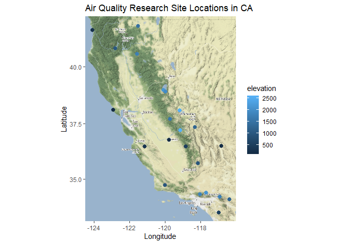
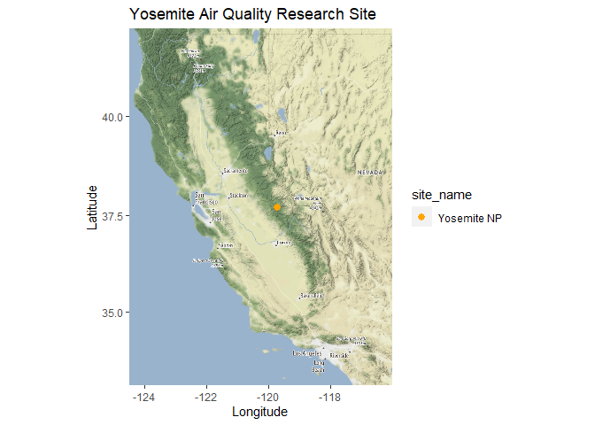
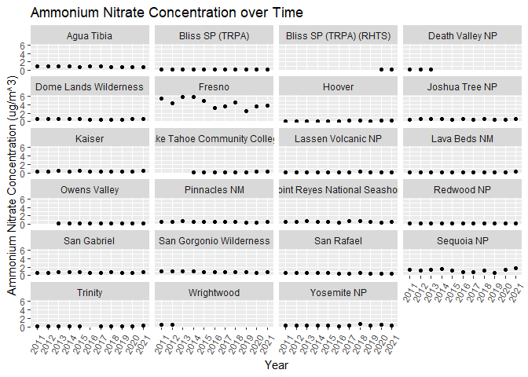
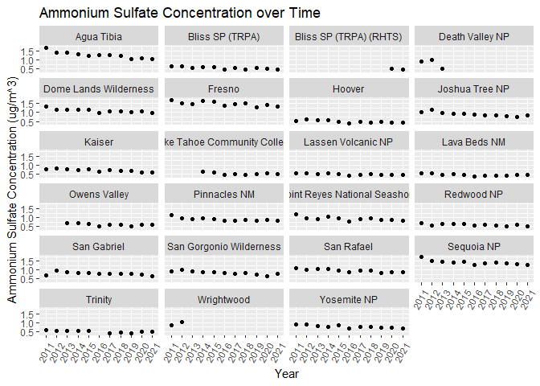
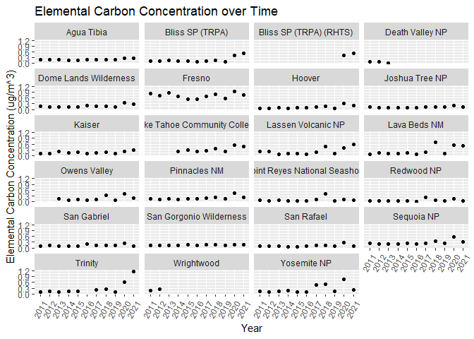
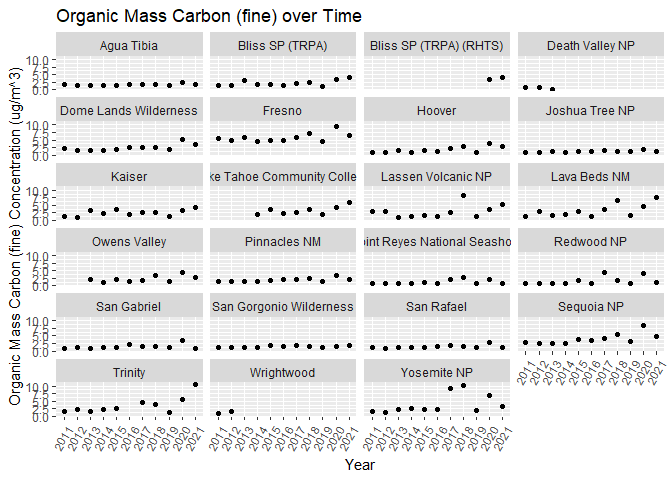
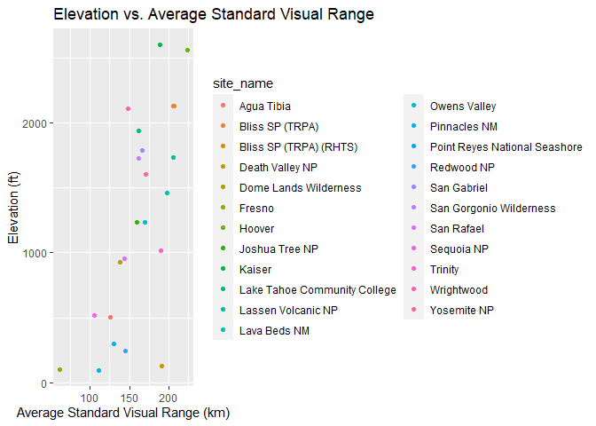

Loading data


```r
visibility <- read_csv("data/CA_visibility_data.csv", na = "-999") %>% clean_names()
```

```
## Rows: 26633 Columns: 22
## ── Column specification ────────────────────────────────────────────────────────
## Delimiter: ","
## chr (11): Dataset, SiteCode, Date, SiteName, State, ammNO3f_Unit, ammSO4f_Un...
## dbl (11): POC, Percentile, Latitude, Longitude, Elevation, ammNO3f_Val, ammS...
## 
## ℹ Use `spec()` to retrieve the full column specification for this data.
## ℹ Specify the column types or set `show_col_types = FALSE` to quiet this message.
```
Split date by year:

```r
visibility_tidy <- visibility %>% 
  separate(date, into= c("month", "day", "year"), sep = "/")
```

#### **Data Cleaning**


```r
glimpse(visibility_tidy)
```

```
## Rows: 26,633
## Columns: 24
## $ dataset       <chr> "IMPRHR2", "IMPRHR2", "IMPRHR2", "IMPRHR2", "IMPRHR2", "…
## $ site_code     <chr> "AGTI1", "AGTI1", "AGTI1", "AGTI1", "AGTI1", "AGTI1", "A…
## $ poc           <dbl> 1, 1, 1, 1, 1, 1, 1, 1, 1, 1, 1, 1, 1, 1, 1, 1, 1, 1, 1,…
## $ month         <chr> "1", "1", "1", "1", "1", "1", "1", "1", "1", "1", "2", "…
## $ day           <chr> "3", "6", "9", "12", "15", "18", "21", "24", "27", "30",…
## $ year          <chr> "2011", "2011", "2011", "2011", "2011", "2011", "2011", …
## $ percentile    <dbl> 10, 10, 70, 10, 10, 10, 10, 10, 10, 50, 0, 30, 90, 10, 3…
## $ site_name     <chr> "Agua Tibia", "Agua Tibia", "Agua Tibia", "Agua Tibia", …
## $ latitude      <dbl> 33.4636, 33.4636, 33.4636, 33.4636, 33.4636, 33.4636, 33…
## $ longitude     <dbl> -116.9706, -116.9706, -116.9706, -116.9706, -116.9706, -…
## $ elevation     <dbl> 507.5, 507.5, 507.5, 507.5, 507.5, 507.5, 507.5, 507.5, …
## $ state         <chr> "CA", "CA", "CA", "CA", "CA", "CA", "CA", "CA", "CA", "C…
## $ amm_no3f_val  <dbl> 0.44634, 0.06966, 1.72409, 0.26909, 0.04502, 0.07650, 0.…
## $ amm_no3f_unit <chr> "ug/m^3", "ug/m^3", "ug/m^3", "ug/m^3", "ug/m^3", "ug/m^…
## $ amm_so4f_val  <dbl> 0.16578, 0.18971, 1.64575, 0.21182, 0.09261, 0.13254, 0.…
## $ amm_so4f_unit <chr> "ug/m^3", "ug/m^3", "ug/m^3", "ug/m^3", "ug/m^3", "ug/m^…
## $ e_cf_val      <dbl> 0.1010, 0.1536, 0.2011, 0.1017, 0.1202, 0.1528, 0.1018, …
## $ e_cf_unit     <chr> "ug/m^3", "ug/m^3", "ug/m^3", "ug/m^3", "ug/m^3", "ug/m^…
## $ om_cf_val     <dbl> 0.65988, 0.65016, 1.86570, 0.50094, 0.60552, 0.76230, 0.…
## $ om_cf_unit    <chr> "ug/m^3", "ug/m^3", "ug/m^3", "ug/m^3", "ug/m^3", "ug/m^…
## $ soi_lf_val    <dbl> 0.12392, 0.12221, 0.13866, 0.22845, 0.17952, 0.25427, 0.…
## $ soi_lf_unit   <chr> "ug/m^3", "ug/m^3", "ug/m^3", "ug/m^3", "ug/m^3", "ug/m^…
## $ svr_val       <dbl> 217.30695, 238.28668, 83.81186, 218.84126, 245.69277, 22…
## $ svr_unit      <chr> "km", "km", "km", "km", "km", "km", "km", "km", "km", "k…
```


```r
head(visibility_tidy) # the data are tidy
```

```
## # A tibble: 6 × 24
##   dataset site_code   poc month day   year  percentile site_name latit…¹ longi…²
##   <chr>   <chr>     <dbl> <chr> <chr> <chr>      <dbl> <chr>       <dbl>   <dbl>
## 1 IMPRHR2 AGTI1         1 1     3     2011          10 Agua Tib…    33.5   -117.
## 2 IMPRHR2 AGTI1         1 1     6     2011          10 Agua Tib…    33.5   -117.
## 3 IMPRHR2 AGTI1         1 1     9     2011          70 Agua Tib…    33.5   -117.
## 4 IMPRHR2 AGTI1         1 1     12    2011          10 Agua Tib…    33.5   -117.
## 5 IMPRHR2 AGTI1         1 1     15    2011          10 Agua Tib…    33.5   -117.
## 6 IMPRHR2 AGTI1         1 1     18    2011          10 Agua Tib…    33.5   -117.
## # … with 14 more variables: elevation <dbl>, state <chr>, amm_no3f_val <dbl>,
## #   amm_no3f_unit <chr>, amm_so4f_val <dbl>, amm_so4f_unit <chr>,
## #   e_cf_val <dbl>, e_cf_unit <chr>, om_cf_val <dbl>, om_cf_unit <chr>,
## #   soi_lf_val <dbl>, soi_lf_unit <chr>, svr_val <dbl>, svr_unit <chr>, and
## #   abbreviated variable names ¹​latitude, ²​longitude
```

Any NAs?

```r
naniar::miss_var_summary(visibility_tidy)
```

```
## # A tibble: 24 × 3
##    variable     n_miss pct_miss
##    <chr>         <int>    <dbl>
##  1 svr_val        2614     9.81
##  2 om_cf_val      2251     8.45
##  3 amm_no3f_val   2180     8.19
##  4 e_cf_val       2162     8.12
##  5 soi_lf_val     1999     7.51
##  6 amm_so4f_val   1988     7.46
##  7 dataset           0     0   
##  8 site_code         0     0   
##  9 poc               0     0   
## 10 month             0     0   
## # … with 14 more rows
```

```r
summary(visibility_tidy)
```

```
##    dataset           site_code              poc       month          
##  Length:26633       Length:26633       Min.   :1   Length:26633      
##  Class :character   Class :character   1st Qu.:1   Class :character  
##  Mode  :character   Mode  :character   Median :1   Mode  :character  
##                                        Mean   :1                     
##                                        3rd Qu.:1                     
##                                        Max.   :1                     
##                                                                      
##      day                year             percentile    site_name        
##  Length:26633       Length:26633       Min.   : 0.0   Length:26633      
##  Class :character   Class :character   1st Qu.:10.0   Class :character  
##  Mode  :character   Mode  :character   Median :50.0   Mode  :character  
##                                        Mean   :42.7                     
##                                        3rd Qu.:70.0                     
##                                        Max.   :90.0                     
##                                                                         
##     latitude       longitude        elevation         state          
##  Min.   :33.46   Min.   :-124.1   Min.   :  97.0   Length:26633      
##  1st Qu.:34.73   1st Qu.:-121.2   1st Qu.: 507.5   Class :character  
##  Median :37.22   Median :-119.7   Median :1235.0   Mode  :character  
##  Mean   :37.32   Mean   :-119.7   Mean   :1226.4                     
##  3rd Qu.:38.98   3rd Qu.:-118.1   3rd Qu.:1791.0                     
##  Max.   :41.71   Max.   :-116.4   Max.   :2597.5                     
##                                                                      
##   amm_no3f_val     amm_no3f_unit       amm_so4f_val    amm_so4f_unit     
##  Min.   : 0.0000   Length:26633       Min.   :0.0000   Length:26633      
##  1st Qu.: 0.0916   Class :character   1st Qu.:0.3140   Class :character  
##  Median : 0.2367   Mode  :character   Median :0.6484   Mode  :character  
##  Mean   : 0.6529                      Mean   :0.8226                     
##  3rd Qu.: 0.5914                      3rd Qu.:1.1531                     
##  Max.   :68.9870                      Max.   :8.1514                     
##  NA's   :2180                         NA's   :1988                       
##     e_cf_val        e_cf_unit           om_cf_val         om_cf_unit       
##  Min.   : 0.0000   Length:26633       Min.   :  0.0000   Length:26633      
##  1st Qu.: 0.0415   Class :character   1st Qu.:  0.5767   Class :character  
##  Median : 0.0951   Mode  :character   Median :  1.1642   Mode  :character  
##  Mean   : 0.2118                      Mean   :  2.5014                     
##  3rd Qu.: 0.1834                      3rd Qu.:  2.1681                     
##  Max.   :30.9986                      Max.   :358.8709                     
##  NA's   :2162                         NA's   :2251                         
##    soi_lf_val      soi_lf_unit           svr_val         svr_unit        
##  Min.   :-0.0234   Length:26633       Min.   :  1.71   Length:26633      
##  1st Qu.: 0.1471   Class :character   1st Qu.: 99.84   Class :character  
##  Median : 0.3981   Mode  :character   Median :147.64   Mode  :character  
##  Mean   : 0.6325                      Mean   :158.50                     
##  3rd Qu.: 0.8055                      3rd Qu.:211.89                     
##  Max.   :33.3080                      Max.   :390.78                     
##  NA's   :1999                         NA's   :2614
```

Importantly, this shows us that there are no missing values for "site_code", "site_name", "date", "longitude", "latitude", "elevation", and "state". The values that do have NAs are all below 10%.


#### **Exploration**


```r
names(visibility_tidy)
```

```
##  [1] "dataset"       "site_code"     "poc"           "month"        
##  [5] "day"           "year"          "percentile"    "site_name"    
##  [9] "latitude"      "longitude"     "elevation"     "state"        
## [13] "amm_no3f_val"  "amm_no3f_unit" "amm_so4f_val"  "amm_so4f_unit"
## [17] "e_cf_val"      "e_cf_unit"     "om_cf_val"     "om_cf_unit"   
## [21] "soi_lf_val"    "soi_lf_unit"   "svr_val"       "svr_unit"
```
##############################################################################
##############################################################################
##### 1. How many sites and where are they? Check "site_code" vs. "site_name"
######**Don't need to include this section in final code doc**
*There are 23 distinct sites names which we will use for analysis*


```r
visibility_tidy %>%
  summarize(distinct_site_code = n_distinct(site_code), #interestingly, there is one more site_code (24) than site_name (23).
            distinct_site_name = n_distinct(site_name),
            distinct_state = n_distinct(state)) #this confirms there is only data for CA in the dataset
```

```
## # A tibble: 1 × 3
##   distinct_site_code distinct_site_name distinct_state
##                <int>              <int>          <int>
## 1                 24                 23              1
```
OR

```r
visibility_tidy %>%
  summarize(across(c(site_code, site_name, state), n_distinct))
```

```
## # A tibble: 1 × 3
##   site_code site_name state
##       <int>     <int> <int>
## 1        24        23     1
```


```r
visibility_tidy %>%
    tabyl(site_code, site_name)
```

```
##  site_code Agua Tibia Bliss SP (TRPA) Bliss SP (TRPA) (RHTS) Death Valley NP
##      AGTI1       1339               0                      0               0
##  BLIS_RHTS          0               0                    244               0
##      BLIS1          0            1095                      0               0
##      BLIS2          0             244                      0               0
##      DEVA1          0               0                      0             283
##      DOME1          0               0                      0               0
##      FRES1          0               0                      0               0
##      HOOV1          0               0                      0               0
##      JOSH1          0               0                      0               0
##      KAIS1          0               0                      0               0
##      LABE1          0               0                      0               0
##      LAVO1          0               0                      0               0
##      LTCC1          0               0                      0               0
##      OWVL1          0               0                      0               0
##      PINN1          0               0                      0               0
##      PORE1          0               0                      0               0
##      RAFA1          0               0                      0               0
##      REDW1          0               0                      0               0
##      SAGA1          0               0                      0               0
##      SAGO1          0               0                      0               0
##      SEQU1          0               0                      0               0
##      TRIN1          0               0                      0               0
##      WRIG1          0               0                      0               0
##      YOSE1          0               0                      0               0
##  Dome Lands Wilderness Fresno Hoover Joshua Tree NP Kaiser
##                      0      0      0              0      0
##                      0      0      0              0      0
##                      0      0      0              0      0
##                      0      0      0              0      0
##                      0      0      0              0      0
##                   1339      0      0              0      0
##                      0   1339      0              0      0
##                      0      0   1339              0      0
##                      0      0      0           1339      0
##                      0      0      0              0   1339
##                      0      0      0              0      0
##                      0      0      0              0      0
##                      0      0      0              0      0
##                      0      0      0              0      0
##                      0      0      0              0      0
##                      0      0      0              0      0
##                      0      0      0              0      0
##                      0      0      0              0      0
##                      0      0      0              0      0
##                      0      0      0              0      0
##                      0      0      0              0      0
##                      0      0      0              0      0
##                      0      0      0              0      0
##                      0      0      0              0      0
##  Lake Tahoe Community College Lassen Volcanic NP Lava Beds NM Owens Valley
##                             0                  0            0            0
##                             0                  0            0            0
##                             0                  0            0            0
##                             0                  0            0            0
##                             0                  0            0            0
##                             0                  0            0            0
##                             0                  0            0            0
##                             0                  0            0            0
##                             0                  0            0            0
##                             0                  0            0            0
##                             0                  0         1339            0
##                             0               1339            0            0
##                           958                  0            0            0
##                             0                  0            0         1037
##                             0                  0            0            0
##                             0                  0            0            0
##                             0                  0            0            0
##                             0                  0            0            0
##                             0                  0            0            0
##                             0                  0            0            0
##                             0                  0            0            0
##                             0                  0            0            0
##                             0                  0            0            0
##                             0                  0            0            0
##  Pinnacles NM Point Reyes National Seashore Redwood NP San Gabriel
##             0                             0          0           0
##             0                             0          0           0
##             0                             0          0           0
##             0                             0          0           0
##             0                             0          0           0
##             0                             0          0           0
##             0                             0          0           0
##             0                             0          0           0
##             0                             0          0           0
##             0                             0          0           0
##             0                             0          0           0
##             0                             0          0           0
##             0                             0          0           0
##             0                             0          0           0
##          1339                             0          0           0
##             0                          1339          0           0
##             0                             0          0           0
##             0                             0       1339           0
##             0                             0          0        1254
##             0                             0          0           0
##             0                             0          0           0
##             0                             0          0           0
##             0                             0          0           0
##             0                             0          0           0
##  San Gorgonio Wilderness San Rafael Sequoia NP Trinity Wrightwood Yosemite NP
##                        0          0          0       0          0           0
##                        0          0          0       0          0           0
##                        0          0          0       0          0           0
##                        0          0          0       0          0           0
##                        0          0          0       0          0           0
##                        0          0          0       0          0           0
##                        0          0          0       0          0           0
##                        0          0          0       0          0           0
##                        0          0          0       0          0           0
##                        0          0          0       0          0           0
##                        0          0          0       0          0           0
##                        0          0          0       0          0           0
##                        0          0          0       0          0           0
##                        0          0          0       0          0           0
##                        0          0          0       0          0           0
##                        0          0          0       0          0           0
##                        0       1339          0       0          0           0
##                        0          0          0       0          0           0
##                        0          0          0       0          0           0
##                     1339          0          0       0          0           0
##                        0          0       1339       0          0           0
##                        0          0          0    1215          0           0
##                        0          0          0       0        218           0
##                        0          0          0       0          0        1339
```


```r
visibility_tidy %>% 
  tabyl(site_code, site_name) %>% 
  adorn_percentages() %>%
  adorn_pct_formatting(digits = 2) #cannot find the extra site_code. As all site_name variables contain 100% of their site codes, I think we should use the site_name variable going forward.
```

```
##  site_code Agua Tibia Bliss SP (TRPA) Bliss SP (TRPA) (RHTS) Death Valley NP
##      AGTI1    100.00%           0.00%                  0.00%           0.00%
##  BLIS_RHTS      0.00%           0.00%                100.00%           0.00%
##      BLIS1      0.00%         100.00%                  0.00%           0.00%
##      BLIS2      0.00%         100.00%                  0.00%           0.00%
##      DEVA1      0.00%           0.00%                  0.00%         100.00%
##      DOME1      0.00%           0.00%                  0.00%           0.00%
##      FRES1      0.00%           0.00%                  0.00%           0.00%
##      HOOV1      0.00%           0.00%                  0.00%           0.00%
##      JOSH1      0.00%           0.00%                  0.00%           0.00%
##      KAIS1      0.00%           0.00%                  0.00%           0.00%
##      LABE1      0.00%           0.00%                  0.00%           0.00%
##      LAVO1      0.00%           0.00%                  0.00%           0.00%
##      LTCC1      0.00%           0.00%                  0.00%           0.00%
##      OWVL1      0.00%           0.00%                  0.00%           0.00%
##      PINN1      0.00%           0.00%                  0.00%           0.00%
##      PORE1      0.00%           0.00%                  0.00%           0.00%
##      RAFA1      0.00%           0.00%                  0.00%           0.00%
##      REDW1      0.00%           0.00%                  0.00%           0.00%
##      SAGA1      0.00%           0.00%                  0.00%           0.00%
##      SAGO1      0.00%           0.00%                  0.00%           0.00%
##      SEQU1      0.00%           0.00%                  0.00%           0.00%
##      TRIN1      0.00%           0.00%                  0.00%           0.00%
##      WRIG1      0.00%           0.00%                  0.00%           0.00%
##      YOSE1      0.00%           0.00%                  0.00%           0.00%
##  Dome Lands Wilderness  Fresno  Hoover Joshua Tree NP  Kaiser
##                  0.00%   0.00%   0.00%          0.00%   0.00%
##                  0.00%   0.00%   0.00%          0.00%   0.00%
##                  0.00%   0.00%   0.00%          0.00%   0.00%
##                  0.00%   0.00%   0.00%          0.00%   0.00%
##                  0.00%   0.00%   0.00%          0.00%   0.00%
##                100.00%   0.00%   0.00%          0.00%   0.00%
##                  0.00% 100.00%   0.00%          0.00%   0.00%
##                  0.00%   0.00% 100.00%          0.00%   0.00%
##                  0.00%   0.00%   0.00%        100.00%   0.00%
##                  0.00%   0.00%   0.00%          0.00% 100.00%
##                  0.00%   0.00%   0.00%          0.00%   0.00%
##                  0.00%   0.00%   0.00%          0.00%   0.00%
##                  0.00%   0.00%   0.00%          0.00%   0.00%
##                  0.00%   0.00%   0.00%          0.00%   0.00%
##                  0.00%   0.00%   0.00%          0.00%   0.00%
##                  0.00%   0.00%   0.00%          0.00%   0.00%
##                  0.00%   0.00%   0.00%          0.00%   0.00%
##                  0.00%   0.00%   0.00%          0.00%   0.00%
##                  0.00%   0.00%   0.00%          0.00%   0.00%
##                  0.00%   0.00%   0.00%          0.00%   0.00%
##                  0.00%   0.00%   0.00%          0.00%   0.00%
##                  0.00%   0.00%   0.00%          0.00%   0.00%
##                  0.00%   0.00%   0.00%          0.00%   0.00%
##                  0.00%   0.00%   0.00%          0.00%   0.00%
##  Lake Tahoe Community College Lassen Volcanic NP Lava Beds NM Owens Valley
##                         0.00%              0.00%        0.00%        0.00%
##                         0.00%              0.00%        0.00%        0.00%
##                         0.00%              0.00%        0.00%        0.00%
##                         0.00%              0.00%        0.00%        0.00%
##                         0.00%              0.00%        0.00%        0.00%
##                         0.00%              0.00%        0.00%        0.00%
##                         0.00%              0.00%        0.00%        0.00%
##                         0.00%              0.00%        0.00%        0.00%
##                         0.00%              0.00%        0.00%        0.00%
##                         0.00%              0.00%        0.00%        0.00%
##                         0.00%              0.00%      100.00%        0.00%
##                         0.00%            100.00%        0.00%        0.00%
##                       100.00%              0.00%        0.00%        0.00%
##                         0.00%              0.00%        0.00%      100.00%
##                         0.00%              0.00%        0.00%        0.00%
##                         0.00%              0.00%        0.00%        0.00%
##                         0.00%              0.00%        0.00%        0.00%
##                         0.00%              0.00%        0.00%        0.00%
##                         0.00%              0.00%        0.00%        0.00%
##                         0.00%              0.00%        0.00%        0.00%
##                         0.00%              0.00%        0.00%        0.00%
##                         0.00%              0.00%        0.00%        0.00%
##                         0.00%              0.00%        0.00%        0.00%
##                         0.00%              0.00%        0.00%        0.00%
##  Pinnacles NM Point Reyes National Seashore Redwood NP San Gabriel
##         0.00%                         0.00%      0.00%       0.00%
##         0.00%                         0.00%      0.00%       0.00%
##         0.00%                         0.00%      0.00%       0.00%
##         0.00%                         0.00%      0.00%       0.00%
##         0.00%                         0.00%      0.00%       0.00%
##         0.00%                         0.00%      0.00%       0.00%
##         0.00%                         0.00%      0.00%       0.00%
##         0.00%                         0.00%      0.00%       0.00%
##         0.00%                         0.00%      0.00%       0.00%
##         0.00%                         0.00%      0.00%       0.00%
##         0.00%                         0.00%      0.00%       0.00%
##         0.00%                         0.00%      0.00%       0.00%
##         0.00%                         0.00%      0.00%       0.00%
##         0.00%                         0.00%      0.00%       0.00%
##       100.00%                         0.00%      0.00%       0.00%
##         0.00%                       100.00%      0.00%       0.00%
##         0.00%                         0.00%      0.00%       0.00%
##         0.00%                         0.00%    100.00%       0.00%
##         0.00%                         0.00%      0.00%     100.00%
##         0.00%                         0.00%      0.00%       0.00%
##         0.00%                         0.00%      0.00%       0.00%
##         0.00%                         0.00%      0.00%       0.00%
##         0.00%                         0.00%      0.00%       0.00%
##         0.00%                         0.00%      0.00%       0.00%
##  San Gorgonio Wilderness San Rafael Sequoia NP Trinity Wrightwood Yosemite NP
##                    0.00%      0.00%      0.00%   0.00%      0.00%       0.00%
##                    0.00%      0.00%      0.00%   0.00%      0.00%       0.00%
##                    0.00%      0.00%      0.00%   0.00%      0.00%       0.00%
##                    0.00%      0.00%      0.00%   0.00%      0.00%       0.00%
##                    0.00%      0.00%      0.00%   0.00%      0.00%       0.00%
##                    0.00%      0.00%      0.00%   0.00%      0.00%       0.00%
##                    0.00%      0.00%      0.00%   0.00%      0.00%       0.00%
##                    0.00%      0.00%      0.00%   0.00%      0.00%       0.00%
##                    0.00%      0.00%      0.00%   0.00%      0.00%       0.00%
##                    0.00%      0.00%      0.00%   0.00%      0.00%       0.00%
##                    0.00%      0.00%      0.00%   0.00%      0.00%       0.00%
##                    0.00%      0.00%      0.00%   0.00%      0.00%       0.00%
##                    0.00%      0.00%      0.00%   0.00%      0.00%       0.00%
##                    0.00%      0.00%      0.00%   0.00%      0.00%       0.00%
##                    0.00%      0.00%      0.00%   0.00%      0.00%       0.00%
##                    0.00%      0.00%      0.00%   0.00%      0.00%       0.00%
##                    0.00%    100.00%      0.00%   0.00%      0.00%       0.00%
##                    0.00%      0.00%      0.00%   0.00%      0.00%       0.00%
##                    0.00%      0.00%      0.00%   0.00%      0.00%       0.00%
##                  100.00%      0.00%      0.00%   0.00%      0.00%       0.00%
##                    0.00%      0.00%    100.00%   0.00%      0.00%       0.00%
##                    0.00%      0.00%      0.00% 100.00%      0.00%       0.00%
##                    0.00%      0.00%      0.00%   0.00%    100.00%       0.00%
##                    0.00%      0.00%      0.00%   0.00%      0.00%     100.00%
```
##############################################################################
##############################################################################


##### 2. where are the sites located in CA?
####### Step 1: Create a Base Map
a) Find the range of latitude and longitude for our data:

```r
visibility_tidy %>% 
  select(latitude, longitude) %>% #note that the lat and long are in degrees decimal
  summary()
```

```
##     latitude       longitude     
##  Min.   :33.46   Min.   :-124.1  
##  1st Qu.:34.73   1st Qu.:-121.2  
##  Median :37.22   Median :-119.7  
##  Mean   :37.32   Mean   :-119.7  
##  3rd Qu.:38.98   3rd Qu.:-118.1  
##  Max.   :41.71   Max.   :-116.4
```

b) Set the bounding box range:

```r
lat <- c(33.46, 41.71)
long <- c(-124.1, -116.4)
bbox <- make_bbox(long, lat, f = 0.05)
```

Let's get a base map for our bounding box area. We will use the stamen maps because they are free. There are several different map types, including: `terrain-labels`, `terrain-lines`, `toner`, `toner-2011`, `toner-background`, `toner-hybrid`, `toner-lines`, `toner-lite`, and `watercolor.`

```r
map1 <- get_map(bbox, maptype = "terrain", source = "stamen")
```

```
## ℹ Map tiles by Stamen Design, under CC BY 3.0. Data by OpenStreetMap, under ODbL.
```

```r
ggmap(map1)
```

<!-- -->

####### Step 2: Adding Points to Base Map
`ggmap` works well with `ggplot2`. To add our points we only need to specify the x and y location similar to how we made charts in previous labs. 

###### **I. Basic map with site locations**


```r
ggmap(map1) + 
  geom_point(data = visibility_tidy, aes(longitude, latitude), size=1.5) +
  labs(x= "Longitude", y= "Latitude", title="Air Quality Research Site Locations in CA")
```

<!-- -->

```r
  #ggsave("plot.png", width = 5, height = 5)
```

###### **II.Basic map with site location and by elevation**


```r
ggmap(map1) + 
  geom_point(data = visibility_tidy, aes(longitude, latitude, colour=elevation), size=2.5) +
  labs(x= "Longitude", y= "Latitude", title="Air Quality Research Site Locations in CA")
```

<!-- -->

###### **III.Basic map with site location and colour name key** - not informative - too many sites
 

```r
ggmap(map1) + 
  geom_point(data = visibility_tidy, aes(longitude, latitude, colour=site_name), size=2.5) +
  labs(x= "Longitude", y= "Latitude", title="Air Quality Research Site Locations in CA")
```

<!-- -->

###### **IV. Basic map with only ONE site location**
Example:

```r
visibility_yos <- visibility_tidy %>% 
  filter(site_name=="Yosemite NP")

  ggmap(map1) + 
  geom_point(data = visibility_yos, aes(longitude, latitude), size=2.5) +
  labs(x= "Longitude", y= "Latitude", title="Yosemite Air Quality Research Site")
```

<!-- -->

###### **IV. Basic map with only ONE site location with key**
  Example:

```r
visibility_yos <- visibility_tidy %>% 
  filter(site_name=="Yosemite NP")

  ggmap(map1) + 
  geom_point(data = visibility_yos, aes(longitude, latitude, fill=site_name), col = "orange", size=2.5) +
  labs(x= "Longitude", y= "Latitude", title="Yosemite Air Quality Research Site")
```

<!-- -->

**Saving maps**

```r
ggsave("plot.png", width = 5, height = 5) #Saves last plot as 5’ x 5’ file named "plot.png" in working directory.
#Matches file type to file extension.
```

#######################################################################################
#######################################################################################

##### 3. Comparing variables over time by site

First, summarise all variables by site and year:

```r
visibility2 <- visibility_tidy %>% 
  group_by(site_name, year) %>% 
  summarise(across(c(svr_val, amm_no3f_val, amm_so4f_val, e_cf_val, om_cf_val, soi_lf_val, longitude, latitude), mean, na.rm=T), total=n())
```

```
## Warning: There was 1 warning in `summarise()`.
## ℹ In argument: `across(...)`.
## ℹ In group 1: `site_name = "Agua Tibia"`, `year = "2011"`.
## Caused by warning:
## ! The `...` argument of `across()` is deprecated as of dplyr 1.1.0.
## Supply arguments directly to `.fns` through an anonymous function instead.
## 
##   # Previously
##   across(a:b, mean, na.rm = TRUE)
## 
##   # Now
##   across(a:b, \(x) mean(x, na.rm = TRUE))
```

```
## `summarise()` has grouped output by 'site_name'. You can override using the
## `.groups` argument.
```
Now, we make a separate, faceted graph per variable:

**A) Graph Mean Standard Visual Range over time, faceted by site**

```r
visibility2 %>% 
  ggplot(aes(x=year, y=svr_val))+
  geom_point(na.rm=TRUE)+
  facet_wrap(~site_name, ncol=4)+
  theme(axis.text.x = element_text(angle = 60, hjust = 1))+
  labs(title = "Standard Visual Range over Time",
       x = "Year",
       y = "Average Standard Visual Range (km)",)
```

<!-- -->

```r
#ggsave("svr_time.png", width = 10, height = 10)
```
**B)Graph Mean Ammonium Nitrate Concentration Over Time** faceted by site

```r
visibility2 %>% 
  ggplot(aes(x=year, y=amm_no3f_val))+
  geom_point(na.rm=TRUE)+
  facet_wrap(~site_name, ncol=4)+
  theme(axis.text.x = element_text(angle = 60, hjust = 1))+
  labs(title = "Ammonium Nitrate Concentration over Time",
       x = "Year",
       y = "Ammonium Nitrate Concentration (ug/m^3)",)
```

<!-- -->

```r
#ggsave("amno3_time.png", width = 10, height = 10)
```
**C) Graph Mean Ammonium Sulfate Concentration Over Time** faceted by site

```r
visibility2 %>% 
  ggplot(aes(x=year, y=amm_so4f_val))+
  geom_point(na.rm=TRUE)+
  facet_wrap(~site_name, ncol=4)+
  theme(axis.text.x = element_text(angle = 60, hjust = 1))+
  labs(title = "Ammonium Sulfate Concentration over Time",
       x = "Year",
       y = "Ammonium Sulfate Concentration (ug/m^3)",) 
```

<!-- -->

```r
#ggsave("ammso4_time.png", width = 10, height = 10)
```

**D) Graph Mean Elemental Carbon Concentration Over Time** faceted by site

```r
visibility2 %>% 
  ggplot(aes(x=year, y=e_cf_val))+
  geom_point(na.rm=TRUE)+
  facet_wrap(~site_name, ncol=4)+
  theme(axis.text.x = element_text(angle = 60, hjust = 1))+
  labs(title = "Elemental Carbon Concentration over Time",
       x = "Year",
       y = "Elemental Carbon Concentration (ug/m^3)",)
```

<!-- -->

```r
#ggsave("ecf_time.png", width = 10, height = 10)
```
####*Notes: Interesting fluctuations for Lassen, Lava Beds, Point Reyes, Yosemite, Sequoia, Trinity. Link to wildfire data?*

**E) Graph Mean Organic Mass Carbon (fine) Over Time** faceted by site

```r
visibility2 %>% 
  ggplot(aes(x=year, y=om_cf_val))+
  geom_point(na.rm=TRUE)+
  facet_wrap(~site_name, ncol=4)+
  theme(axis.text.x = element_text(angle = 60, hjust = 1))+
  labs(title = "Organic Mass Carbon (fine) over Time",
       x = "Year",
       y = "Organic Mass Carbon (fine) Concentration (ug/m^3)",) #fill by season?
```

<!-- -->

```r
#ggsave("omcf_time.png", width = 10, height = 10)
```

**F) Graph Mean Fine Soil Particles Over Time** faceted by site

```r
visibility2 %>% 
  ggplot(aes(x=year, y=soi_lf_val))+
  geom_point(na.rm=TRUE)+
  facet_wrap(~site_name, ncol=4)+
  theme(axis.text.x = element_text(angle = 60, hjust = 1))+
  labs(title = "Fine Soil Particles over Time",
       x = "Year",
       y = "Fine Soil Particle Concentration (ug/m^3)",)
```

<!-- -->

```r
#ggsave("soilf_time.png", width = 10, height = 10)
```
##### 4. Plotting the Relationship between Average Standard Visual Range and Elevation

First, summarise SVR by site:

```r
visibility3 <- visibility_tidy %>% 
  group_by(site_name) %>% 
  summarise(across(c(svr_val, elevation), mean, na.rm=T), total=n()) %>% 
   arrange(desc(svr_val))
visibility3
```

```
## # A tibble: 23 × 4
##    site_name              svr_val elevation total
##    <chr>                    <dbl>     <dbl> <int>
##  1 Hoover                    223.     2561.  1339
##  2 Bliss SP (TRPA) (RHTS)    206.     2131.   244
##  3 Lassen Volcanic NP        206.     1733.  1339
##  4 Bliss SP (TRPA)           205.     2131.  1339
##  5 Lava Beds NM              198.     1460.  1339
##  6 Death Valley NP           190.      130    283
##  7 Trinity                   190.     1014   1215
##  8 Kaiser                    188.     2598.  1339
##  9 Yosemite NP               171.     1603   1339
## 10 Owens Valley              170.     1234   1037
## # … with 13 more rows
```

Notes: Hoover has the highest overall SVR and Fresno has the lowest.

Now, we can graph the relationship:

```r
visibility3 %>% 
  ggplot(aes(svr_val, elevation, col=site_name))+
  geom_point()+
  labs(title = "Elevation vs. Average Standard Visual Range",
       x = "Average Standard Visual Range (km)",
       y = "Elevation (ft)",
       fill = "Site Name")
```

<!-- -->

```r
#ggsave("svr_elevation.png", width = 8, height = 5)
```

#### **Potential questions**

1.  How does visibility change with elevation?
2.  How does visibility change over time (overall and by site)?
3.  Can changes in visibility be linked with major pollution events such as wild fires?
4.  What are the most/least polluted sites?
