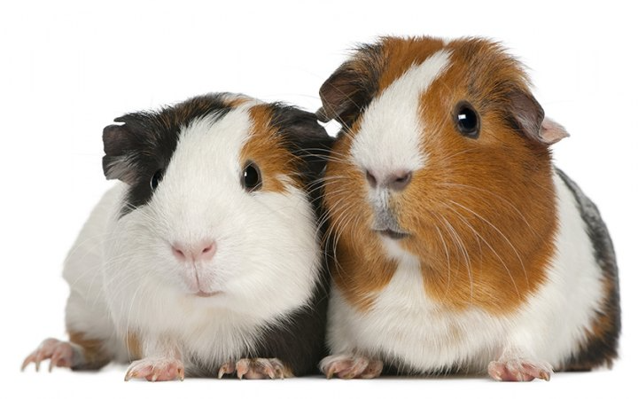
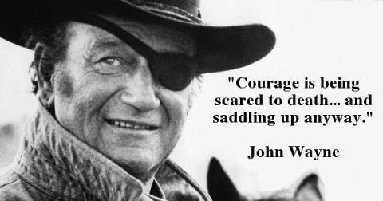

```{r setup, include=FALSE}
knitr::opts_chunk$set(echo = FALSE)
library("jpeg")
```

## Welcome!

### What is this class about?
- Learn to manage, transform, and visualize data using the R programming language  
- Organize messy data, transform it in ways that address your questions, and communicate results  
- Can you turn a computer on? Use a mouse? *No programming experience required*  

## Why are you doing this?

> **Want to Make it as a Biologist? Better Learn to Code**  
> "In biology, big data is the thing. Every day, biologists go into the lab to coax data out of living matter—more and more data, with the advent of biological tools like Crispr/Cas9..."We cannot manually look through 15,000 data points anymore," Udeshi says. To analyze it all, biologists need to write programs specifically tailored for their experiments."  
> [Wired Magazine (2017)](https://www.wired.com/2017/03/biologists-teaching-code-survive/)

```{r out.width = "50%", fig.align = "center"}

```

## Will it hurt?

- At first, yup!
- Learning a new "language" is hard and takes practice
- I am here to guide you, but I won't have all the answers
- We are a community of learners and will help each other

```{r out.width = "75%", fig.align = "center"}

```

## General Information

- Fridays, 2:10-4:00p, 2102 SCC
- Joel Ledford (jmledford@ucdavis.edu)  
- Office: 2220 Life Sciences, Department of Plant Biology
- Rebecca Godwin (rgodwin@ucdavis.edu)

## Logistics

- Attendance is mandatory
- Weekly homework (60%)
- Midterm exam (10%)  
- Group project (30%)

## Let's Get Started!

```{r out.width = "100%", fig.align = "center"}

```