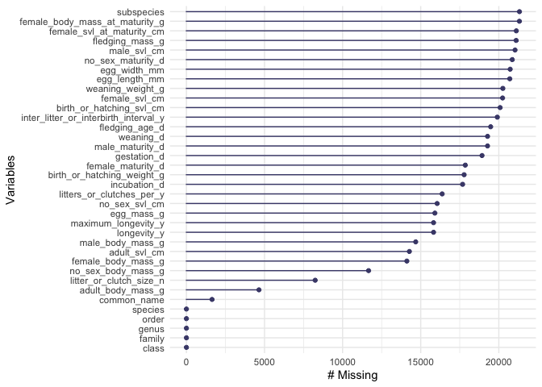

## Instructions
Answer the following questions and complete the exercises in RMarkdown. Please embed all of your code and push your final work to your repository. Your final lab report should be organized, clean, and run free from errors. Remember, you must remove the `#` for the included code chunks to run. Be sure to add your name to the author header above.  

Make sure to use the formatting conventions of RMarkdown to make your report neat and clean!  

## Load the libraries

``` r
library(tidyverse)
library(janitor)
library(naniar)
```

## Data
For this homework, we will use `amniota` data from: Myhrvold N, Baldridge E, Chan B, Sivam D, Freeman DL, Ernest SKM (2015). “An amniote life-history database to perform comparative analyses with birds, mammals, and reptiles.” _Ecology_, *96*, 3109. doi: 10.1890/15-0846.1 (URL: https://doi.org/10.1890/15-0846.1).

``` r
amniota <- read_csv("data/amniota.csv") %>% 
  clean_names()
```

1. Do some exploratory analysis of the `amniota` data set. Use the function(s) of your choice. Try to get an idea of how NA's are represented in the data.

``` r
glimpse(amniota) #NA's are represented by -999
```

```
## Rows: 21,322
## Columns: 36
## $ class                                 <chr> "Aves", "Aves", "Aves", "Aves", …
## $ order                                 <chr> "Accipitriformes", "Accipitrifor…
## $ family                                <chr> "Accipitridae", "Accipitridae", …
## $ genus                                 <chr> "Accipiter", "Accipiter", "Accip…
## $ species                               <chr> "albogularis", "badius", "bicolo…
## $ subspecies                            <dbl> -999, -999, -999, -999, -999, -9…
## $ common_name                           <chr> "Pied Goshawk", "Shikra", "Bicol…
## $ female_maturity_d                     <dbl> -999.000, 363.468, -999.000, -99…
## $ litter_or_clutch_size_n               <dbl> -999.000, 3.250, 2.700, -999.000…
## $ litters_or_clutches_per_y             <dbl> -999, 1, -999, -999, 1, -999, -9…
## $ adult_body_mass_g                     <dbl> 251.500, 140.000, 345.000, 142.0…
## $ maximum_longevity_y                   <dbl> -999.00000, -999.00000, -999.000…
## $ gestation_d                           <dbl> -999, -999, -999, -999, -999, -9…
## $ weaning_d                             <dbl> -999, -999, -999, -999, -999, -9…
## $ birth_or_hatching_weight_g            <dbl> -999, -999, -999, -999, -999, -9…
## $ weaning_weight_g                      <dbl> -999, -999, -999, -999, -999, -9…
## $ egg_mass_g                            <dbl> -999.00, 21.00, 32.00, -999.00, …
## $ incubation_d                          <dbl> -999.00, 30.00, -999.00, -999.00…
## $ fledging_age_d                        <dbl> -999.00, 32.00, -999.00, -999.00…
## $ longevity_y                           <dbl> -999.00000, -999.00000, -999.000…
## $ male_maturity_d                       <dbl> -999, -999, -999, -999, -999, -9…
## $ inter_litter_or_interbirth_interval_y <dbl> -999, -999, -999, -999, -999, -9…
## $ female_body_mass_g                    <dbl> 352.500, 168.500, 390.000, -999.…
## $ male_body_mass_g                      <dbl> 223.000, 125.000, 212.000, 142.0…
## $ no_sex_body_mass_g                    <dbl> -999.0, 123.0, -999.0, -999.0, -…
## $ egg_width_mm                          <dbl> -999, -999, -999, -999, -999, -9…
## $ egg_length_mm                         <dbl> -999, -999, -999, -999, -999, -9…
## $ fledging_mass_g                       <dbl> -999, -999, -999, -999, -999, -9…
## $ adult_svl_cm                          <dbl> -999.00, 30.00, 39.50, -999.00, …
## $ male_svl_cm                           <dbl> -999, -999, -999, -999, -999, -9…
## $ female_svl_cm                         <dbl> -999, -999, -999, -999, -999, -9…
## $ birth_or_hatching_svl_cm              <dbl> -999, -999, -999, -999, -999, -9…
## $ female_svl_at_maturity_cm             <dbl> -999, -999, -999, -999, -999, -9…
## $ female_body_mass_at_maturity_g        <dbl> -999, -999, -999, -999, -999, -9…
## $ no_sex_svl_cm                         <dbl> -999, -999, -999, -999, -999, -9…
## $ no_sex_maturity_d                     <dbl> -999, -999, -999, -999, -999, -9…
```

2. Make any necessary replacements in the data such that all NA's appear as "NA". 

``` r
amniota_tidy <- amniota %>% 
  replace_with_na_all(condition = ~.x == -999)
```

3. How many total NA's are in the data set? Use the package `naniar` to produce a summary, including percentages, of missing data in each column for the `amniota` data.

``` r
miss_var_summary(amniota_tidy)
```

```
## # A tibble: 36 × 3
##    variable                       n_miss pct_miss
##    <chr>                           <int>    <num>
##  1 subspecies                      21322    100  
##  2 female_body_mass_at_maturity_g  21318    100.0
##  3 female_svl_at_maturity_cm       21120     99.1
##  4 fledging_mass_g                 21111     99.0
##  5 male_svl_cm                     21040     98.7
##  6 no_sex_maturity_d               20860     97.8
##  7 egg_width_mm                    20727     97.2
##  8 egg_length_mm                   20702     97.1
##  9 weaning_weight_g                20258     95.0
## 10 female_svl_cm                   20242     94.9
## # ℹ 26 more rows
```

4. Double check your replacement using `summary`. Do you see any other potential issues? If so, fix them.
_`female_maturity_d` column has a value of -30258.711. This is likely a placeholder for missing data._ 

``` r
summary(amniota_tidy)
```

```
##     class              order              family             genus          
##  Length:21322       Length:21322       Length:21322       Length:21322      
##  Class :character   Class :character   Class :character   Class :character  
##  Mode  :character   Mode  :character   Mode  :character   Mode  :character  
##                                                                             
##                                                                             
##                                                                             
##                                                                             
##    species            subspecies    common_name        female_maturity_d 
##  Length:21322       Min.   : NA     Length:21322       Min.   :-30258.7  
##  Class :character   1st Qu.: NA     Class :character   1st Qu.:   288.4  
##  Mode  :character   Median : NA     Mode  :character   Median :   365.0  
##                     Mean   :NaN                        Mean   :   691.2  
##                     3rd Qu.: NA                        3rd Qu.:   819.3  
##                     Max.   : NA                        Max.   :  9131.2  
##                     NA's   :21322                      NA's   :17849     
##  litter_or_clutch_size_n litters_or_clutches_per_y adult_body_mass_g  
##  Min.   :  0.900         Min.   : 0.120            Min.   :        0  
##  1st Qu.:  2.000         1st Qu.: 1.000            1st Qu.:       15  
##  Median :  2.800         Median : 1.050            Median :       44  
##  Mean   :  3.826         Mean   : 1.752            Mean   :    37493  
##  3rd Qu.:  4.150         3rd Qu.: 2.000            3rd Qu.:      238  
##  Max.   :156.000         Max.   :52.000            Max.   :149000000  
##  NA's   :8244            NA's   :16374             NA's   :4645       
##  maximum_longevity_y  gestation_d        weaning_d      
##  Min.   :  0.0833    Min.   :   5.00   Min.   :   1.94  
##  1st Qu.:  6.0000    1st Qu.:  29.91   1st Qu.:  27.75  
##  Median : 12.3083    Median :  63.92   Median :  51.60  
##  Mean   : 16.4657    Mean   : 105.28   Mean   : 113.05  
##  3rd Qu.: 22.0000    3rd Qu.: 151.88   3rd Qu.: 129.83  
##  Max.   :211.0000    Max.   :7396.92   Max.   :1826.25  
##  NA's   :15822       NA's   :18926     NA's   :19279    
##  birth_or_hatching_weight_g weaning_weight_g      egg_mass_g      
##  Min.   :0.000e+00          Min.   :9.000e-01   Min.   :   0.218  
##  1st Qu.:1.300e+00          1st Qu.:1.320e+01   1st Qu.:   2.100  
##  Median :5.890e+00          Median :4.310e+01   Median :   5.100  
##  Mean   :4.480e+03          Mean   :4.139e+04   Mean   :  22.252  
##  3rd Qu.:4.385e+01          3rd Qu.:8.503e+02   3rd Qu.:  20.100  
##  Max.   :2.250e+06          Max.   :1.700e+07   Max.   :1500.000  
##  NA's   :17779              NA's   :20258       NA's   :15907     
##   incubation_d     fledging_age_d   longevity_y       male_maturity_d  
##  Min.   :   2.00   Min.   :  1.0   Min.   :  0.0833   Min.   :  30.44  
##  1st Qu.:  17.00   1st Qu.: 16.5   1st Qu.:  5.5000   1st Qu.: 365.00  
##  Median :  29.25   Median : 27.5   Median : 10.7000   Median : 365.25  
##  Mean   :  46.67   Mean   : 36.8   Mean   : 13.5209   Mean   : 787.16  
##  3rd Qu.:  59.50   3rd Qu.: 46.0   3rd Qu.: 18.2000   3rd Qu.: 913.00  
##  Max.   :1762.00   Max.   :345.0   Max.   :177.0000   Max.   :9131.25  
##  NA's   :17682     NA's   :19478   NA's   :15822      NA's   :19278    
##  inter_litter_or_interbirth_interval_y female_body_mass_g  male_body_mass_g   
##  Min.   :0.0465                        Min.   :      0.3   Min.   :      0.3  
##  1st Qu.:0.3184                        1st Qu.:     14.0   1st Qu.:     16.5  
##  Median :0.9993                        Median :     40.7   Median :     48.4  
##  Mean   :0.9067                        Mean   :   2075.8   Mean   :   6196.8  
##  3rd Qu.:1.0000                        3rd Qu.:    220.0   3rd Qu.:    245.5  
##  Max.   :4.8467                        Max.   :3700000.0   Max.   :4545000.0  
##  NA's   :19904                         NA's   :14113       NA's   :14679      
##  no_sex_body_mass_g   egg_width_mm    egg_length_mm    fledging_mass_g  
##  Min.   :        0   Min.   :  2.50   Min.   :  2.50   Min.   :   4.85  
##  1st Qu.:       13   1st Qu.:  8.00   1st Qu.: 10.94   1st Qu.:  14.60  
##  Median :       35   Median : 13.00   Median : 19.98   Median :  24.80  
##  Mean   :    68952   Mean   : 22.99   Mean   : 36.40   Mean   : 452.27  
##  3rd Qu.:      164   3rd Qu.: 35.90   3rd Qu.: 58.92   3rd Qu.: 107.00  
##  Max.   :136000000   Max.   :125.00   Max.   :455.00   Max.   :9992.00  
##  NA's   :11663       NA's   :20727    NA's   :20702    NA's   :21111    
##   adult_svl_cm      male_svl_cm     female_svl_cm      birth_or_hatching_svl_cm
##  Min.   :   1.79   Min.   :  1.57   Min.   :   1.800   Min.   :  0.400         
##  1st Qu.:   9.50   1st Qu.: 21.41   1st Qu.:   5.756   1st Qu.:  2.450         
##  Median :  18.50   Median : 35.85   Median :   8.150   Median :  3.300         
##  Mean   :  38.20   Mean   : 50.44   Mean   :  20.609   Mean   : 12.099         
##  3rd Qu.:  40.50   3rd Qu.: 63.39   3rd Qu.:  17.721   3rd Qu.:  5.256         
##  Max.   :3049.00   Max.   :315.20   Max.   :1125.000   Max.   :759.999         
##  NA's   :14274     NA's   :21040    NA's   :20242      NA's   :20085           
##  female_svl_at_maturity_cm female_body_mass_at_maturity_g no_sex_svl_cm   
##  Min.   :  2.85            Min.   :    30.0               Min.   :   1.7  
##  1st Qu.:  4.90            1st Qu.:    82.5               1st Qu.:   5.7  
##  Median :  6.00            Median : 97050.0               Median :   7.7  
##  Mean   : 18.69            Mean   : 97032.5               Mean   :  20.0  
##  3rd Qu.:  8.40            3rd Qu.:194000.0               3rd Qu.:  11.0  
##  Max.   :580.00            Max.   :194000.0               Max.   :3300.0  
##  NA's   :21120             NA's   :21318                  NA's   :16052   
##  no_sex_maturity_d
##  Min.   :   33.0  
##  1st Qu.:  365.3  
##  Median :  913.1  
##  Mean   : 1604.5  
##  3rd Qu.: 2008.9  
##  Max.   :14610.0  
##  NA's   :20860
```


``` r
amniota_tidy %>% 
  filter(female_maturity_d=="-30258.711") 
```

```
## # A tibble: 4 × 36
##   class order      family genus species subspecies common_name female_maturity_d
##   <chr> <chr>      <chr>  <chr> <chr>        <dbl> <chr>                   <dbl>
## 1 Aves  Accipitri… Accip… Circ… melano…         NA Pied Harri…           -30259.
## 2 Aves  Passerifo… Vidui… Vidua funerea         NA Dusky Indi…           -30259.
## 3 Aves  Passerifo… Vidui… Vidua nigeri…         NA Quailfinch…           -30259.
## 4 Aves  Passerifo… Vidui… Vidua purpur…         NA Purple Ind…           -30259.
## # ℹ 28 more variables: litter_or_clutch_size_n <dbl>,
## #   litters_or_clutches_per_y <dbl>, adult_body_mass_g <dbl>,
## #   maximum_longevity_y <dbl>, gestation_d <dbl>, weaning_d <dbl>,
## #   birth_or_hatching_weight_g <dbl>, weaning_weight_g <dbl>, egg_mass_g <dbl>,
## #   incubation_d <dbl>, fledging_age_d <dbl>, longevity_y <dbl>,
## #   male_maturity_d <dbl>, inter_litter_or_interbirth_interval_y <dbl>,
## #   female_body_mass_g <dbl>, male_body_mass_g <dbl>, …
```


``` r
amniota_tidy <- amniota_tidy %>% 
  mutate(female_maturity_d=ifelse(female_maturity_d<0, NA, female_maturity_d))
```


``` r
amniota_tidy <- amniota_tidy %>% 
  replace_with_na(replace= list(female_maturity_d=-30258.711))
```

5. Use `naniar` to visualize the number of NA's in each variable. Which variables have the most NA's?

``` r
amniota_tidy %>% 
  gg_miss_var()
```

<!-- -->

6. Calculate the number of NAs in the `egg_mass_g` column sorted by taxonomic class; i.e. how many NA's are present in the `egg_mass_g` column in birds, mammals, and reptiles? Does this results make sense biologically? How do these results affect your interpretation of NA's?**  

_NA's could reflect missing data (no observations were recorded) or it could reflect data that are truly not applicable._  


``` r
amniota_tidy %>%
  select(class, egg_mass_g) %>% 
  group_by(class) %>%
  miss_var_summary(order=T)
```

```
## # A tibble: 3 × 4
## # Groups:   class [3]
##   class    variable   n_miss pct_miss
##   <chr>    <chr>       <int>    <num>
## 1 Aves     egg_mass_g   4914     50.1
## 2 Mammalia egg_mass_g   4953    100  
## 3 Reptilia egg_mass_g   6040     92.0
```

## Knit and Upload
Please knit your work as an .html file and upload to Canvas. Homework is due before the start of the next lab. No late work is accepted. Make sure to use the formatting conventions of RMarkdown to make your report neat and clean! 
