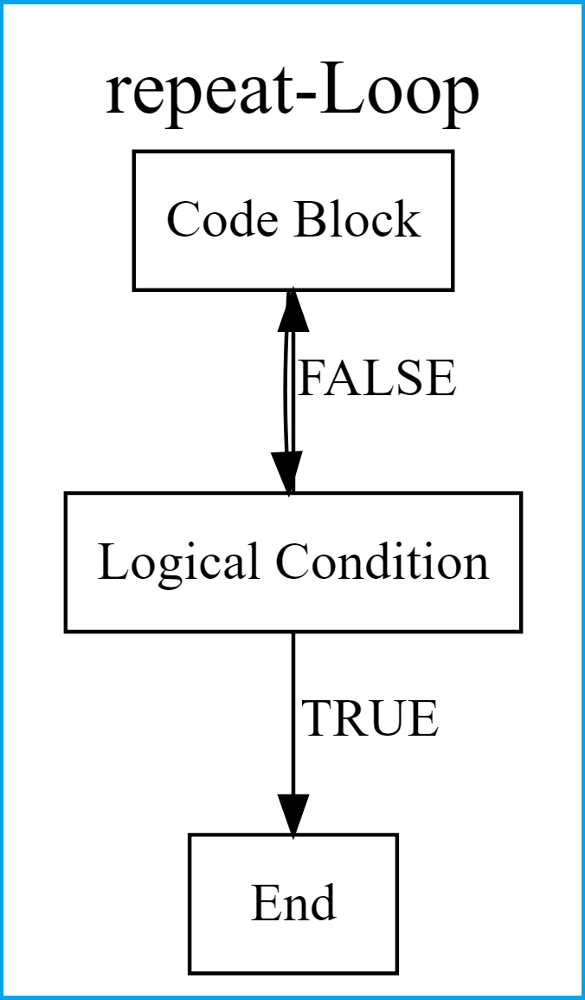
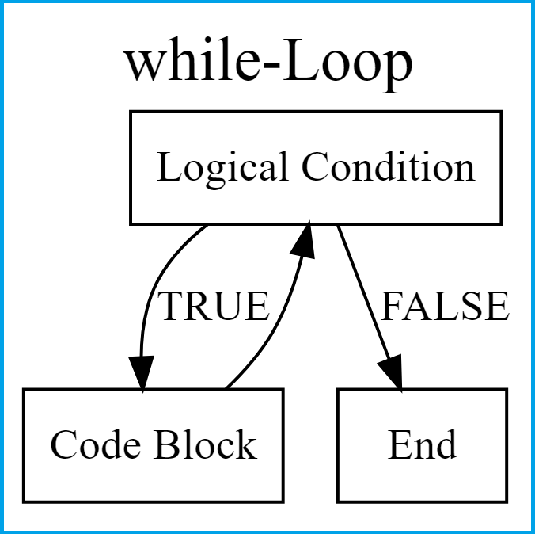
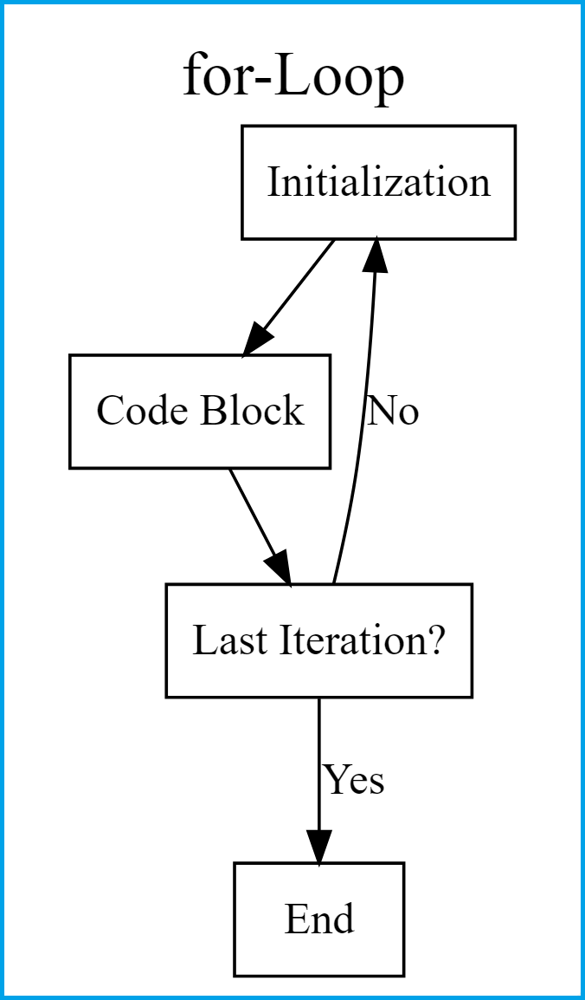

## Learning Goals
*At the end of this exercise, you will be able to:*  
1. know the concept of loops.
2. understand the three different types of loops.
3. use loops in vectors and data frames.
4. use loops through multiple files and create a summary.

## Resources and references
- [Statistics Globe](https://statisticsglobe.com/loops-in-r/)
- [R - Loops](https://www.tutorialspoint.com/r/r_loops.htm)
- [Data Carpentry for Biologists](https://datacarpentry.org/semester-biology/materials/for-loops-R/)
- [Data Carpentry](https://github.com/datacarpentry/semester-biology)
- [Data Science in Omics Introduction](https://hoytpr.github.io/bioinformatics-semester/)

## Load the libraries
```{r message=FALSE, warning=FALSE}
library(tidyverse)
library(ggmap)
library(lubridate)
```

## What Are Loops?
A loop is a programming instruction that repeats until a specific condition is reached. Each time the code block within the loop is executed is called an iteration.
*Different Types of Loops:*
Depending on your specific programming situation, you may need different loop-structures that execute the code blocks within the loop on the basis of different conditions. The R programming language generally provides three different types of loops: 
1. Repeat-loops, 2. While-loops, 3. For-loops

## Repeat-Loops
Repeat-loops repeat a code block until a break condition is fulfilled. This break condition marks the end of the loop.


### Syntax of repeat loop
```{r,eval=FALSE}
repeat { 
   commands 
   if(condition) {
      break
   }
}
```

### example 0: Writing a repeat-Loop in R (Basics)
```{r}
x <- 0                 # Preliminary specification of data object
repeat{                # Head of repeat-loop
  x <- x + 1           # Body of repeat-loop
  print(x)
  if(x >= 10) {        # Break condition of repeat-loop
    break
  }
}
```

### example 1: repeat-Loop Through Columns of Data Frame
```{r}
data <- data.frame(x1 = 1:5,      # Create example data
                   x2 = 6:10,
                   x3 = 11:15)
data 


data1 <- data                   # Replicate example data
i <- 1                          # Create running index
repeat{                         # Start repeat-loop
  data1[ , i] <- data1[ , i] + 100
  i <- i + 1
  if(i > 2) {
    break
  }
}
data1
```

### Practice: Please write a repeat loop to change all numeric data from in centimeters to millimeters.
```{r}
#?iris
data(iris)                          # Loading data frame
head(iris)                          # Head of example data
iris1 <- iris                       # Replicate example data

i <- 1
repeat{
  iris1[ , i] <- iris1[ , i] * 10
  i <- i + 1
  if(!is.numeric(iris1[ , i])){
    break
  }
}
head(iris1)
```

## While-Loops
While-loops repeat a code block as long as a certain logical condition is TRUE. It tests the condition before executing the loop body.


### Syntax of while loop
```{r,eval=FALSE}
while (test_expression) {
   statement
}
```

### example 0: Writing while-Loop in R (Basics)
```{r}
x <- 0                  # Preliminary specification of data object
while(x < 10) {         # Head of while-loop
  x <- x + 1            # Body of while-loop
  print(x)
}
```

### example 1: while-Loop Through Columns of Data Frame
```{r}
data2 <- data                       # Replicate example data
data2
i <- 1                              # Create running index
while(i <= 2) {                     # Start while-loop
  data2[ , i] <- data2[ , i] + 100
  i <- i + 1
}
data2
```

### Practice: Please write a while loop to change all numeric data from in centimeters to millimeters.
```{r}
head(iris)                                        # Showing head of data in RStudio console
iris2 <- iris                                     # Replicate example data

i <- 1
while(is.numeric(iris2[ , i])){
  iris2[ , i] <- iris2[ , i] * 10
  i <- i + 1
}
head(iris2) 
```

## For-Loops
For-loops specify a collection of objects (e.g. elements in a vector or list) to which a code block should be applied.


### Syntax of for loop
```{r,eval=FALSE}
for (value in vector) {
   statements
}
```

### example 0: Loop Through Vector in R (Basics)
```{r}
for (i in 1:10) {
  print(i)
}
```

### example 1: For-Loop Through Columns of Data Frame
```{r}
data3 <- data                       # Replicate example data
data3
for(i in 1:2) {           # for-loop over columns
  data3[ , i] <- data3[ , i] + 100
}
data3
```

### Practice: Please write a for loop to change only width data from in centimeters to millimeters.
```{r}                                                 
head(iris)                                             # Inspecting iris flower data set
iris3 <- iris                                          # Replicate iris data set

for(i in c(2,4)){
  iris3[ , i] <- iris3[ , i] * 10
}
head(iris3)

for(i in 1:ncol(iris3)){
  if(str_detect(colnames(iris3)[i], "Width")){
    iris3[ , i] <- iris3[ , i] * 10
  }
}
head(iris3)
```

### example 2: Looping over files
The simulated satellite collar data is downloaded from [Data Carpentry](http://www.datacarpentry.org/semester-biology/data/locations.zip).
We can get the names of each of the files we want to loop over by using `list.files()`.
```{r}
data_files <- list.files("data/locations", pattern = "locations-2*", full.names = TRUE)
data_files
```

We would like to count the number of observations in each file.
```{r message=FALSE, warning=FALSE}
# create an empty vector to store those counts
results <- vector(mode = "integer", length = length(data_files))

for (i in 1:length(data_files)){
  data0 <- read_csv(data_files[i])
  count <- nrow(data0)
  results[i] <- count
}
results
```

### Practice 2: Storing loop results in a data frame
```{r}
# Start by creating an empty data frame
results <- data.frame(file_name = vector(mode = "character", length = length(data_files)),
                      count = vector(mode = "integer", length = length(data_files)))

for (i in 1:length(data_files)){
  data0 <- read_csv(data_files[i])
  count <- nrow(data0)
  results$file_name[i] <- data_files[i]
  results$count[i] <- count
}
results
```

### example 3: Looping over files for ggplot
Let’s use some satellite collar data on a number of different individuals and we want to be able to quickly look at all of their recent movements at once.
```{r message=FALSE, warning=FALSE}
data_files3 <- list.files("data/individual_collar_data", full.names = TRUE)
data_files3
# only ggplot
for (i in 1:length(data_files3)){
  data0 <- as.data.frame(read_csv(data_files3[i]))
  print(
    ggplot(data0, aes(x=long,y=lat))+
      geom_path()+
      geom_point()+
      labs(title = data_files3[i], x = "longitude", y = "latitude")
  )
}
# how to show them on a map?

# summary table
data_list <- lapply(data_files3, read_csv)
collar_data_all <- bind_rows(data_list)
collar_data_all %>% 
  summarise(max_lat=max(lat),
            min_lat=min(lat),
            max_long=max(long),
            min_long=min(long))

lat <- c(14.91539, 31.56526)
long <- c(122.0874, 134.9906)
bbox <- make_bbox(long, lat, f = 0.5)
map <- get_map(bbox, maptype = "terrain", source = "stamen")
ggmap(map)

for (i in 1:length(data_files3)){
  data0 <- as.data.frame(read_csv(data_files3[i]))
  print(
    ggmap(map)+
      geom_path(data = data0, aes(long,lat))+
      geom_point(data = data0, aes(long,lat))+
      labs(title = data_files3[i], x = "longitude", y = "latitude")
  )
}

```

### example 4: Looping over files for basic genetic analysis
[Bioconductor](https://www.bioconductor.org/) project is an open source software repository that hosts a wide range of statistical tools developed in the R programming environment. Please use standard R installation procedures to install the BiocManager package and then install "ShortRead" and "Biostrings". 
```{r message=FALSE, warning=FALSE}
# if (!requireNamespace("BiocManager", quietly = TRUE))
#     install.packages("BiocManager")
# BiocManager::install()                            # To install core packages or update installed packages
# BiocManager::install(c("ShortRead", "Biostrings"))# Install specific packages
library(ShortRead)
library(Biostrings)
```

The data is downloaded from [PATRIC, BACTERIAL BIOINFORMATICS RESOURCE CENTER](https://patricbrc.org/)
The first two lines load a .[fasta](https://en.wikipedia.org/wiki/FASTA_format) file using the ShortRead package in Bioconductor. The second two lines determine the frequency of all of the bases in sequence and then calculate the GC content.
```{r}
reads <- readFasta("data/archaea-dna/a-saccharovorans.fasta")
seq <- sread(reads)
base_freq <- alphabetFrequency(seq)
gc_content <- (base_freq[1, "G"] + base_freq[1, "C"]) / sum(base_freq) * 100
gc_content
```

Then create a for loop that uses the above code to read in each sequence file and calculate it’s GC content. Store the resulting values in a data frame with one column with file names and a second column with GC contents.
```{r}
data_files2 <- list.files("data/archaea-dna")
data_files2

GC_results <- data.frame(file_name = vector(mode = "character", length = length(data_files2)),
                         gc_content = vector(mode = "integer", length = length(data_files2)))

for (i in 1:length(data_files2)){
  reads <- readFasta("data/archaea-dna",data_files2[i])
  seq <- sread(reads)
  base_freq <- alphabetFrequency(seq)
  gc_content <- (base_freq[1, "G"] + base_freq[1, "C"]) / sum(base_freq) * 100
  GC_results$file_name[i] <- data_files2[i]
  GC_results$gc_content[i] <- gc_content
}
GC_results
```

## Packages for next time  
Please install packages below for part 2!  
```{r}
#install.packages("qtl")
#install.packages("qtlcharts")
```

## That's it! Take a break and I will see you on Zoom!  

-->[Home](https://jmledford3115.github.io/datascibiol/)