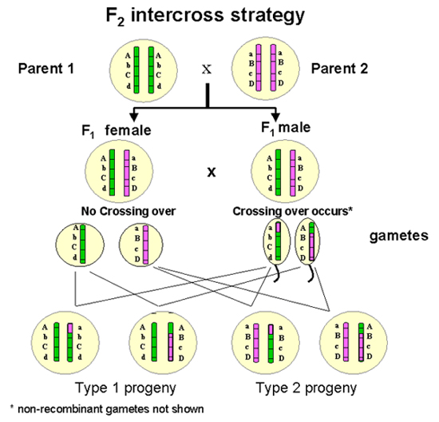

## Learning Goals
*At the end of this exercise, you will be able to:* 
1. know the concept of F2 intercross and the standard input format for R/qtl
2. summarize and understand the F2 intercross data
3. construct basic genetic map using R/qtl
4. create interactive graphics for genetic mapping using R/qtlcharts

## Resources and references
- [R/qtl: A QTL mapping environment](https://rqtl.org/)
- [R/qtl manual](https://rqtl.org/manual/qtl-manual.pdf)
- [R/qtlcharts Interactive Graphics for Quantitative Trait Locus Mapping](https://www.ncbi.nlm.nih.gov/pmc/articles/PMC4317647/)
- [R/qtlcharts](http://kbroman.org/qtlcharts/)

## F2 intercross strategy
- [Resource](http://www.cdfd.org.in/SILKSAT/F2_cross_strategy.html)


## Load the libraries
```{r}
library(qtl)
library(qtlcharts)
knitr::opts_chunk$set(fig.width=8, fig.height=6, message=FALSE)
```

The function read.cross is for importing data into R/qtl.
```{r}
?read.cross
```

## Example 1: Identify genomic regions that regulate blood pressure, heart rate, and heart weight
We will consider data from [Sugiyama et al., Physiol Genomics 10:5–12, 2002](https://journals.physiology.org/doi/full/10.1152/physiolgenomics.00002.2002). The data are from an intercross between BALB/cJ and CBA/CaJ; only male offspring were considered. There are four phenotypes: blood pressure, heart rate, body weight, and heart weight.
"sug.csv" is the name of the file, which we import directly from the R/qtl website. genotypes indicates the codes used for the genotypes; alleles indicates single-character codes to be used in plots and such.
```{r}
sug <- read.cross("csv", "https://rqtl.org", "sug.csv",
                  genotypes=c("CC", "CB", "BB"), alleles=c("C", "B"))
```

## Summaries
Get a quick summary of the data. 
```{r}
summary(sug)
```
```{r}
head(sug$pheno)
```


There are a number of simple functions for pulling out pieces of summary information. 
```{r}
nind(sug)    # No. individuals
nphe(sug)    # No. phenotypes
nchr(sug)    # No. chromosomes
totmar(sug)  # Total markers
nmar(sug)    # No. markers on each chromosome
```
Get a summary plot of the data.
```{r}
plot(sug)
```

Individual parts of the above plot may be obtained as follows.
```{r}
#?plotMissing
plotMissing(sug, main="")
plotMissing(sug, main="", reorder=1)
#?plotMap
plotMap(sug)
plotMap(sug,show.marker.names=TRUE)
#?plotPheno
plotPheno(sug, pheno.col=1)
plotPheno(sug, pheno.col=2)
plotPheno(sug, pheno.col=3)
plotPheno(sug, pheno.col=4)
```

Let’s make an interactive chart of the genetic map of markers for these data using R/qtlcharts.
```{r}
iplotMap(sug) #D7MIT31
```
Let’s use iplotCorr to plot a heat map of the correlation matrix for the phenotype of all pairs, linked to scatterplots of the phenotypes.
```{r}
iplotCorr(sug$pheno)
iplotCorr(sug$pheno, chartOpts=list(height=300, width=600, scatcolors="pink"))
```
The interactive graphs produced by R/qtlcharts are, by default, saved to a temporary file and then opened in the default web browser. If you want to save a chart to a particular file, assign the result to some object and use the function `saveWidget()` in the [htmlwidgets package] (http://www.htmlwidgets.org/), as follows:
```{r}
corrplot <- iplotCorr(sug$pheno, chartOpts=list(height=300, width=600, scatcolors="pink"))
htmlwidgets::saveWidget(corrplot, file="iplotCorr_example.html")
```

## Quantitative Trait Locus (QTL) Analysis
Quantitative trait locus (QTL) analysis is a statistical method that links two types of information—phenotypic data (trait measurements) and genotypic data (usually molecular markers)—in an attempt to explain the genetic basis of variation in complex traits (Falconer & Mackay, 1996; Kearsey, 1998; Lynch & Walsh, 1998). [Quantitative Trait Locus (QTL) Analysis](https://www.nature.com/scitable/topicpage/quantitative-trait-locus-qtl-analysis-53904/)

### LOD Score
LOD score is actually an acronym for "log of the odds," LOD. LOD score actually refers to a numerical result when estimating whether two genes, or a gene and a disease, are linked to one another. [NIH LOD Score](https://www.genome.gov/genetics-glossary/LOD-Score#:~:text=LOD%20stands%20for%20%22logarithm%20of,therefore%20likely%20to%20be%20inherited.)

### Single-QTL analysis
We first calculate the QTL genotype probabilities, given the observed marker data, via the function calc.genoprob. This is done at the markers and at a grid along the chromosomes. The argument step is the density of the grid (in cM), and defines the density of later QTL analyses. To perform a single-QTL genome scan, we use the function scanone. By default, it considers the first phenotype in the input cross object (in this case, blood pressure).
```{r}
sug <- calc.genoprob(sug, step=1)
out.em <- scanone(sug)
out.em2 <- scanone(sug, pheno.col=1:4)
```
The output has “class” "scanone". The summary function is passed to the function summary.scanone, and gives the maximum LOD score on each chromosome.
```{r}
summary(out.em)
summary(out.em2)
```
Alternatively, we can give a threshold, e.g., to only see those chromosomes with LOD > 3.
```{r}
summary(out.em, threshold=3)
```
We can plot the results as follows.
```{r}
plot(out.em)
```
```{r}
plot(out.em, chr=c(7,15), ylab="LOD Score")
```
### iplotScanone
iplotScanone creates an interactive chart with LOD curves from a genome scan linked to estimated QTL effects. If you provide just the output from scanone, the only interactivity is that hovering over marker positions on the LOD curves will give information about the marker name, position, and LOD score.
```{r}
iplotScanone(out.em)
```
You can use the chr to plot only selected chromosomes.
```{r}
iplotScanone(out.em, chr=c(7,15))
```

```{r}
iplotScanone(out.em, sug)
```

```{r}
iplotScanone(out.em, sug, chr=c(7,15))
```

## Example 2: Gravitropism in Arabidopsis
We’ll consider the grav dataset included with R/qtlcharts. These are data from [Moore et al. Genetics 195:1077-1086, 2013](https://doi.org/10.1534/genetics.113.153346), on a QTL experiment on gravitropism in Arabidopsis, with data on 162 recombinant inbred lines (Ler × Cvi). Seedlings were sprouted and then rotated 90 degrees with respect to gravity; the growth of the seedlings was then recorded on video. The outcome is the root tip angle (in degrees) at two-minute increments over eight hours.

```{r}
data(grav)
```
## Practice
1. Get a quick summary of the grav data. 
```{r}
summary(grav)
```
2. Make an genetic map of markers for the grav data.
```{r}
plotMap(grav)
```
```{r}
iplotMap(grav)
```
3. Plot a heat map of the correlation matrix for the phenotype at all pairs of times, linked to scatterplots of the phenotypes.
```{r}
head(grav$pheno)
iplotCorr(grav$pheno)
```
## iplotCurves
iplotCurves creates a plot of a set of curves linked to one or two scatterplots.

```{r}
iplotCurves(grav$pheno)
```
```{r}
times1 <- as.numeric(sub("T", "", phenames(grav)))/60
times1
times <- attr(grav, "time")
times
#?attr
phe <- grav$pheno
head(phe)
```

```{r}
iplotCurves(phe, times)
```
To change the axis labels, pass curves_xlab and curves_ylab using chartOpts.
```{r}
iplotCurves(phe, times, chartOpts=list(curves_xlab="Time (hrs)",
                                       curves_ylab="Response"))
```

```{r}
iplotCurves(phe, times, phe[,c("T30", "T240")], phe[,c("T240", "T480")],
            chartOpts=list(curves_xlab="Time", curves_ylab="Root tip angle",
                           scat1_xlab="Angle at 30 min", scat1_ylab="Angle at 4 hrs",
                           scat2_xlab="Angle at 4 hrs", scat2_ylab="Angle at 8 hrs"))
```

Let’s further run a single-QTL genome scan with each individual time point.
```{r}
grav <- calc.genoprob(grav, step=1)
out.em <- scanone(grav, pheno.col=1:nphe(grav))
summary(out.em)
```

## Charts within a loop
If you want to produce multiple interactive charts within a loop.
```{r}
times_m <- c("T30", "T240", "T480")
times_clear <- c("30 mins", "4 hours", "8 hours")
times_number <- match(times_m, phenames(grav))

for(i in 1:length(times_m))
    print(iplotScanone(out.em, lodcolumn=times_number[i], chartOpts=list(title=times_clear[i])))
```

## That's it, let's take a break!   

-->[Home](https://jmledford3115.github.io/datascibiol/)