## Instructions
Answer the following questions and complete the exercises in RMarkdown. Please embed all of your code and push your final work to your repository. Your final lab report should be organized, clean, and run free from errors. Remember, you must remove the `#` for the included code chunks to run. Be sure to add your name to the author header above. For any included plots, make sure they are clearly labeled. You are free to use any plot type that you feel best communicates the results of your analysis.  

Make sure to use the formatting conventions of RMarkdown to make your report neat and clean!  

## Load the libraries

```r
library(qtl)
library(qtlcharts)
library(tidyverse)
library(ggmap)
```

**1. We have a satellite collars on a number of different individuals and want to be able to quickly look at all of their recent movements at once. Please load all the data files from `us_individual_collar_data` and use for loop to create plots for all different individuals of the path they move on longitude and latitude.**

```r
data_files <- list.files("data/us_individual_collar_data", full.names = TRUE)
# only ggplot
for (i in 1:length(data_files)){
  data0 <- as.data.frame(read_csv(data_files[i]))
  print(
    ggplot(data0, aes(x=long,y=lat,color=time))+
      geom_path()+
      geom_point()+
      labs(title = data_files[i], x = "longitude", y = "latitude")
  )
}
```

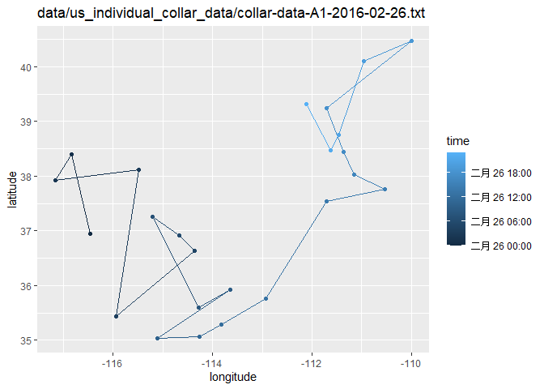<!-- -->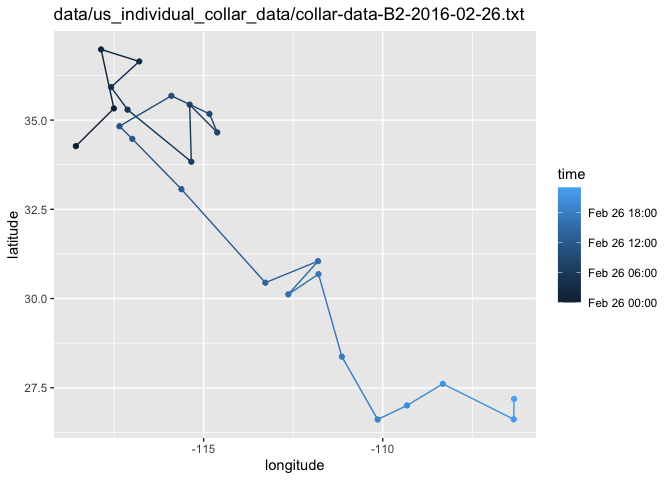<!-- -->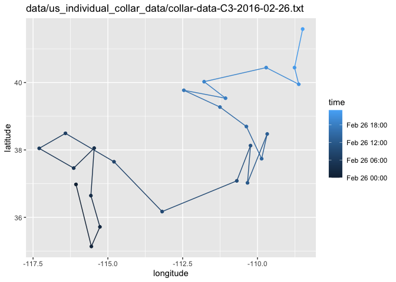<!-- -->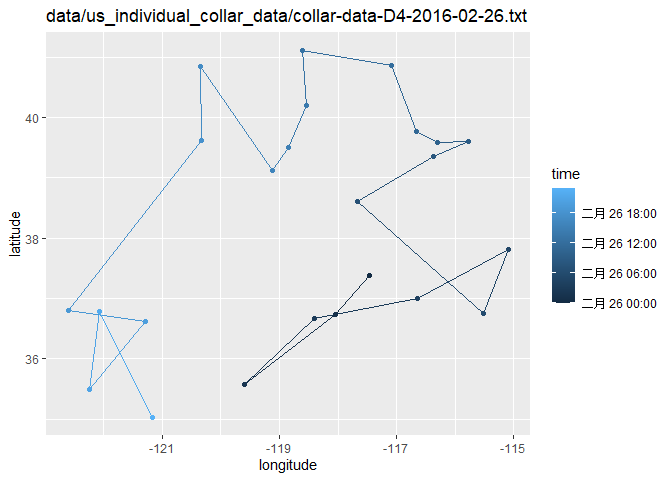<!-- -->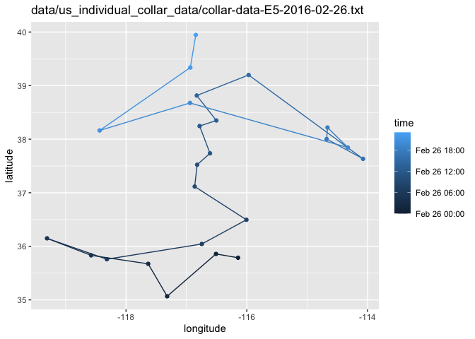<!-- -->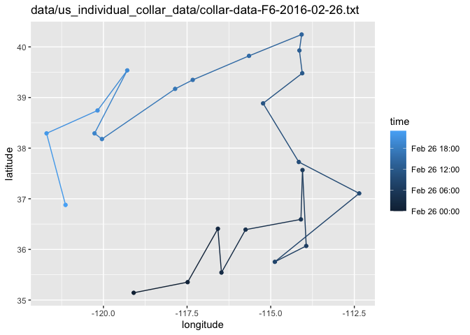<!-- -->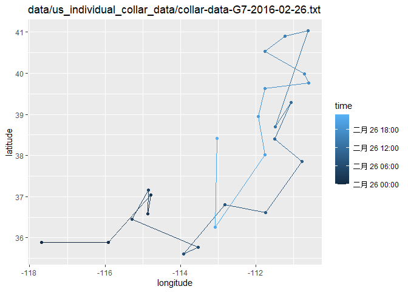<!-- -->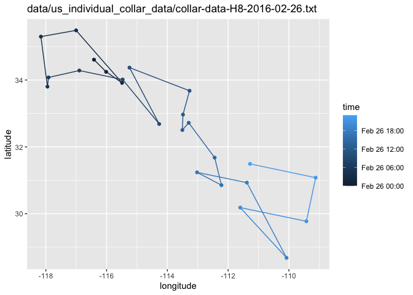<!-- -->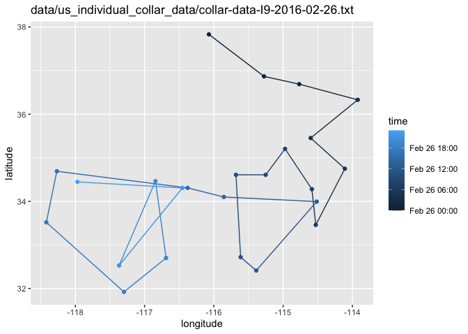<!-- -->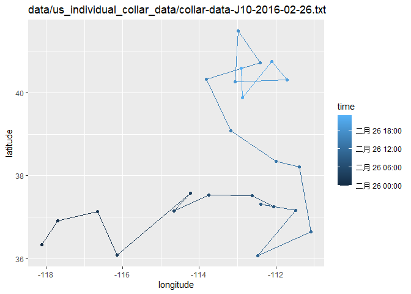<!-- -->

**2. Please load all the data files from `us_individual_collar_data` and combine all data into one data frame. Create a summary to show what is the maximum and minimum of recorded data points on longitude and latitude.**

```r
# summary table
data_list <- lapply(data_files, read_csv)
(collar_data_all <- bind_rows(data_list))
```

```
## # A tibble: 240 x 6
##       X1 date       collar time                  lat  long
##    <dbl> <date>     <chr>  <dttm>              <dbl> <dbl>
##  1     1 2016-02-26 A1     2016-02-26 00:00:00  37.0 -116.
##  2     2 2016-02-26 A1     2016-02-26 01:00:00  38.4 -117.
##  3     3 2016-02-26 A1     2016-02-26 02:00:00  37.9 -117.
##  4     4 2016-02-26 A1     2016-02-26 03:00:00  38.1 -115.
##  5     5 2016-02-26 A1     2016-02-26 04:00:00  35.4 -116.
##  6     6 2016-02-26 A1     2016-02-26 05:00:00  36.6 -114.
##  7     7 2016-02-26 A1     2016-02-26 06:00:00  36.9 -115.
##  8     8 2016-02-26 A1     2016-02-26 07:00:00  37.3 -115.
##  9     9 2016-02-26 A1     2016-02-26 08:00:00  35.6 -114.
## 10    10 2016-02-26 A1     2016-02-26 09:00:00  35.9 -114.
## # ... with 230 more rows
```

```r
collar_data_all %>% 
  summarise(max_lat=max(lat),
            min_lat=min(lat),
            max_long=max(long),
            min_long=min(long))
```

```
## # A tibble: 1 x 4
##   max_lat min_lat max_long min_long
##     <dbl>   <dbl>    <dbl>    <dbl>
## 1    41.6    26.6    -106.    -123.
```

**3. Use the range of the latitude and longitude from Q2 to build an appropriate bounding box for your map and load a map from `stamen` in a terrain style projection and display the map. Then, build a final map that overlays the recorded path from Q1.**

```r
# on a map
lat <- c(26.6116, 41.58802)
long <- c(-122.6017, -106.3343)
bbox <- make_bbox(long, lat, f = 0.5)
map <- get_map(bbox, maptype = "terrain", source = "stamen")
ggmap(map)
```

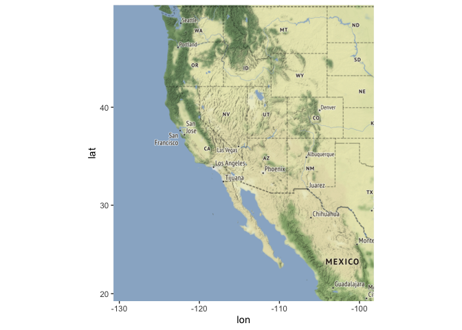<!-- -->

```r
for (i in 1:length(data_files)){
  data0 <- as.data.frame(read_csv(data_files[i]))
  print(
    ggmap(map)+
      geom_path(data = data0, aes(long,lat))+
      geom_point(data = data0, aes(long,lat,color=time))+
      labs(title = data_files[i], x = "longitude", y = "latitude")
  )
}
```

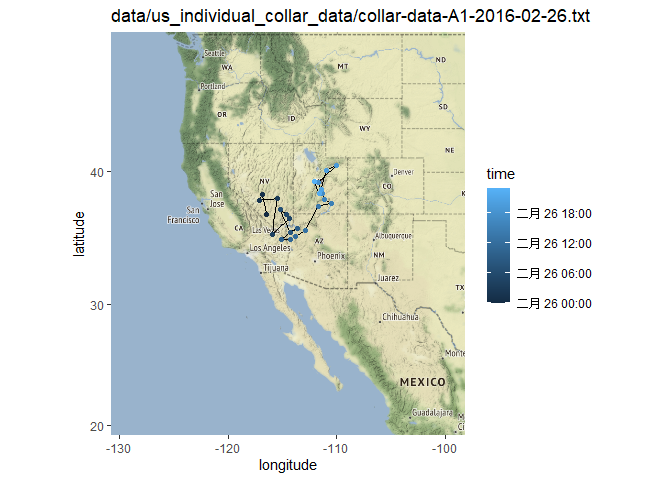<!-- -->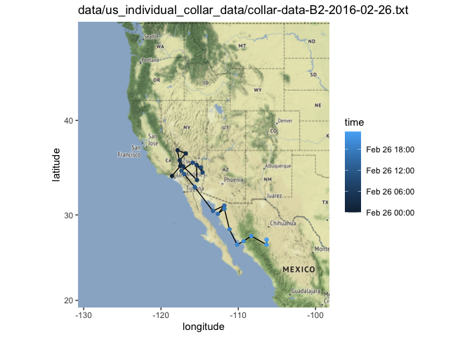<!-- --><!-- -->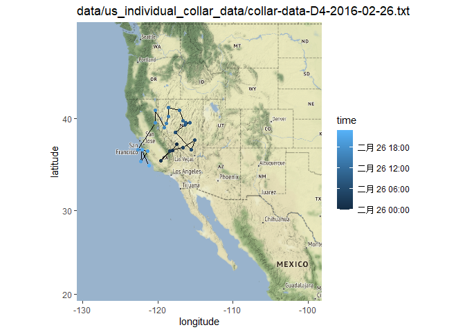<!-- --><!-- --><!-- -->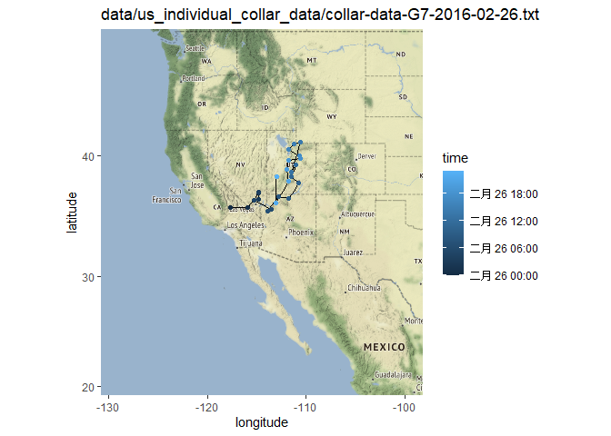<!-- -->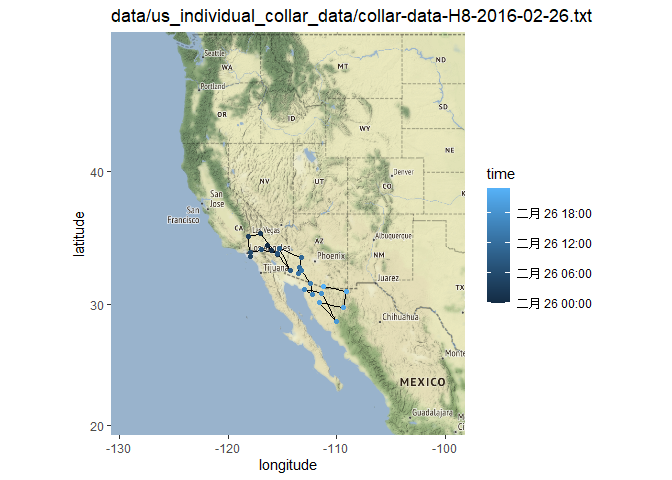<!-- -->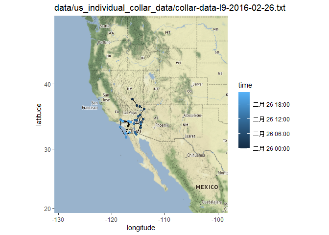<!-- -->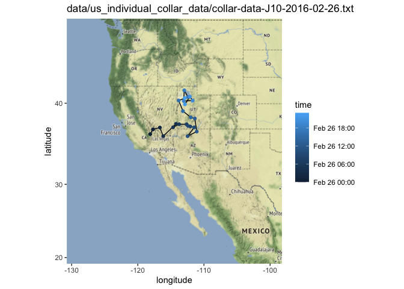<!-- -->

## Load the Data
We will use the data from an experiment on hypertension in the mouse [Sugiyama et al., Genomics 71:70-77, 2001](https://www.sciencedirect.com/science/article/pii/S0888754300964012?via%3Dihub)

```r
#?hyper
data(hyper)
```

**4. Create a summary of the hypertension data. How many individuals and phenotypes are included in this data set? How many gene markers and chromosomes are included in this data set? Please create a table to show the number of markers on each chromosome.**

```r
summary(hyper)
```

```
##     Backcross
## 
##     No. individuals:    250 
## 
##     No. phenotypes:     2 
##     Percent phenotyped: 100 100 
## 
##     No. chromosomes:    20 
##         Autosomes:      1 2 3 4 5 6 7 8 9 10 11 12 13 14 15 16 17 18 19 
##         X chr:          X 
## 
##     Total markers:      174 
##     No. markers:        22 8 6 20 14 11 7 6 5 5 14 5 5 5 11 6 12 4 4 4 
##     Percent genotyped:  47.7 
##     Genotypes (%):    
##           Autosomes:    BB:50.1  BA:49.9 
##        X chromosome:    BY:53.0  AY:47.0
```

```r
nind(hyper)    # No. individuals
```

```
## [1] 250
```

```r
nphe(hyper)    # No. phenotypes
```

```
## [1] 2
```

```r
nchr(hyper)    # No. chromosomes
```

```
## [1] 20
```

```r
totmar(hyper)  # Total markers
```

```
## [1] 174
```
> 250 individuals and 2 phenotypes (one of them is ID) are included in this data set.

> 174 gene markers and 20 chromosomes are included in this data set.


```r
nmar(hyper)    # No. markers on each chromosome
```

```
##  1  2  3  4  5  6  7  8  9 10 11 12 13 14 15 16 17 18 19  X 
## 22  8  6 20 14 11  7  6  5  5 14  5  5  5 11  6 12  4  4  4
```

**5. Please make an interactive genetic map of markers for the hypertension data.**

```r
iplotMap(hyper)
```

```
## Set screen size to height=700 x width=1000
```

```{=html}
<div id="htmlwidget-0ec6891f2bc9aa535842" style="width:672px;height:480px;" class="iplotMap html-widget"></div>
<script type="application/json" data-for="htmlwidget-0ec6891f2bc9aa535842">{"x":{"data":{"chr":["1","1","1","1","1","1","1","1","1","1","1","1","1","1","1","1","1","1","1","1","1","1","2","2","2","2","2","2","2","2","3","3","3","3","3","3","4","4","4","4","4","4","4","4","4","4","4","4","4","4","4","4","4","4","4","4","5","5","5","5","5","5","5","5","5","5","5","5","5","5","6","6","6","6","6","6","6","6","6","6","6","7","7","7","7","7","7","7","8","8","8","8","8","8","9","9","9","9","9","10","10","10","10","10","11","11","11","11","11","11","11","11","11","11","11","11","11","11","12","12","12","12","12","13","13","13","13","13","14","14","14","14","14","15","15","15","15","15","15","15","15","15","15","15","16","16","16","16","16","16","17","17","17","17","17","17","17","17","17","17","17","17","18","18","18","18","19","19","19","19","X","X","X","X"],"pos":[3.3,19.7,32.8,35,37.2,41.5,43.7,43.7,49.2,54.6,64.5,67.8,69.9,74.3,75.4,82,82,82,82,86.3,94,115.8,7.7,17.5,29.5,49.2,54.6,66.7,85.2,98.4,2.2,17.5,37.2,44.8,57.9,66.7,0,14.2,16.4,17.5,18.6,21.9,23,23,25.1,28.4,29.5,30.6,31.7,31.7,32.8,33.9,35,47,56.8,74.3,0,5.5,10.9,14.2,15.3,18.6,32.8,51.4,60.1,66.7,73.2,74.3,77.6,82,0,9.8,21.9,25.1,29.5,40.4,51.4,56.8,63.4,65.6,66.7,1.1,13.1,26.2,28.4,37.2,53.6,55.6,6.6,19.7,33.9,40.4,59,75.4,12,24,40.4,56.8,68.9,2.2,15.3,50.3,69.9,75.4,2.2,4.4,4.4,8.7,8.7,10.9,13.1,17.5,17.5,19.7,25.1,43.7,60.1,80.9,1.1,16.4,23,40.4,56.8,5.7,7.7,16.4,40.4,59,0,16.4,36.1,52.5,67.8,5.5,5.5,7.7,13.1,16.4,16.4,17.5,17.5,29.5,55.7,63.4,0,25.1,31.7,32.8,51.4,51.4,1.1,1.1,1.1,2.2,3.3,3.3,5.5,6.6,10.9,19.7,33.9,50.3,2.2,14.2,26.2,37.2,0,17.5,32.8,55.7,1.1,20.8,29.5,43.7],"marker":["D1Mit296","D1Mit123","D1Mit156","D1Mit178","D1Mit19","D1Mit7","D1Mit46","D1Mit132","D1Mit334","D1Mit305","D1Mit26","D1Mit94","D1Mit218","D1Mit100","D1Mit102","D1Mit14","D1Mit105","D1Mit159","D1Mit267","D1Mit15","D1Mit456","D1Mit155","D2Mit359","D2Mit82","D2Mit241","D2Mit14","D2Mit62","D2Mit280","D2Mit229","D2Mit266","D3Mit164","D3Mit6","D3Mit11","D3Mit14","D3Mit44","D3Mit19","D4Mit149","D4Mit41","D4Mit108","D4Mit237","D4Mit286","D4Mit214","D4Mit53","D4Mit89","D4Mit111","D4Mit288","D4Mit164","D4Mit178","D4Mit80","D4Mit81","D4Mit276","D4Mit152","D4Mit302","D4Mit175","D4Mit16","D4Mit14","D5Mit193","D5Mit61","D5Mit387","D5Mit148","D5Mit13","D5Mit55","D5Mit312","D5Mit188","D5Mit213","D5Mit31","D5Mit99","D5Mit101","D5Mit409","D5Mit169","D6Mit86","D6Mit273","D6Mit188","D6Mit8","D6Mit213","D6Mit36","D6Mit135","D6Mit59","D6Mit295","D6Mit201","D6Mit15","D7Mit306","D7Mit25","D7Mit297","D7Mit30","D7Mit37","D7Mit71","D7Nds4","D8Mit3","D8Mit292","D8Mit25","D8Mit45","D8Mit271","D8Mit156","D9Mit297","D9Mit27","D9Mit8","D9Mit24","D9Mit18","D10Mit166","D10Mit214","D10Mit11","D10Mit14","D10Mit297","D11Mit74","D11Mit2","D11Mit78","D11Mit79","D11Mit80","D11Mit82","D11Mit163","D11Mit110","D11Mit136","D11Mit20","D11Mit310","D11Mit35","D11Mit67","D11Mit48","D12Mit37","D12Mit110","D12Mit34","D12Mit118","D12Mit20","D13Mit16","D13Mit59","D13Mit91","D13Mit148","D13Mit78","D14Mit48","D14Mit14","D14Mit37","D14Mit7","D14Mit266","D15Mit11","D15Mit175","D15Mit53","D15Mit111","D15Mit56","D15Mit22","D15Mit206","D15Mit152","D15Mit156","D15Mit108","D15Mit79","D16Mit32","D16Mit4","D16Mit171","D16Mit5","D16Mit70","D16Mit106","D17Mit164","D17Mit143","D17Mit57","D17Mit113","D17Mit131","D17Mit46","D17Mit45","D17Mit23","D17Mit11","D17Mit10","D17Mit53","D17Mit221","D18Mit67","D18Mit17","D18Mit50","D18Mit4","D19Mit59","D19Mit40","D19Mit53","D19Mit137","DXMit55","DXMit22","DXMit16","DXMit130"],"chrname":["1","2","3","4","5","6","7","8","9","10","11","12","13","14","15","16","17","18","19","X"]},"chartOpts":{"shiftStart":false}},"evals":[],"jsHooks":[]}</script>
```

**6. Make a plot shows the pattern of missing genotype data in the hypertension dataset. Please reorder the recorded individuals according to their blood pressure phenotypes. Is there a specific pattern of missing genotype? Please explain it.**

```r
plotMissing(hyper, main="")
```

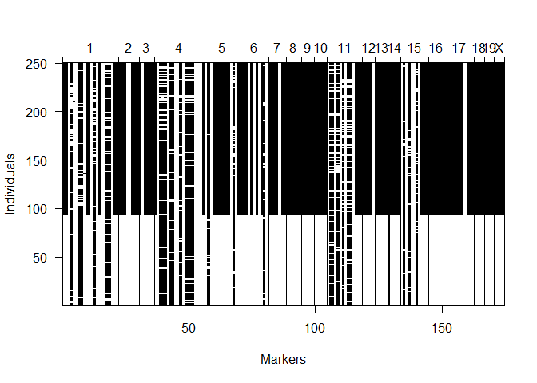<!-- -->

```r
head(hyper$pheno)
```

```
##      bp  sex
## 1 109.6 male
## 2 109.8 male
## 3 110.1 male
## 4 110.6 male
## 5 115.0 male
## 6 109.8 male
```

```r
plotMissing(hyper, main="", reorder=1)
```

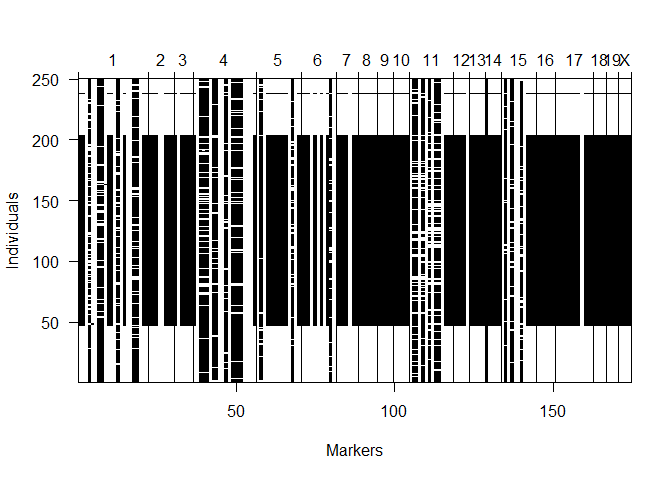<!-- -->
> The scientists only genotyped the individuals that have the extreme phenotypes (the individuals with very high blood pressure and very low blood pressure). Therefore, we see all the black lines concentrate in the middle of the y-axis.

**7. Based on your answer from previous question, you probably noticed that there are gene markers without data. Please use the function `drop.nullmarkers` to remove markers that have no genotype data. After this, make a new summary to show the number of markers on each chromosome. How many gene markers were dropped? Where were the dropped markers located? Please use the data without nullmarkers for the following questions.**

```r
totmar(hyper)  # Total markers
```

```
## [1] 174
```

```r
nmar(hyper)    # No. markers on each chromosome
```

```
##  1  2  3  4  5  6  7  8  9 10 11 12 13 14 15 16 17 18 19  X 
## 22  8  6 20 14 11  7  6  5  5 14  5  5  5 11  6 12  4  4  4
```

```r
hyper <- drop.nullmarkers(hyper)
totmar(hyper)  # Total markers
```

```
## [1] 173
```

```r
nmar(hyper)    # No. markers on each chromosome
```

```
##  1  2  3  4  5  6  7  8  9 10 11 12 13 14 15 16 17 18 19  X 
## 22  8  6 20 14 11  7  6  5  5 14  5  5  4 11  6 12  4  4  4
```
> One nullmarker was dropped from chromosome 14.

**8. Please conduct single-QTL analysis and create a table to give the maximum LOD score on each chromosome based on their blood pressure phenotypes. Which gene marker has the higiest LOD score? Which chromosome contains the gene marker that has the highest LOD score? Then, creates an interactive chart with LOD curves from a genome scan for all chromosomes.**

```r
hyper <- calc.genoprob(hyper, step=1)
out.em <- scanone(hyper, pheno.col=1)
summary(out.em)
```

```
##           chr  pos   lod
## c1.loc45    1 48.3 3.529
## c2.loc45    2 52.7 1.612
## c3.loc33    3 35.2 0.784
## D4Mit164    4 29.5 8.094
## c5.loc68    5 68.0 1.554
## c6.loc23    6 23.0 1.862
## D7Mit297    7 26.2 0.400
## D8Mit271    8 59.0 0.791
## D9Mit18     9 68.9 0.750
## c10.loc8   10 10.2 0.261
## c11.loc36  11 38.2 0.668
## D12Mit37   12  1.1 0.429
## D13Mit78   13 59.0 0.313
## D14Mit7    14 52.5 0.106
## c15.loc14  15 19.5 1.730
## D16Mit70   16 51.4 0.370
## D17Mit46   17  3.3 0.207
## D18Mit17   18 14.2 0.506
## D19Mit59   19  0.0 0.792
## cX.loc38    X 39.1 0.998
```

```r
max(out.em)
```

```
##          chr  pos  lod
## D4Mit164   4 29.5 8.09
```

```r
iplotScanone(out.em)
```

```{=html}
<div id="htmlwidget-7a3188d87a3caa650954" style="width:672px;height:480px;" class="iplotScanone html-widget"></div>
<script type="application/json" data-for="htmlwidget-7a3188d87a3caa650954">{"x":{"scanone_data":{"chr":["1","1","1","1","1","1","1","1","1","1","1","1","1","1","1","1","1","1","1","1","1","1","1","1","1","1","1","1","1","1","1","1","1","1","1","1","1","1","1","1","1","1","1","1","1","1","1","1","1","1","1","1","1","1","1","1","1","1","1","1","1","1","1","1","1","1","1","1","1","1","1","1","1","1","1","1","1","1","1","1","1","1","1","1","1","1","1","1","1","1","1","1","1","1","1","1","1","1","1","1","1","1","1","1","1","1","1","1","1","1","1","1","1","1","1","1","1","1","1","1","1","1","1","1","1","1","1","1","1","1","1","1","1","1","2","2","2","2","2","2","2","2","2","2","2","2","2","2","2","2","2","2","2","2","2","2","2","2","2","2","2","2","2","2","2","2","2","2","2","2","2","2","2","2","2","2","2","2","2","2","2","2","2","2","2","2","2","2","2","2","2","2","2","2","2","2","2","2","2","2","2","2","2","2","2","2","2","2","2","2","2","2","2","2","2","2","2","2","2","2","2","2","2","2","2","2","2","2","2","2","2","2","3","3","3","3","3","3","3","3","3","3","3","3","3","3","3","3","3","3","3","3","3","3","3","3","3","3","3","3","3","3","3","3","3","3","3","3","3","3","3","3","3","3","3","3","3","3","3","3","3","3","3","3","3","3","3","3","3","3","3","3","3","3","3","3","3","3","3","3","3","3","4","4","4","4","4","4","4","4","4","4","4","4","4","4","4","4","4","4","4","4","4","4","4","4","4","4","4","4","4","4","4","4","4","4","4","4","4","4","4","4","4","4","4","4","4","4","4","4","4","4","4","4","4","4","4","4","4","4","4","4","4","4","4","4","4","4","4","4","4","4","4","4","4","4","4","4","4","4","4","4","4","4","4","4","4","4","4","4","4","4","4","4","4","4","5","5","5","5","5","5","5","5","5","5","5","5","5","5","5","5","5","5","5","5","5","5","5","5","5","5","5","5","5","5","5","5","5","5","5","5","5","5","5","5","5","5","5","5","5","5","5","5","5","5","5","5","5","5","5","5","5","5","5","5","5","5","5","5","5","5","5","5","5","5","5","5","5","5","5","5","5","5","5","5","5","5","5","5","5","5","5","5","5","5","5","5","5","5","5","5","6","6","6","6","6","6","6","6","6","6","6","6","6","6","6","6","6","6","6","6","6","6","6","6","6","6","6","6","6","6","6","6","6","6","6","6","6","6","6","6","6","6","6","6","6","6","6","6","6","6","6","6","6","6","6","6","6","6","6","6","6","6","6","6","6","6","6","6","6","6","6","6","6","6","6","6","6","7","7","7","7","7","7","7","7","7","7","7","7","7","7","7","7","7","7","7","7","7","7","7","7","7","7","7","7","7","7","7","7","7","7","7","7","7","7","7","7","7","7","7","7","7","7","7","7","7","7","7","7","7","7","7","7","7","7","7","7","7","8","8","8","8","8","8","8","8","8","8","8","8","8","8","8","8","8","8","8","8","8","8","8","8","8","8","8","8","8","8","8","8","8","8","8","8","8","8","8","8","8","8","8","8","8","8","8","8","8","8","8","8","8","8","8","8","8","8","8","8","8","8","8","8","8","8","8","8","8","8","8","8","8","8","9","9","9","9","9","9","9","9","9","9","9","9","9","9","9","9","9","9","9","9","9","9","9","9","9","9","9","9","9","9","9","9","9","9","9","9","9","9","9","9","9","9","9","9","9","9","9","9","9","9","9","9","9","9","9","9","9","9","9","9","9","10","10","10","10","10","10","10","10","10","10","10","10","10","10","10","10","10","10","10","10","10","10","10","10","10","10","10","10","10","10","10","10","10","10","10","10","10","10","10","10","10","10","10","10","10","10","10","10","10","10","10","10","10","10","10","10","10","10","10","10","10","10","10","10","10","10","10","10","10","10","10","10","10","10","10","10","10","10","11","11","11","11","11","11","11","11","11","11","11","11","11","11","11","11","11","11","11","11","11","11","11","11","11","11","11","11","11","11","11","11","11","11","11","11","11","11","11","11","11","11","11","11","11","11","11","11","11","11","11","11","11","11","11","11","11","11","11","11","11","11","11","11","11","11","11","11","11","11","11","11","11","11","11","11","11","11","11","11","11","11","11","11","11","11","11","11","11","11","11","11","12","12","12","12","12","12","12","12","12","12","12","12","12","12","12","12","12","12","12","12","12","12","12","12","12","12","12","12","12","12","12","12","12","12","12","12","12","12","12","12","12","12","12","12","12","12","12","12","12","12","12","12","12","12","12","12","12","12","12","12","13","13","13","13","13","13","13","13","13","13","13","13","13","13","13","13","13","13","13","13","13","13","13","13","13","13","13","13","13","13","13","13","13","13","13","13","13","13","13","13","13","13","13","13","13","13","13","13","13","13","13","13","13","13","13","13","13","13","14","14","14","14","14","14","14","14","14","14","14","14","14","14","14","14","14","14","14","14","14","14","14","14","14","14","14","14","14","14","14","14","14","14","14","14","14","14","14","14","14","14","14","14","14","14","14","14","14","14","14","14","14","14","14","15","15","15","15","15","15","15","15","15","15","15","15","15","15","15","15","15","15","15","15","15","15","15","15","15","15","15","15","15","15","15","15","15","15","15","15","15","15","15","15","15","15","15","15","15","15","15","15","15","15","15","15","15","15","15","15","15","15","15","15","15","15","15","15","15","15","15","15","16","16","16","16","16","16","16","16","16","16","16","16","16","16","16","16","16","16","16","16","16","16","16","16","16","16","16","16","16","16","16","16","16","16","16","16","16","16","16","16","16","16","16","16","16","16","16","16","16","16","16","16","16","16","16","16","16","17","17","17","17","17","17","17","17","17","17","17","17","17","17","17","17","17","17","17","17","17","17","17","17","17","17","17","17","17","17","17","17","17","17","17","17","17","17","17","17","17","17","17","17","17","17","17","17","17","17","17","17","17","17","17","17","17","17","17","17","17","18","18","18","18","18","18","18","18","18","18","18","18","18","18","18","18","18","18","18","18","18","18","18","18","18","18","18","18","18","18","18","18","18","18","18","18","18","18","18","19","19","19","19","19","19","19","19","19","19","19","19","19","19","19","19","19","19","19","19","19","19","19","19","19","19","19","19","19","19","19","19","19","19","19","19","19","19","19","19","19","19","19","19","19","19","19","19","19","19","19","19","19","19","19","19","19","19","19","X","X","X","X","X","X","X","X","X","X","X","X","X","X","X","X","X","X","X","X","X","X","X","X","X","X","X","X","X","X","X","X","X","X","X","X","X","X","X","X","X","X","X","X","X","X"],"pos":[3.3,4.3,5.3,6.3,7.3,8.3,9.3,10.3,11.3,12.3,13.3,14.3,15.3,16.3,17.3,18.3,19.3,19.7,20.3,21.3,22.3,23.3,24.3,25.3,26.3,27.3,28.3,29.3,30.3,31.3,32.3,32.8,33.3,34.3,35,35.3,36.3,37.2,37.3,38.3,39.3,40.3,41.3,41.5,42.3,43.3,43.7,43.7,44.3,45.3,46.3,47.3,48.3,49.2,49.3,50.3,51.3,52.3,53.3,54.3,54.6,55.3,56.3,57.3,58.3,59.3,60.3,61.3,62.3,63.3,64.3,64.5,65.3,66.3,67.3,67.8,68.3,69.3,69.9,70.3,71.3,72.3,73.3,74.3,74.3,75.3,75.4,76.3,77.3,78.3,79.3,80.3,81.3,82,82,82,82,82.3,83.3,84.3,85.3,86.3,86.3,87.3,88.3,89.3,90.3,91.3,92.3,93.3,94,94.3,95.3,96.3,97.3,98.3,99.3,100.3,101.3,102.3,103.3,104.3,105.3,106.3,107.3,108.3,109.3,110.3,111.3,112.3,113.3,114.3,115.3,115.8,7.7,8.7,9.7,10.7,11.7,12.7,13.7,14.7,15.7,16.7,17.5,17.7,18.7,19.7,20.7,21.7,22.7,23.7,24.7,25.7,26.7,27.7,28.7,29.5,29.7,30.7,31.7,32.7,33.7,34.7,35.7,36.7,37.7,38.7,39.7,40.7,41.7,42.7,43.7,44.7,45.7,46.7,47.7,48.7,49.2,49.7,50.7,51.7,52.7,53.7,54.6,54.7,55.7,56.7,57.7,58.7,59.7,60.7,61.7,62.7,63.7,64.7,65.7,66.7,66.7,67.7,68.7,69.7,70.7,71.7,72.7,73.7,74.7,75.7,76.7,77.7,78.7,79.7,80.7,81.7,82.7,83.7,84.7,85.2,85.7,86.7,87.7,88.7,89.7,90.7,91.7,92.7,93.7,94.7,95.7,96.7,97.7,98.4,2.2,3.2,4.2,5.2,6.2,7.2,8.2,9.2,10.2,11.2,12.2,13.2,14.2,15.2,16.2,17.2,17.5,18.2,19.2,20.2,21.2,22.2,23.2,24.2,25.2,26.2,27.2,28.2,29.2,30.2,31.2,32.2,33.2,34.2,35.2,36.2,37.2,37.2,38.2,39.2,40.2,41.2,42.2,43.2,44.2,44.8,45.2,46.2,47.2,48.2,49.2,50.2,51.2,52.2,53.2,54.2,55.2,56.2,57.2,57.9,58.2,59.2,60.2,61.2,62.2,63.2,64.2,65.2,66.2,66.7,0,1,2,3,4,5,6,7,8,9,10,11,12,13,14,14.2,15,16,16.4,17,17.5,18,18.6,19,20,21,21.9,22,23,23,23,24,25,25.1,26,27,28,28.4,29,29.5,30,30.6,31,31.7,31.7,32,32.8,33,33.9,34,35,35,36,37,38,39,40,41,42,43,44,45,46,47,47,48,49,50,51,52,53,54,55,56,56.8,57,58,59,60,61,62,63,64,65,66,67,68,69,70,71,72,73,74,74.3,0,1,2,3,4,5,5.5,6,7,8,9,10,10.9,11,12,13,14,14.2,15,15.3,16,17,18,18.6,19,20,21,22,23,24,25,26,27,28,29,30,31,32,32.8,33,34,35,36,37,38,39,40,41,42,43,44,45,46,47,48,49,50,51,51.4,52,53,54,55,56,57,58,59,60,60.1,61,62,63,64,65,66,66.7,67,68,69,70,71,72,73,73.2,74,74.3,75,76,77,77.6,78,79,80,81,82,82,0,1,2,3,4,5,6,7,8,9,9.8,10,11,12,13,14,15,16,17,18,19,20,21,21.9,22,23,24,25,25.1,26,27,28,29,29.5,30,31,32,33,34,35,36,37,38,39,40,40.4,41,42,43,44,45,46,47,48,49,50,51,51.4,52,53,54,55,56,56.8,57,58,59,60,61,62,63,63.4,64,65,65.6,66,66.7,1.1,2.1,3.1,4.1,5.1,6.1,7.1,8.1,9.1,10.1,11.1,12.1,13.1,13.1,14.1,15.1,16.1,17.1,18.1,19.1,20.1,21.1,22.1,23.1,24.1,25.1,26.1,26.2,27.1,28.1,28.4,29.1,30.1,31.1,32.1,33.1,34.1,35.1,36.1,37.1,37.2,38.1,39.1,40.1,41.1,42.1,43.1,44.1,45.1,46.1,47.1,48.1,49.1,50.1,51.1,52.1,53.1,53.6,54.1,55.1,55.6,6.6,7.6,8.6,9.6,10.6,11.6,12.6,13.6,14.6,15.6,16.6,17.6,18.6,19.6,19.7,20.6,21.6,22.6,23.6,24.6,25.6,26.6,27.6,28.6,29.6,30.6,31.6,32.6,33.6,33.9,34.6,35.6,36.6,37.6,38.6,39.6,40.4,40.6,41.6,42.6,43.6,44.6,45.6,46.6,47.6,48.6,49.6,50.6,51.6,52.6,53.6,54.6,55.6,56.6,57.6,58.6,59,59.6,60.6,61.6,62.6,63.6,64.6,65.6,66.6,67.6,68.6,69.6,70.6,71.6,72.6,73.6,74.6,75.4,12,13,14,15,16,17,18,19,20,21,22,23,24,24,25,26,27,28,29,30,31,32,33,34,35,36,37,38,39,40,40.4,41,42,43,44,45,46,47,48,49,50,51,52,53,54,55,56,56.8,57,58,59,60,61,62,63,64,65,66,67,68,68.9,2.2,3.2,4.2,5.2,6.2,7.2,8.2,9.2,10.2,11.2,12.2,13.2,14.2,15.2,15.3,16.2,17.2,18.2,19.2,20.2,21.2,22.2,23.2,24.2,25.2,26.2,27.2,28.2,29.2,30.2,31.2,32.2,33.2,34.2,35.2,36.2,37.2,38.2,39.2,40.2,41.2,42.2,43.2,44.2,45.2,46.2,47.2,48.2,49.2,50.2,50.3,51.2,52.2,53.2,54.2,55.2,56.2,57.2,58.2,59.2,60.2,61.2,62.2,63.2,64.2,65.2,66.2,67.2,68.2,69.2,69.9,70.2,71.2,72.2,73.2,74.2,75.2,75.4,2.2,3.2,4.2,4.4,4.4,5.2,6.2,7.2,8.2,8.7,8.7,9.2,10.2,10.9,11.2,12.2,13.1,13.2,14.2,15.2,16.2,17.2,17.5,17.5,18.2,19.2,19.7,20.2,21.2,22.2,23.2,24.2,25.1,25.2,26.2,27.2,28.2,29.2,30.2,31.2,32.2,33.2,34.2,35.2,36.2,37.2,38.2,39.2,40.2,41.2,42.2,43.2,43.7,44.2,45.2,46.2,47.2,48.2,49.2,50.2,51.2,52.2,53.2,54.2,55.2,56.2,57.2,58.2,59.2,60.1,60.2,61.2,62.2,63.2,64.2,65.2,66.2,67.2,68.2,69.2,70.2,71.2,72.2,73.2,74.2,75.2,76.2,77.2,78.2,79.2,80.2,80.9,1.1,2.1,3.1,4.1,5.1,6.1,7.1,8.1,9.1,10.1,11.1,12.1,13.1,14.1,15.1,16.1,16.4,17.1,18.1,19.1,20.1,21.1,22.1,23,23.1,24.1,25.1,26.1,27.1,28.1,29.1,30.1,31.1,32.1,33.1,34.1,35.1,36.1,37.1,38.1,39.1,40.1,40.4,41.1,42.1,43.1,44.1,45.1,46.1,47.1,48.1,49.1,50.1,51.1,52.1,53.1,54.1,55.1,56.1,56.8,5.7,6.7,7.7,7.7,8.7,9.7,10.7,11.7,12.7,13.7,14.7,15.7,16.4,16.7,17.7,18.7,19.7,20.7,21.7,22.7,23.7,24.7,25.7,26.7,27.7,28.7,29.7,30.7,31.7,32.7,33.7,34.7,35.7,36.7,37.7,38.7,39.7,40.4,40.7,41.7,42.7,43.7,44.7,45.7,46.7,47.7,48.7,49.7,50.7,51.7,52.7,53.7,54.7,55.7,56.7,57.7,58.7,59,16.4,17.4,18.4,19.4,20.4,21.4,22.4,23.4,24.4,25.4,26.4,27.4,28.4,29.4,30.4,31.4,32.4,33.4,34.4,35.4,36.1,36.4,37.4,38.4,39.4,40.4,41.4,42.4,43.4,44.4,45.4,46.4,47.4,48.4,49.4,50.4,51.4,52.4,52.5,53.4,54.4,55.4,56.4,57.4,58.4,59.4,60.4,61.4,62.4,63.4,64.4,65.4,66.4,67.4,67.8,5.5,5.5,6.5,7.5,7.7,8.5,9.5,10.5,11.5,12.5,13.1,13.5,14.5,15.5,16.4,16.4,16.5,17.5,17.5,17.5,18.5,19.5,20.5,21.5,22.5,23.5,24.5,25.5,26.5,27.5,28.5,29.5,29.5,30.5,31.5,32.5,33.5,34.5,35.5,36.5,37.5,38.5,39.5,40.5,41.5,42.5,43.5,44.5,45.5,46.5,47.5,48.5,49.5,50.5,51.5,52.5,53.5,54.5,55.5,55.7,56.5,57.5,58.5,59.5,60.5,61.5,62.5,63.4,0,1,2,3,4,5,6,7,8,9,10,11,12,13,14,15,16,17,18,19,20,21,22,23,24,25,25.1,26,27,28,29,30,31,31.7,32,32.8,33,34,35,36,37,38,39,40,41,42,43,44,45,46,47,48,49,50,51,51.4,51.4,1.1,1.1,1.1,2.1,2.2,3.1,3.3,3.3,4.1,5.1,5.5,6.1,6.6,7.1,8.1,9.1,10.1,10.9,11.1,12.1,13.1,14.1,15.1,16.1,17.1,18.1,19.1,19.7,20.1,21.1,22.1,23.1,24.1,25.1,26.1,27.1,28.1,29.1,30.1,31.1,32.1,33.1,33.9,34.1,35.1,36.1,37.1,38.1,39.1,40.1,41.1,42.1,43.1,44.1,45.1,46.1,47.1,48.1,49.1,50.1,50.3,2.2,3.2,4.2,5.2,6.2,7.2,8.2,9.2,10.2,11.2,12.2,13.2,14.2,14.2,15.2,16.2,17.2,18.2,19.2,20.2,21.2,22.2,23.2,24.2,25.2,26.2,26.2,27.2,28.2,29.2,30.2,31.2,32.2,33.2,34.2,35.2,36.2,37.2,37.2,0,1,2,3,4,5,6,7,8,9,10,11,12,13,14,15,16,17,17.5,18,19,20,21,22,23,24,25,26,27,28,29,30,31,32,32.8,33,34,35,36,37,38,39,40,41,42,43,44,45,46,47,48,49,50,51,52,53,54,55,55.7,1.1,2.1,3.1,4.1,5.1,6.1,7.1,8.1,9.1,10.1,11.1,12.1,13.1,14.1,15.1,16.1,17.1,18.1,19.1,20.1,20.8,21.1,22.1,23.1,24.1,25.1,26.1,27.1,28.1,29.1,29.5,30.1,31.1,32.1,33.1,34.1,35.1,36.1,37.1,38.1,39.1,40.1,41.1,42.1,43.1,43.7],"lod":[0.41174,0.42569,0.43856,0.45005,0.45987,0.46774,0.47345,0.47683,0.47775,0.47617,0.47213,0.46571,0.45708,0.44647,0.43417,0.42047,0.40572,0.3996,0.45082,0.54331,0.64359,0.74992,0.86024,0.97231,1.084,1.1933,1.2985,1.3984,1.492,1.5786,1.6577,1.6944,1.7071,1.6918,1.652,1.8438,2.4599,2.9441,2.9507,3.0106,3.0599,3.099,3.1282,3.1329,3.231,3.3175,3.3422,3.3422,3.3871,3.4473,3.4906,3.5178,3.5295,3.5267,3.511,3.3297,3.1027,2.8263,2.4983,2.1244,2.0066,2.0598,2.1248,2.176,2.2134,2.2373,2.248,2.2462,2.2322,2.2068,2.1708,2.1624,2.5847,2.9784,3.2576,3.3629,3.3429,3.2207,3.0964,3.1721,3.2998,3.3387,3.2942,3.1759,3.1759,3.2163,3.2198,3.3638,3.4558,3.477,3.4315,3.3253,3.1662,3.0291,3.0291,3.0292,3.0292,2.9574,2.6759,2.331,1.9331,1.5125,1.5125,1.4993,1.4827,1.4623,1.4377,1.4085,1.3743,1.3345,1.3031,1.2945,1.2636,1.2292,1.1914,1.1503,1.1062,1.0592,1.0096,0.95777,0.9041,0.84899,0.7929,0.73633,0.67978,0.62378,0.56884,0.51544,0.46402,0.41498,0.36863,0.32522,0.28491,0.26594,0.22479,0.26456,0.30634,0.34861,0.38964,0.42773,0.46144,0.48973,0.51202,0.52818,0.53687,0.54396,0.57922,0.61374,0.64701,0.67853,0.70785,0.7346,0.75849,0.77927,0.79684,0.81112,0.82213,0.82866,0.83923,0.89252,0.94594,0.99872,1.05,1.099,1.1449,1.187,1.2245,1.2569,1.2838,1.3048,1.3197,1.3284,1.3309,1.3274,1.3182,1.3036,1.2843,1.2608,1.2477,1.3398,1.4976,1.5946,1.6124,1.5517,1.4452,1.4487,1.4796,1.5021,1.5149,1.5171,1.5079,1.4871,1.4549,1.4118,1.3586,1.2969,1.2284,1.1551,1.1551,1.0506,0.94549,0.84046,0.7365,0.6347,0.53627,0.44253,0.35487,0.27467,0.20323,0.1417,0.090904,0.051367,0.023231,0.0063054,6.4385e-05,0.0037624,0.016493,0.025937,0.027007,0.029188,0.031405,0.033631,0.035837,0.038001,0.040082,0.042058,0.043903,0.045595,0.047118,0.048457,0.049613,0.050309,0.037033,0.017769,0.0046979,2.4748e-06,0.0058269,0.023899,0.054982,0.098483,0.15242,0.21376,0.27908,0.34516,0.40934,0.46972,0.52506,0.57474,0.58851,0.60064,0.61788,0.63491,0.6516,0.66783,0.68348,0.69841,0.7125,0.72563,0.73767,0.74851,0.75806,0.76622,0.77293,0.77812,0.78175,0.78382,0.78431,0.78326,0.7807,0.7807,0.54899,0.33944,0.16796,0.051411,0.0016398,0.019824,0.096727,0.16518,0.16291,0.1572,0.15142,0.14559,0.13973,0.13384,0.12796,0.1221,0.11628,0.11051,0.10481,0.099205,0.093706,0.089929,0.087176,0.077613,0.067619,0.057471,0.047483,0.037976,0.029245,0.021539,0.015012,0.012217,2.0619,2.3173,2.5826,2.8534,3.1257,3.3955,3.6598,3.9158,4.1616,4.3956,4.6166,4.8236,5.0155,5.1916,5.3507,5.3804,5.5238,5.5317,5.4854,6.5634,6.5579,6.5364,6.5093,6.5726,6.7016,6.7941,6.8497,6.7947,5.8422,5.8422,5.8422,6.2185,6.3167,6.3079,6.2903,6.2546,6.2033,6.1784,7.4728,8.0937,7.6406,6.3749,6.3483,5.1376,5.1376,5.1199,4.8876,4.8664,4.7649,4.6946,3.7287,3.7287,3.6753,3.6169,3.5533,3.4844,3.4101,3.3303,3.2451,3.1544,3.0584,2.957,2.8506,2.7396,2.7396,2.8489,2.9331,2.9865,3.0054,2.9873,2.9319,2.8408,2.7173,2.5672,2.433,2.4441,2.4964,2.5425,2.5815,2.6125,2.6349,2.6482,2.652,2.6461,2.6305,2.6053,2.5708,2.5272,2.4751,2.4153,2.3484,2.2756,2.1977,2.1736,0.37286,0.36829,0.35234,0.32502,0.2884,0.24633,0.22466,0.20702,0.17296,0.14101,0.1117,0.085523,0.064921,0.066246,0.08013,0.095027,0.11073,0.11395,0.14927,0.163,0.20267,0.26052,0.31259,0.33804,0.31808,0.26856,0.22031,0.1743,0.13159,0.093324,0.060576,0.034305,0.015234,0.0037821,1.5798e-08,0.0036044,0.014026,0.030491,0.04742,0.048961,0.057103,0.065963,0.075525,0.08576,0.096621,0.10805,0.11999,0.13236,0.14508,0.15805,0.1712,0.18442,0.19763,0.21074,0.22368,0.23638,0.24877,0.26079,0.26549,0.27591,0.29321,0.31029,0.32701,0.34323,0.35882,0.37368,0.38771,0.40085,0.40211,0.55232,0.73973,0.93395,1.1217,1.2946,1.4488,1.5448,1.5489,1.5541,1.5465,1.5273,1.4975,1.4584,1.4112,1.4009,1.3833,1.3524,1.3664,1.3626,1.3296,1.2961,1.3192,1.3598,1.3756,1.3671,1.3353,1.3353,0.11721,0.17826,0.25552,0.34671,0.44628,0.54623,0.63824,0.71576,0.7751,0.81554,0.83534,0.85432,0.95086,1.049,1.1469,1.2429,1.3357,1.424,1.5069,1.5839,1.6545,1.7184,1.7756,1.8212,1.8278,1.862,1.8505,1.8054,1.7993,1.6725,1.4983,1.291,1.06,0.9416,0.96863,1.0201,1.0669,1.1074,1.1405,1.165,1.1801,1.1853,1.1807,1.1666,1.1437,1.1323,1.1426,1.1547,1.1594,1.1562,1.1442,1.1235,1.094,1.0565,1.0118,0.96128,0.90637,0.88355,0.90184,0.91753,0.91395,0.8919,0.85381,0.8142,0.83358,0.92506,0.99991,1.0491,1.0668,1.0519,1.0082,0.98427,0.94664,0.7874,0.64101,0.66672,0.65953,0.13697,0.14069,0.14362,0.14561,0.14652,0.14625,0.14477,0.14209,0.13827,0.13347,0.12784,0.12159,0.11494,0.11494,0.13449,0.15551,0.17774,0.20091,0.2247,0.24876,0.27273,0.29627,0.31908,0.34089,0.36148,0.38068,0.39838,0.40006,0.30872,0.188,0.15406,0.13806,0.11624,0.09586,0.077122,0.060221,0.045317,0.032524,0.021907,0.013472,0.012747,0.010353,0.0078402,0.0055523,0.0035639,0.0019492,0.00078585,0.00013138,2.9256e-05,0.00050235,0.0015558,0.0031601,0.0052699,0.0078193,0.010729,0.013914,0.017287,0.019018,0.036688,0.084516,0.10937,0.057409,0.052166,0.046884,0.041626,0.036457,0.031448,0.026665,0.022172,0.018018,0.014265,0.010938,0.008061,0.0056432,0.003683,0.0035117,0.0033464,0.0031517,0.0029469,0.0027341,0.0025157,0.0022945,0.0020732,0.0018548,0.0016421,0.0014379,0.0012388,0.0010598,0.00089453,0.00074405,0.00070189,6.7726e-05,0.00034197,0.0020852,0.0052901,0.0098535,0.015584,0.020842,0.023266,0.037656,0.055974,0.078386,0.10498,0.13574,0.17059,0.20928,0.25152,0.29693,0.34505,0.39539,0.44744,0.50071,0.55471,0.609,0.66319,0.7169,0.76984,0.79074,0.79046,0.78751,0.78121,0.77131,0.75764,0.74013,0.71882,0.69384,0.66546,0.63409,0.60022,0.56444,0.52742,0.48984,0.45238,0.41565,0.38714,0.10981,0.10212,0.094403,0.086724,0.079135,0.071691,0.064447,0.057455,0.050765,0.044422,0.038459,0.032919,0.027818,0.027818,0.031261,0.034923,0.038771,0.042777,0.046906,0.051112,0.05535,0.059568,0.063716,0.067746,0.07161,0.075268,0.078685,0.081835,0.084698,0.087264,0.088206,0.093042,0.10136,0.1099,0.11855,0.12718,0.13561,0.14368,0.15123,0.15811,0.16417,0.16932,0.1735,0.17667,0.17883,0.18005,0.18038,0.18006,0.18908,0.23856,0.29486,0.35656,0.42136,0.4863,0.54827,0.60442,0.65259,0.69145,0.72053,0.74008,0.75025,0.21431,0.22348,0.23207,0.23986,0.24668,0.25233,0.25666,0.25957,0.26099,0.26093,0.25941,0.25653,0.25242,0.24725,0.24668,0.23923,0.23053,0.22139,0.21182,0.20185,0.19149,0.1808,0.16981,0.15859,0.14721,0.13572,0.12422,0.11279,0.10152,0.09051,0.079855,0.069644,0.059938,0.050866,0.042466,0.034789,0.027876,0.021752,0.016412,0.011892,0.0081538,0.0051547,0.002902,0.0013245,0.00037236,8.5761e-06,0.00016732,0.00079903,0.0018529,0.0032835,0.0034444,0.0021619,0.0010501,0.00032095,9.1492e-06,0.00014888,0.00076693,0.0019003,0.0035386,0.0056862,0.0083285,0.011454,0.014998,0.018926,0.023182,0.027708,0.032442,0.037321,0.042288,0.047287,0.050775,0.05376,0.063713,0.072961,0.080557,0.085801,0.088431,0.088655,0.17167,0.17288,0.15954,0.15537,0.15537,0.075108,0.013856,0.0015824,0.036857,0.069934,0.069934,0.089088,0.13132,0.16172,0.17317,0.21022,0.24012,0.24193,0.25922,0.27458,0.28757,0.29789,0.30044,0.30044,0.32997,0.37167,0.39206,0.40453,0.42375,0.43333,0.43185,0.41937,0.40003,0.40267,0.42956,0.45711,0.48494,0.51261,0.53959,0.56535,0.58927,0.61081,0.62944,0.64471,0.65629,0.66396,0.66766,0.66745,0.66354,0.65624,0.64596,0.63317,0.62598,0.61457,0.59095,0.56634,0.54082,0.51449,0.48748,0.45992,0.43197,0.40382,0.37564,0.34764,0.32002,0.29299,0.26672,0.24141,0.21721,0.19649,0.19525,0.18237,0.16879,0.15458,0.13988,0.12486,0.10971,0.094653,0.07996,0.065897,0.052736,0.040729,0.030081,0.020986,0.013532,0.0077463,0.0036406,0.0011065,5.3635e-05,0.00031131,0.0017244,0.0033158,0.42866,0.40658,0.37968,0.34796,0.31182,0.27214,0.23027,0.18795,0.14712,0.10963,0.076989,0.050179,0.029532,0.014877,0.0056217,0.00097671,0.00035398,0.0005103,0.00078496,0.0011117,0.0014749,0.0018543,0.0022276,0.0025418,0.0025626,0.002777,0.0029949,0.003214,0.0034302,0.0036391,0.0038358,0.0040161,0.0041756,0.004311,0.0044197,0.0045003,0.0045526,0.0045772,0.0045761,0.0045517,0.0045073,0.0044456,0.0044248,0.0048178,0.0054085,0.0060269,0.0066677,0.007324,0.0079879,0.008651,0.0093048,0.0099409,0.010552,0.01113,0.011671,0.012169,0.012621,0.013027,0.013386,0.013609,0.091005,0.062509,0.032791,0.032791,0.033114,0.033137,0.032821,0.03216,0.031169,0.029883,0.028352,0.026638,0.025371,0.02362,0.017939,0.012653,0.0079551,0.0040884,0.0013703,6.879e-05,0.00044198,0.0028144,0.0073188,0.014034,0.022968,0.033889,0.046515,0.060445,0.075215,0.09035,0.1054,0.12,0.13383,0.14668,0.15844,0.16906,0.17853,0.1845,0.18651,0.19327,0.20012,0.20704,0.21402,0.22104,0.2281,0.23517,0.24225,0.24932,0.25638,0.2634,0.27038,0.27731,0.28417,0.29097,0.29768,0.30431,0.31085,0.31279,0.085449,0.073861,0.062636,0.051914,0.041841,0.032561,0.02422,0.016951,0.010871,0.0060735,0.0026463,0.0006128,2.4896e-06,0.00076738,0.0028846,0.0062556,0.010789,0.016369,0.02287,0.03016,0.035663,0.036857,0.040999,0.045358,0.049908,0.054613,0.059431,0.064314,0.069211,0.074067,0.078829,0.083444,0.087863,0.092043,0.095945,0.099541,0.10281,0.10574,0.10602,0.10145,0.096158,0.090653,0.084979,0.079179,0.073305,0.06741,0.061551,0.055784,0.050165,0.044745,0.039571,0.034683,0.030107,0.025879,0.024286,1.0675,1.0675,0.93131,0.77795,0.74597,0.8289,0.93355,1.037,1.1371,1.2322,1.2863,1.3055,1.3425,1.363,1.3673,1.3673,1.4195,1.7054,1.7054,1.7054,1.7234,1.7298,1.7229,1.7015,1.6647,1.6122,1.5443,1.4623,1.368,1.2646,1.1558,1.0458,1.0458,1.0491,1.0512,1.0519,1.0511,1.0488,1.0447,1.0388,1.031,1.0213,1.0095,0.99575,0.97996,0.96219,0.9425,0.92098,0.89775,0.87296,0.84679,0.81943,0.7911,0.76203,0.73245,0.7026,0.67271,0.64298,0.61363,0.60782,0.66056,0.72486,0.78521,0.83952,0.88608,0.92353,0.95096,0.96666,0.02849,0.021568,0.015238,0.009705,0.0051961,0.0019539,0.00021858,0.00023261,0.002204,0.0063252,0.012683,0.021278,0.032042,0.044805,0.059345,0.075281,0.092281,0.10998,0.12801,0.14605,0.16383,0.18112,0.19771,0.21349,0.22835,0.24225,0.24359,0.24305,0.24146,0.2388,0.23505,0.23025,0.22444,0.21981,0.20601,0.14188,0.14452,0.15815,0.17244,0.18729,0.20258,0.21816,0.23384,0.24945,0.26479,0.27967,0.29389,0.30727,0.31968,0.33097,0.34105,0.34987,0.35739,0.3636,0.36855,0.37018,0.37018,0.15575,0.15575,0.15575,0.10842,0.10248,0.1869,0.20666,0.20666,0.12575,0.047322,0.026251,0.025885,0.025583,0.015999,0.0032874,0.0001676,0.0067189,0.018179,0.016982,0.01153,0.0070369,0.003592,0.0012691,0.00012262,0.0001849,0.0014642,0.0039445,0.0059936,0.0050968,0.0031097,0.0015511,0.00049896,2.2444e-05,0.00017628,0.00099534,0.002497,0.0046599,0.0074452,0.010789,0.014608,0.018809,0.023294,0.02702,0.027963,0.032979,0.038493,0.044481,0.050894,0.05767,0.064729,0.071975,0.079305,0.086609,0.093781,0.10072,0.10734,0.11356,0.11933,0.12461,0.12938,0.13026,0.11878,0.15154,0.18922,0.231,0.27539,0.32035,0.36358,0.40296,0.4368,0.46407,0.48441,0.49809,0.50576,0.50576,0.46802,0.42416,0.3749,0.32164,0.26638,0.21163,0.16008,0.1142,0.075753,0.045627,0.023839,0.0097074,0.0097074,0.0053181,0.0021091,0.00031435,0.0001235,0.0016401,0.0048732,0.0097316,0.016038,0.023518,0.03188,0.040814,0.040814,0.79179,0.76552,0.73682,0.70575,0.67242,0.63703,0.5998,0.56105,0.52115,0.48054,0.43966,0.39905,0.35918,0.32056,0.28362,0.24873,0.21618,0.18618,0.17218,0.17971,0.19509,0.21072,0.22631,0.24156,0.25616,0.26978,0.28215,0.29301,0.30219,0.30957,0.31509,0.31878,0.32072,0.32103,0.32024,0.32257,0.33416,0.3456,0.35676,0.36748,0.37765,0.3871,0.39571,0.40335,0.40989,0.41526,0.41937,0.42217,0.42366,0.42383,0.42271,0.42037,0.41686,0.41231,0.40681,0.40048,0.39344,0.38581,0.38019,0.001557,0.0051242,0.010963,0.019255,0.030129,0.043676,0.059926,0.07884,0.10033,0.12419,0.15018,0.17803,0.20739,0.23791,0.26923,0.301,0.33289,0.36458,0.39582,0.42635,0.44721,0.46727,0.53523,0.60139,0.66062,0.70792,0.7393,0.75247,0.74717,0.72536,0.71286,0.74194,0.78955,0.83492,0.87669,0.91361,0.94463,0.96894,0.98604,0.99568,0.99794,0.99312,0.98178,0.96465,0.94265,0.9275],"marker":["D1Mit296","","","","","","","","","","","","","","","","","D1Mit123","","","","","","","","","","","","","","D1Mit156","","","D1Mit178","","","D1Mit19","","","","","","D1Mit7","","","D1Mit46","D1Mit132","","","","","","D1Mit334","","","","","","","D1Mit305","","","","","","","","","","","D1Mit26","","","","D1Mit94","","","D1Mit218","","","","","","D1Mit100","","D1Mit102","","","","","","","D1Mit14","D1Mit105","D1Mit159","D1Mit267","","","","","","D1Mit15","","","","","","","","D1Mit456","","","","","","","","","","","","","","","","","","","","","","","D1Mit155","D2Mit359","","","","","","","","","","D2Mit82","","","","","","","","","","","","","D2Mit241","","","","","","","","","","","","","","","","","","","","","D2Mit14","","","","","","D2Mit62","","","","","","","","","","","","","","D2Mit280","","","","","","","","","","","","","","","","","","","D2Mit229","","","","","","","","","","","","","","D2Mit266","D3Mit164","","","","","","","","","","","","","","","","D3Mit6","","","","","","","","","","","","","","","","","","","","","D3Mit11","","","","","","","","D3Mit14","","","","","","","","","","","","","","D3Mit44","","","","","","","","","","D3Mit19","D4Mit149","","","","","","","","","","","","","","","D4Mit41","","","D4Mit108","","D4Mit237","","D4Mit286","","","","D4Mit214","","","D4Mit53","D4Mit89","","","D4Mit111","","","","D4Mit288","","D4Mit164","","D4Mit178","","D4Mit80","D4Mit81","","D4Mit276","","D4Mit152","","","D4Mit302","","","","","","","","","","","","","D4Mit175","","","","","","","","","","D4Mit16","","","","","","","","","","","","","","","","","","","D4Mit14","D5Mit193","","","","","","D5Mit61","","","","","","D5Mit387","","","","","D5Mit148","","D5Mit13","","","","D5Mit55","","","","","","","","","","","","","","","D5Mit312","","","","","","","","","","","","","","","","","","","","D5Mit188","","","","","","","","","","D5Mit213","","","","","","","D5Mit31","","","","","","","","D5Mit99","","D5Mit101","","","","D5Mit409","","","","","","D5Mit169","D6Mit86","","","","","","","","","","D6Mit273","","","","","","","","","","","","","D6Mit188","","","","","D6Mit8","","","","","D6Mit213","","","","","","","","","","","","D6Mit36","","","","","","","","","","","","D6Mit135","","","","","","D6Mit59","","","","","","","","D6Mit295","","","D6Mit201","","D6Mit15","D7Mit306","","","","","","","","","","","","","D7Mit25","","","","","","","","","","","","","","D7Mit297","","","D7Mit30","","","","","","","","","","D7Mit37","","","","","","","","","","","","","","","","","D7Mit71","","","D7Nds4","D8Mit3","","","","","","","","","","","","","","D8Mit292","","","","","","","","","","","","","","","D8Mit25","","","","","","","D8Mit45","","","","","","","","","","","","","","","","","","","","D8Mit271","","","","","","","","","","","","","","","","","D8Mit156","D9Mit297","","","","","","","","","","","","","D9Mit27","","","","","","","","","","","","","","","","","D9Mit8","","","","","","","","","","","","","","","","","D9Mit24","","","","","","","","","","","","","D9Mit18","D10Mit166","","","","","","","","","","","","","","D10Mit214","","","","","","","","","","","","","","","","","","","","","","","","","","","","","","","","","","","","D10Mit11","","","","","","","","","","","","","","","","","","","","D10Mit14","","","","","","","D10Mit297","D11Mit74","","","D11Mit2","D11Mit78","","","","","D11Mit79","D11Mit80","","","D11Mit82","","","D11Mit163","","","","","","D11Mit110","D11Mit136","","","D11Mit20","","","","","","D11Mit310","","","","","","","","","","","","","","","","","","","","D11Mit35","","","","","","","","","","","","","","","","","D11Mit67","","","","","","","","","","","","","","","","","","","","","","D11Mit48","D12Mit37","","","","","","","","","","","","","","","","D12Mit110","","","","","","","D12Mit34","","","","","","","","","","","","","","","","","","","D12Mit118","","","","","","","","","","","","","","","","","D12Mit20","D13Mit16","","","D13Mit59","","","","","","","","","D13Mit91","","","","","","","","","","","","","","","","","","","","","","","","","D13Mit148","","","","","","","","","","","","","","","","","","","","D13Mit78","D14Mit14","","","","","","","","","","","","","","","","","","","","D14Mit37","","","","","","","","","","","","","","","","","","D14Mit7","","","","","","","","","","","","","","","","D14Mit266","D15Mit11","D15Mit175","","","D15Mit53","","","","","","D15Mit111","","","","D15Mit56","D15Mit22","","","D15Mit206","D15Mit152","","","","","","","","","","","","","D15Mit156","","","","","","","","","","","","","","","","","","","","","","","","","","","D15Mit108","","","","","","","","D15Mit79","D16Mit32","","","","","","","","","","","","","","","","","","","","","","","","","","D16Mit4","","","","","","","D16Mit171","","D16Mit5","","","","","","","","","","","","","","","","","","","","D16Mit70","D16Mit106","D17Mit164","D17Mit143","D17Mit57","","D17Mit113","","D17Mit131","D17Mit46","","","D17Mit45","","D17Mit23","","","","","D17Mit11","","","","","","","","","","D17Mit10","","","","","","","","","","","","","","","D17Mit53","","","","","","","","","","","","","","","","","","D17Mit221","D18Mit67","","","","","","","","","","","","","D18Mit17","","","","","","","","","","","","","D18Mit50","","","","","","","","","","","","D18Mit4","D19Mit59","","","","","","","","","","","","","","","","","","D19Mit40","","","","","","","","","","","","","","","","D19Mit53","","","","","","","","","","","","","","","","","","","","","","","","D19Mit137","DXMit55","","","","","","","","","","","","","","","","","","","","DXMit22","","","","","","","","","","DXMit16","","","","","","","","","","","","","","","DXMit130"],"chrname":["1","2","3","4","5","6","7","8","9","10","11","12","13","14","15","16","17","18","19","X"],"lodname":"lod"},"pxg_data":null,"pxg_type":"none","chartOpts":null},"evals":[],"jsHooks":[]}</script>
```
> Gene marker D4Mit164, which is on chromosome 4, has the highest LOD score (8.094).

**9. Based on your genome scan results, create a table which only includes those chromosomes with LOD > 1. Creates an interactive chart with LOD curves linked to estimated QTL effects for only those chromosomes with LOD > 1. Find the gene maker with the highest LOD score and describe how does the genotype of this marker influence the individual's phenotype.**

```r
summary(out.em, threshold=1)
```

```
##           chr  pos  lod
## c1.loc45    1 48.3 3.53
## c2.loc45    2 52.7 1.61
## D4Mit164    4 29.5 8.09
## c5.loc68    5 68.0 1.55
## c6.loc23    6 23.0 1.86
## c15.loc14  15 19.5 1.73
```

```r
iplotScanone(out.em, hyper, chr=c(1, 2, 4, 5, 6, 15))
```

```{=html}
<div id="htmlwidget-712345be8d4101d399c5" style="width:672px;height:480px;" class="iplotScanone html-widget"></div>
<script type="application/json" data-for="htmlwidget-712345be8d4101d399c5">{"x":{"scanone_data":{"chr":["1","1","1","1","1","1","1","1","1","1","1","1","1","1","1","1","1","1","1","1","1","1","1","1","1","1","1","1","1","1","1","1","1","1","1","1","1","1","1","1","1","1","1","1","1","1","1","1","1","1","1","1","1","1","1","1","1","1","1","1","1","1","1","1","1","1","1","1","1","1","1","1","1","1","1","1","1","1","1","1","1","1","1","1","1","1","1","1","1","1","1","1","1","1","1","1","1","1","1","1","1","1","1","1","1","1","1","1","1","1","1","1","1","1","1","1","1","1","1","1","1","1","1","1","1","1","1","1","1","1","1","1","1","1","2","2","2","2","2","2","2","2","2","2","2","2","2","2","2","2","2","2","2","2","2","2","2","2","2","2","2","2","2","2","2","2","2","2","2","2","2","2","2","2","2","2","2","2","2","2","2","2","2","2","2","2","2","2","2","2","2","2","2","2","2","2","2","2","2","2","2","2","2","2","2","2","2","2","2","2","2","2","2","2","2","2","2","2","2","2","2","2","2","2","2","2","2","2","2","2","2","2","4","4","4","4","4","4","4","4","4","4","4","4","4","4","4","4","4","4","4","4","4","4","4","4","4","4","4","4","4","4","4","4","4","4","4","4","4","4","4","4","4","4","4","4","4","4","4","4","4","4","4","4","4","4","4","4","4","4","4","4","4","4","4","4","4","4","4","4","4","4","4","4","4","4","4","4","4","4","4","4","4","4","4","4","4","4","4","4","4","4","4","4","4","4","5","5","5","5","5","5","5","5","5","5","5","5","5","5","5","5","5","5","5","5","5","5","5","5","5","5","5","5","5","5","5","5","5","5","5","5","5","5","5","5","5","5","5","5","5","5","5","5","5","5","5","5","5","5","5","5","5","5","5","5","5","5","5","5","5","5","5","5","5","5","5","5","5","5","5","5","5","5","5","5","5","5","5","5","5","5","5","5","5","5","5","5","5","5","5","5","6","6","6","6","6","6","6","6","6","6","6","6","6","6","6","6","6","6","6","6","6","6","6","6","6","6","6","6","6","6","6","6","6","6","6","6","6","6","6","6","6","6","6","6","6","6","6","6","6","6","6","6","6","6","6","6","6","6","6","6","6","6","6","6","6","6","6","6","6","6","6","6","6","6","6","6","6","15","15","15","15","15","15","15","15","15","15","15","15","15","15","15","15","15","15","15","15","15","15","15","15","15","15","15","15","15","15","15","15","15","15","15","15","15","15","15","15","15","15","15","15","15","15","15","15","15","15","15","15","15","15","15","15","15","15","15","15","15","15","15","15","15","15","15","15"],"pos":[3.3,4.3,5.3,6.3,7.3,8.3,9.3,10.3,11.3,12.3,13.3,14.3,15.3,16.3,17.3,18.3,19.3,19.7,20.3,21.3,22.3,23.3,24.3,25.3,26.3,27.3,28.3,29.3,30.3,31.3,32.3,32.8,33.3,34.3,35,35.3,36.3,37.2,37.3,38.3,39.3,40.3,41.3,41.5,42.3,43.3,43.7,43.7,44.3,45.3,46.3,47.3,48.3,49.2,49.3,50.3,51.3,52.3,53.3,54.3,54.6,55.3,56.3,57.3,58.3,59.3,60.3,61.3,62.3,63.3,64.3,64.5,65.3,66.3,67.3,67.8,68.3,69.3,69.9,70.3,71.3,72.3,73.3,74.3,74.3,75.3,75.4,76.3,77.3,78.3,79.3,80.3,81.3,82,82,82,82,82.3,83.3,84.3,85.3,86.3,86.3,87.3,88.3,89.3,90.3,91.3,92.3,93.3,94,94.3,95.3,96.3,97.3,98.3,99.3,100.3,101.3,102.3,103.3,104.3,105.3,106.3,107.3,108.3,109.3,110.3,111.3,112.3,113.3,114.3,115.3,115.8,7.7,8.7,9.7,10.7,11.7,12.7,13.7,14.7,15.7,16.7,17.5,17.7,18.7,19.7,20.7,21.7,22.7,23.7,24.7,25.7,26.7,27.7,28.7,29.5,29.7,30.7,31.7,32.7,33.7,34.7,35.7,36.7,37.7,38.7,39.7,40.7,41.7,42.7,43.7,44.7,45.7,46.7,47.7,48.7,49.2,49.7,50.7,51.7,52.7,53.7,54.6,54.7,55.7,56.7,57.7,58.7,59.7,60.7,61.7,62.7,63.7,64.7,65.7,66.7,66.7,67.7,68.7,69.7,70.7,71.7,72.7,73.7,74.7,75.7,76.7,77.7,78.7,79.7,80.7,81.7,82.7,83.7,84.7,85.2,85.7,86.7,87.7,88.7,89.7,90.7,91.7,92.7,93.7,94.7,95.7,96.7,97.7,98.4,0,1,2,3,4,5,6,7,8,9,10,11,12,13,14,14.2,15,16,16.4,17,17.5,18,18.6,19,20,21,21.9,22,23,23,23,24,25,25.1,26,27,28,28.4,29,29.5,30,30.6,31,31.7,31.7,32,32.8,33,33.9,34,35,35,36,37,38,39,40,41,42,43,44,45,46,47,47,48,49,50,51,52,53,54,55,56,56.8,57,58,59,60,61,62,63,64,65,66,67,68,69,70,71,72,73,74,74.3,0,1,2,3,4,5,5.5,6,7,8,9,10,10.9,11,12,13,14,14.2,15,15.3,16,17,18,18.6,19,20,21,22,23,24,25,26,27,28,29,30,31,32,32.8,33,34,35,36,37,38,39,40,41,42,43,44,45,46,47,48,49,50,51,51.4,52,53,54,55,56,57,58,59,60,60.1,61,62,63,64,65,66,66.7,67,68,69,70,71,72,73,73.2,74,74.3,75,76,77,77.6,78,79,80,81,82,82,0,1,2,3,4,5,6,7,8,9,9.8,10,11,12,13,14,15,16,17,18,19,20,21,21.9,22,23,24,25,25.1,26,27,28,29,29.5,30,31,32,33,34,35,36,37,38,39,40,40.4,41,42,43,44,45,46,47,48,49,50,51,51.4,52,53,54,55,56,56.8,57,58,59,60,61,62,63,63.4,64,65,65.6,66,66.7,5.5,5.5,6.5,7.5,7.7,8.5,9.5,10.5,11.5,12.5,13.1,13.5,14.5,15.5,16.4,16.4,16.5,17.5,17.5,17.5,18.5,19.5,20.5,21.5,22.5,23.5,24.5,25.5,26.5,27.5,28.5,29.5,29.5,30.5,31.5,32.5,33.5,34.5,35.5,36.5,37.5,38.5,39.5,40.5,41.5,42.5,43.5,44.5,45.5,46.5,47.5,48.5,49.5,50.5,51.5,52.5,53.5,54.5,55.5,55.7,56.5,57.5,58.5,59.5,60.5,61.5,62.5,63.4],"lod":[0.41174,0.42569,0.43856,0.45005,0.45987,0.46774,0.47345,0.47683,0.47775,0.47617,0.47213,0.46571,0.45708,0.44647,0.43417,0.42047,0.40572,0.3996,0.45082,0.54331,0.64359,0.74992,0.86024,0.97231,1.084,1.1933,1.2985,1.3984,1.492,1.5786,1.6577,1.6944,1.7071,1.6918,1.652,1.8438,2.4599,2.9441,2.9507,3.0106,3.0599,3.099,3.1282,3.1329,3.231,3.3175,3.3422,3.3422,3.3871,3.4473,3.4906,3.5178,3.5295,3.5267,3.511,3.3297,3.1027,2.8263,2.4983,2.1244,2.0066,2.0598,2.1248,2.176,2.2134,2.2373,2.248,2.2462,2.2322,2.2068,2.1708,2.1624,2.5847,2.9784,3.2576,3.3629,3.3429,3.2207,3.0964,3.1721,3.2998,3.3387,3.2942,3.1759,3.1759,3.2163,3.2198,3.3638,3.4558,3.477,3.4315,3.3253,3.1662,3.0291,3.0291,3.0292,3.0292,2.9574,2.6759,2.331,1.9331,1.5125,1.5125,1.4993,1.4827,1.4623,1.4377,1.4085,1.3743,1.3345,1.3031,1.2945,1.2636,1.2292,1.1914,1.1503,1.1062,1.0592,1.0096,0.95777,0.9041,0.84899,0.7929,0.73633,0.67978,0.62378,0.56884,0.51544,0.46402,0.41498,0.36863,0.32522,0.28491,0.26594,0.22479,0.26456,0.30634,0.34861,0.38964,0.42773,0.46144,0.48973,0.51202,0.52818,0.53687,0.54396,0.57922,0.61374,0.64701,0.67853,0.70785,0.7346,0.75849,0.77927,0.79684,0.81112,0.82213,0.82866,0.83923,0.89252,0.94594,0.99872,1.05,1.099,1.1449,1.187,1.2245,1.2569,1.2838,1.3048,1.3197,1.3284,1.3309,1.3274,1.3182,1.3036,1.2843,1.2608,1.2477,1.3398,1.4976,1.5946,1.6124,1.5517,1.4452,1.4487,1.4796,1.5021,1.5149,1.5171,1.5079,1.4871,1.4549,1.4118,1.3586,1.2969,1.2284,1.1551,1.1551,1.0506,0.94549,0.84046,0.7365,0.6347,0.53627,0.44253,0.35487,0.27467,0.20323,0.1417,0.090904,0.051367,0.023231,0.0063054,6.4385e-05,0.0037624,0.016493,0.025937,0.027007,0.029188,0.031405,0.033631,0.035837,0.038001,0.040082,0.042058,0.043903,0.045595,0.047118,0.048457,0.049613,0.050309,2.0619,2.3173,2.5826,2.8534,3.1257,3.3955,3.6598,3.9158,4.1616,4.3956,4.6166,4.8236,5.0155,5.1916,5.3507,5.3804,5.5238,5.5317,5.4854,6.5634,6.5579,6.5364,6.5093,6.5726,6.7016,6.7941,6.8497,6.7947,5.8422,5.8422,5.8422,6.2185,6.3167,6.3079,6.2903,6.2546,6.2033,6.1784,7.4728,8.0937,7.6406,6.3749,6.3483,5.1376,5.1376,5.1199,4.8876,4.8664,4.7649,4.6946,3.7287,3.7287,3.6753,3.6169,3.5533,3.4844,3.4101,3.3303,3.2451,3.1544,3.0584,2.957,2.8506,2.7396,2.7396,2.8489,2.9331,2.9865,3.0054,2.9873,2.9319,2.8408,2.7173,2.5672,2.433,2.4441,2.4964,2.5425,2.5815,2.6125,2.6349,2.6482,2.652,2.6461,2.6305,2.6053,2.5708,2.5272,2.4751,2.4153,2.3484,2.2756,2.1977,2.1736,0.37286,0.36829,0.35234,0.32502,0.2884,0.24633,0.22466,0.20702,0.17296,0.14101,0.1117,0.085523,0.064921,0.066246,0.08013,0.095027,0.11073,0.11395,0.14927,0.163,0.20267,0.26052,0.31259,0.33804,0.31808,0.26856,0.22031,0.1743,0.13159,0.093324,0.060576,0.034305,0.015234,0.0037821,1.5798e-08,0.0036044,0.014026,0.030491,0.04742,0.048961,0.057103,0.065963,0.075525,0.08576,0.096621,0.10805,0.11999,0.13236,0.14508,0.15805,0.1712,0.18442,0.19763,0.21074,0.22368,0.23638,0.24877,0.26079,0.26549,0.27591,0.29321,0.31029,0.32701,0.34323,0.35882,0.37368,0.38771,0.40085,0.40211,0.55232,0.73973,0.93395,1.1217,1.2946,1.4488,1.5448,1.5489,1.5541,1.5465,1.5273,1.4975,1.4584,1.4112,1.4009,1.3833,1.3524,1.3664,1.3626,1.3296,1.2961,1.3192,1.3598,1.3756,1.3671,1.3353,1.3353,0.11721,0.17826,0.25552,0.34671,0.44628,0.54623,0.63824,0.71576,0.7751,0.81554,0.83534,0.85432,0.95086,1.049,1.1469,1.2429,1.3357,1.424,1.5069,1.5839,1.6545,1.7184,1.7756,1.8212,1.8278,1.862,1.8505,1.8054,1.7993,1.6725,1.4983,1.291,1.06,0.9416,0.96863,1.0201,1.0669,1.1074,1.1405,1.165,1.1801,1.1853,1.1807,1.1666,1.1437,1.1323,1.1426,1.1547,1.1594,1.1562,1.1442,1.1235,1.094,1.0565,1.0118,0.96128,0.90637,0.88355,0.90184,0.91753,0.91395,0.8919,0.85381,0.8142,0.83358,0.92506,0.99991,1.0491,1.0668,1.0519,1.0082,0.98427,0.94664,0.7874,0.64101,0.66672,0.65953,1.0675,1.0675,0.93131,0.77795,0.74597,0.8289,0.93355,1.037,1.1371,1.2322,1.2863,1.3055,1.3425,1.363,1.3673,1.3673,1.4195,1.7054,1.7054,1.7054,1.7234,1.7298,1.7229,1.7015,1.6647,1.6122,1.5443,1.4623,1.368,1.2646,1.1558,1.0458,1.0458,1.0491,1.0512,1.0519,1.0511,1.0488,1.0447,1.0388,1.031,1.0213,1.0095,0.99575,0.97996,0.96219,0.9425,0.92098,0.89775,0.87296,0.84679,0.81943,0.7911,0.76203,0.73245,0.7026,0.67271,0.64298,0.61363,0.60782,0.66056,0.72486,0.78521,0.83952,0.88608,0.92353,0.95096,0.96666],"marker":["D1Mit296","","","","","","","","","","","","","","","","","D1Mit123","","","","","","","","","","","","","","D1Mit156","","","D1Mit178","","","D1Mit19","","","","","","D1Mit7","","","D1Mit46","D1Mit132","","","","","","D1Mit334","","","","","","","D1Mit305","","","","","","","","","","","D1Mit26","","","","D1Mit94","","","D1Mit218","","","","","","D1Mit100","","D1Mit102","","","","","","","D1Mit14","D1Mit105","D1Mit159","D1Mit267","","","","","","D1Mit15","","","","","","","","D1Mit456","","","","","","","","","","","","","","","","","","","","","","","D1Mit155","D2Mit359","","","","","","","","","","D2Mit82","","","","","","","","","","","","","D2Mit241","","","","","","","","","","","","","","","","","","","","","D2Mit14","","","","","","D2Mit62","","","","","","","","","","","","","","D2Mit280","","","","","","","","","","","","","","","","","","","D2Mit229","","","","","","","","","","","","","","D2Mit266","D4Mit149","","","","","","","","","","","","","","","D4Mit41","","","D4Mit108","","D4Mit237","","D4Mit286","","","","D4Mit214","","","D4Mit53","D4Mit89","","","D4Mit111","","","","D4Mit288","","D4Mit164","","D4Mit178","","D4Mit80","D4Mit81","","D4Mit276","","D4Mit152","","","D4Mit302","","","","","","","","","","","","","D4Mit175","","","","","","","","","","D4Mit16","","","","","","","","","","","","","","","","","","","D4Mit14","D5Mit193","","","","","","D5Mit61","","","","","","D5Mit387","","","","","D5Mit148","","D5Mit13","","","","D5Mit55","","","","","","","","","","","","","","","D5Mit312","","","","","","","","","","","","","","","","","","","","D5Mit188","","","","","","","","","","D5Mit213","","","","","","","D5Mit31","","","","","","","","D5Mit99","","D5Mit101","","","","D5Mit409","","","","","","D5Mit169","D6Mit86","","","","","","","","","","D6Mit273","","","","","","","","","","","","","D6Mit188","","","","","D6Mit8","","","","","D6Mit213","","","","","","","","","","","","D6Mit36","","","","","","","","","","","","D6Mit135","","","","","","D6Mit59","","","","","","","","D6Mit295","","","D6Mit201","","D6Mit15","D15Mit11","D15Mit175","","","D15Mit53","","","","","","D15Mit111","","","","D15Mit56","D15Mit22","","","D15Mit206","D15Mit152","","","","","","","","","","","","","D15Mit156","","","","","","","","","","","","","","","","","","","","","","","","","","","D15Mit108","","","","","","","","D15Mit79"],"chrname":["1","2","4","5","6","15"],"lodname":"lod"},"pxg_data":{"geno":[[2,2,1,2,2,1,2,1,2,1,2,1,1,2,2,2,2,1,1,2,1,2,1,1,2,1,2,1,1,2,2,2,1,1,1,1,2,2,2,1,1,2,2,2,1,2,1,2,1,2,2,2,2,2,1,1,2,2,1,1,2,2,2,2,2,2,2,2,1,2,2,1,1,1,2,1,1,2,2,1,2,1,2,2,2,2,2,2,1,2,2,1,-2,-2,-1,-1,-1,-1,-2,-1,-2,-1,-1,-2,-1,-2,-1,-1,-2,-1,-1,-2,-1,-2,-2,-1,-1,-2,-2,-2,-1,-2,-2,-2,-1,-1,-2,-1,-1,-1,-1,-1,-1,-1,-1,-2,-2,-2,-1,-1,-1,-1,-1,-2,-1,-1,-2,-2,-1,-1,-2,-1,-2,-2,-2,-2,-2,-2,-2,-2,-2,-2,-1,-1,-1,-1,-2,-2,-1,-2,-2,-2,-1,-1,-1,-1,-2,-1,-1,-2,-1,-2,-2,-2,-1,-2,-1,-2,-1,-2,-1,-1,-1,-2,-1,-1,-1,-2,-1,-1,-2,-2,-2,-2,-1,-1,-1,-1,-1,-2,-2,-1,-1,-2,-2,-2,-1,-1,-2,-2,-1,-2,-2,-1,-2,-2,-2,-2,-1,-1,-1,-1,-1,-1,-2,-1,-2,-1,-1,-1,-2,-2,-2,-2,-2,-2,-1,-2,-1,-2],[2,2,1,2,2,1,2,1,2,1,2,1,1,2,2,1,2,1,1,2,1,2,1,1,2,2,2,1,1,2,2,2,1,1,2,1,2,1,2,2,2,2,2,2,1,1,1,2,1,2,2,2,1,2,1,1,2,2,2,2,2,2,1,2,2,2,2,2,1,2,2,1,1,1,2,1,1,2,1,1,2,1,2,2,2,2,2,2,2,2,2,1,-2,-1,-1,-2,-1,-1,-2,-1,-2,-1,-1,-2,-1,-2,-2,-2,-1,-1,-1,-1,-1,-2,-2,-1,-1,-2,-2,-2,-1,-1,-2,-2,-2,-1,-1,-2,-1,-1,-1,-1,-1,-1,-1,-2,-2,-2,-1,-2,-1,-1,-1,-2,-1,-1,-1,-2,-1,-1,-2,-1,-2,-2,-2,-2,-2,-2,-2,-2,-2,-2,-1,-2,-1,-1,-1,-2,-1,-2,-2,-2,-1,-1,-1,-1,-2,-1,-2,-2,-1,-2,-2,-2,-1,-2,-1,-2,-1,-2,-1,-1,-1,-2,-1,-1,-1,-1,-1,-1,-2,-2,-2,-2,-1,-1,-2,-1,-1,-2,-2,-2,-1,-2,-2,-2,-1,-1,-2,-2,-2,-2,-2,-2,-2,-2,-2,-2,-1,-1,-1,-2,-1,-2,-2,-2,-2,-1,-1,-1,-2,-2,-2,-2,-2,-2,-1,-1,-1,-2],[2,2,1,2,1,1,2,1,2,1,2,1,1,2,2,1,2,1,1,1,1,2,1,1,1,2,2,1,1,1,1,2,1,1,2,1,2,1,2,2,2,2,2,1,1,1,2,2,1,2,2,2,1,2,2,2,1,2,2,2,2,2,1,2,2,1,2,2,1,1,2,1,1,2,2,2,1,1,1,1,2,1,2,2,2,2,2,2,2,2,2,1,1,1,1,2,1,1,2,1,2,1,1,2,1,1,2,2,1,1,1,1,1,2,2,1,1,2,2,2,1,1,2,1,2,2,2,2,1,1,2,1,1,1,1,1,2,2,2,2,1,2,2,2,1,1,1,1,1,1,2,1,2,2,2,2,2,2,2,2,2,2,1,1,1,1,1,1,1,2,2,2,1,1,1,2,2,2,2,2,1,2,2,2,2,2,1,2,1,2,1,1,1,2,1,1,1,2,1,1,1,2,2,2,1,1,2,1,1,2,1,2,1,2,2,1,1,1,2,2,2,2,2,2,2,2,2,2,1,1,1,2,2,2,2,2,2,1,1,1,2,2,2,2,2,2,1,1,1,2],[-2,1,-1,2,-1,-1,2,-1,2,-1,-2,-1,-1,-2,2,-1,-2,-1,-1,-1,-1,-2,-1,-1,-1,-2,-2,-1,-1,-1,-1,-2,-1,-1,-2,-1,-2,-1,-2,-2,-2,-2,-2,-1,-1,-1,-2,-2,-1,-2,-2,-2,-1,-2,-2,-2,-1,-2,-2,-2,-2,-2,-1,-2,-2,-1,-2,-2,-1,-1,-2,-1,1,-2,-2,-2,-1,-1,-1,-1,-2,-1,-2,-2,-2,-2,-2,-2,-2,-2,-2,-1,-1,-1,-1,-2,-1,-1,2,-1,-2,-1,-1,-2,-1,-1,-2,-2,-1,-1,-1,-1,-1,-2,-2,2,-1,-2,-2,-2,-1,-1,-2,-1,-2,-2,-2,-2,-1,-1,-2,-1,-1,-1,-1,-1,-2,-2,-2,-2,1,1,-2,-2,-1,-1,-1,-1,-1,-1,-2,-1,-2,-2,-2,-2,-2,-2,1,-2,-2,-2,-1,-1,1,1,1,1,1,-2,-2,1,1,-1,1,-2,2,1,1,1,1,-2,-2,-2,-2,2,-1,-2,-1,-2,-1,-1,-1,-2,-1,-1,-1,2,-1,-1,-1,-2,2,2,1,1,2,1,1,2,1,2,1,2,2,-1,1,-1,2,2,2,2,1,2,1,-2,-2,1,2,-1,-1,-2,-2,-2,-2,-2,-2,-1,-1,-1,-2,-2,-2,-2,-2,-2,-1,-1,-1,-2],[2,1,1,1,1,1,1,1,1,1,2,1,1,2,1,1,2,1,1,1,1,2,1,1,1,2,2,1,1,1,1,2,1,1,2,1,2,1,2,2,2,2,2,1,1,1,2,2,1,2,2,2,1,2,2,2,1,2,2,2,2,2,1,2,2,1,2,2,1,1,2,1,2,2,2,2,1,1,1,1,2,1,2,2,2,2,2,2,2,2,2,1,1,1,1,2,1,1,1,1,2,1,1,2,1,1,2,2,1,1,1,1,1,2,2,2,1,2,2,2,1,1,2,1,2,2,2,2,1,1,2,1,1,1,1,1,2,2,2,2,1,1,2,2,1,1,1,1,1,1,2,1,2,2,2,2,2,2,1,2,2,2,1,1,1,1,2,1,1,2,2,1,2,1,1,2,2,1,1,1,1,2,2,2,2,2,1,2,1,2,1,1,1,2,1,1,1,2,1,1,1,2,1,2,1,1,2,1,1,-2,1,2,1,2,2,1,1,1,2,2,2,2,1,2,1,2,2,1,2,1,1,2,2,2,2,2,2,1,1,1,2,2,2,2,2,2,1,1,1,2],[2,1,1,1,1,1,1,1,1,1,2,1,1,2,1,1,2,1,1,1,1,2,1,1,1,2,2,1,1,1,1,2,1,1,2,1,2,1,2,2,2,2,2,1,1,1,2,2,1,2,2,2,1,2,2,2,1,2,2,2,2,2,1,2,2,1,2,2,1,1,2,1,2,2,2,2,1,1,1,1,2,1,2,2,2,2,2,2,2,2,2,1,1,1,1,2,1,1,1,1,2,1,1,2,1,1,2,2,1,1,1,1,1,2,2,2,1,2,2,2,1,1,2,1,2,2,2,2,1,1,2,1,1,1,1,1,2,2,2,2,1,1,2,2,1,1,1,1,1,1,2,1,2,2,2,2,2,2,1,2,2,2,1,1,1,1,2,1,1,2,2,1,2,1,2,2,1,1,1,1,2,2,2,2,2,2,1,2,1,2,1,1,1,2,1,1,1,2,1,1,1,2,1,2,1,1,2,1,1,2,1,2,1,2,2,1,1,1,2,2,2,2,1,2,1,2,2,1,2,1,1,2,2,2,2,2,2,1,1,1,2,2,2,2,2,2,1,1,1,2],[-2,-1,-1,-1,-1,-1,-1,-2,-1,-1,-2,-1,-1,-2,-1,-1,-2,-1,-1,-1,-1,-2,-1,-1,-1,-2,-2,-1,-1,-1,-1,2,-1,-1,-2,-1,-2,-1,-2,-2,-2,-2,-2,-1,-1,-1,-2,-2,-1,-2,-2,-2,-1,-2,-2,-2,-1,-2,-2,-2,-2,-2,-1,-2,-2,-1,-2,-2,-1,-1,-2,-1,-2,-2,-2,-2,-1,-1,-1,-1,-2,-1,-2,-2,-2,-2,-2,-2,-2,-2,-2,-1,-1,-1,-1,-2,-1,-1,-1,-1,-2,-1,1,2,-1,1,-2,-2,1,-1,1,-1,1,-2,-2,-2,-1,-2,-2,2,1,1,2,-1,-2,-2,-2,-2,1,-1,-2,1,-1,-1,-1,1,-2,-2,-1,-2,-1,-1,-2,-2,2,2,-1,-1,-1,-1,-2,-1,-2,-2,-2,-2,-2,-2,-1,-2,-2,-2,-1,-1,-1,-1,2,-1,-1,-2,-2,-1,-2,-1,-2,-2,-1,-1,-1,-1,-2,-2,-2,-2,-2,-2,-1,-2,-1,-2,-1,-1,1,-2,-1,-1,-1,-2,1,1,-1,-2,-1,-2,1,-1,-2,1,-1,-2,-1,-2,-1,-2,-2,-1,-1,-1,-2,-2,-2,-2,-1,-2,-1,-2,2,-1,-2,-1,-1,-2,-2,-2,-2,-2,-2,-1,-1,-1,-2,2,-2,-2,-2,-2,-1,-1,-1,-2],[-2,-1,-1,-1,-1,-1,-1,2,-1,-1,-2,-1,-1,-2,-1,-1,-2,-1,-1,-1,-1,-2,-1,-1,-1,-2,-2,-1,-1,-1,-1,-2,-1,-1,-2,-1,-2,-1,-2,-2,-2,-2,-2,-1,-1,-1,-2,-2,-1,-2,-2,-2,-1,-2,-2,-2,-1,-2,-2,-2,-2,-2,-1,-2,-2,-1,-2,-2,-1,-1,-2,-1,-2,-2,-2,-2,-1,-1,-1,-1,-2,-1,-2,-2,-2,-2,-2,-2,-2,-2,-2,-1,-1,-1,-1,-2,-1,-1,-1,-1,-2,-1,1,2,-1,1,-2,-2,1,-1,1,-1,1,-2,-2,-2,-1,-2,-2,2,1,1,2,-1,-2,-2,-2,-2,1,-1,-2,1,-1,-1,-1,1,-2,-2,1,-2,-1,-1,-2,-2,2,2,-1,-1,-1,-1,-2,-1,-2,-2,-2,-2,-2,-2,-1,-2,-2,-2,-1,-1,-1,-1,2,-1,-1,-2,-2,-1,-2,-1,-2,-2,-1,-1,-1,-1,-2,-2,-2,-2,-2,-2,-1,-2,-1,-2,-1,-1,1,-2,-1,-1,-1,-2,1,1,-1,-2,-1,-2,-1,-1,-2,-1,-1,-2,-1,-2,-1,-2,-2,-1,-1,-1,-2,-2,-2,-2,-1,-2,-1,-2,2,-1,-2,-1,-1,-2,-2,-2,-2,-2,-2,-1,-1,-1,-2,2,-2,-2,-2,-2,-1,-1,-1,-2],[2,1,1,1,1,1,1,2,1,1,2,1,1,2,1,1,2,1,1,1,1,2,1,1,1,2,2,1,1,1,1,1,1,1,2,1,2,1,2,2,2,2,2,1,1,1,2,2,1,2,2,2,1,2,2,2,1,2,2,2,2,2,1,2,2,1,2,2,1,1,2,1,2,2,2,2,1,1,1,1,2,1,2,2,2,2,2,2,2,2,2,1,1,1,1,2,1,1,1,1,2,1,1,2,1,1,2,2,2,1,1,1,2,2,2,2,1,2,2,2,1,1,2,1,2,2,2,2,1,1,2,1,1,1,1,-2,2,2,1,2,1,1,2,2,2,2,1,1,1,1,2,1,2,2,2,2,2,2,1,2,2,2,1,1,1,1,2,1,1,2,2,1,2,1,2,2,1,1,1,1,2,2,2,2,2,2,1,2,1,2,1,1,2,2,1,1,1,2,1,1,1,2,1,2,2,1,2,2,1,2,1,2,1,2,2,1,1,1,2,2,2,2,1,2,1,2,1,1,2,1,1,2,2,2,2,2,2,1,1,1,2,1,2,2,2,2,1,1,1,2],[2,1,2,1,1,1,1,2,1,1,2,1,1,2,1,1,2,1,1,1,1,2,1,1,1,2,2,2,1,1,1,1,1,1,2,1,2,1,2,2,2,2,2,1,1,1,2,2,1,2,2,2,1,2,2,2,1,1,2,2,2,2,1,2,2,1,1,2,1,1,1,1,2,2,2,2,1,1,1,1,2,2,2,2,2,2,2,2,2,2,2,1,-1,-1,-1,-2,-1,-1,-1,-1,-2,-1,-1,-1,-1,-1,-2,-2,-2,-1,-1,-1,-2,-2,-2,-2,-1,-2,-2,-1,-1,-1,-2,-1,-2,-2,-2,-2,-2,-1,-1,-2,-1,-1,-1,-2,-2,-2,-1,-2,-1,-1,-2,-2,-2,-2,-1,-1,-1,-1,-2,-1,-2,-2,-1,-2,-2,-2,-1,-2,-2,-2,-1,-1,-1,-1,-2,-1,-1,-2,-2,-1,-2,-1,-2,-2,-1,-1,-1,-1,-2,-2,-2,-2,-2,-2,-1,-2,-1,-2,-1,-1,-2,-2,-1,-1,-1,-2,-1,-1,-1,-2,-1,-2,-2,-1,-2,-2,-1,-2,-1,-2,-1,-1,-2,-1,-1,-1,-2,-2,-2,-2,-1,-2,-1,-2,-1,-1,-2,-1,-1,-2,-2,-2,-2,-2,-2,-1,-1,-1,-2,-1,-2,-2,-2,-2,-1,-1,-1,-2],[2,1,2,1,1,1,1,2,1,1,2,1,1,2,1,2,2,1,1,1,1,2,1,1,1,2,2,2,1,1,1,1,1,1,2,1,1,1,1,2,2,1,2,1,1,1,2,2,1,2,2,2,1,2,2,2,1,1,2,2,2,2,1,1,2,1,1,2,1,1,1,1,2,2,2,2,1,1,1,1,2,2,2,2,2,2,2,2,2,2,2,1,-1,-1,-1,-2,-1,-1,-1,-1,-2,-1,-2,-1,-1,-2,-2,-2,-2,-1,-1,-1,-2,-2,-2,-2,-1,-2,-2,-1,-2,-2,-1,-1,-2,-2,-2,-2,-2,-1,-2,-2,-1,-1,-1,-2,-2,-2,-1,-1,-1,-1,-1,-2,-2,-2,-1,-1,-1,-1,-2,-1,-2,-2,-1,-2,-2,-2,-1,-2,-2,-2,-1,-1,-1,-1,-1,-1,-1,-2,-2,-2,-1,-1,-1,-2,-1,-1,-1,-1,-2,-2,-2,-2,-2,-1,-1,-2,-1,-2,-2,-1,-2,-2,-1,-1,-1,-2,-2,-2,-1,-2,-1,-1,-2,-1,-2,-2,-1,-2,-1,-2,-1,-1,-2,-1,-1,-1,-2,-2,-2,-1,-1,-2,-1,-2,-1,-1,-2,-1,-1,-2,-2,-2,-2,-2,-2,-1,-1,-1,-2,-1,-2,-2,-2,-2,-1,-1,-1,-1],[1,1,2,1,1,1,1,2,1,1,2,1,1,2,1,2,2,1,1,1,1,2,1,1,1,2,2,2,1,1,2,1,1,1,1,1,1,1,1,2,1,1,1,1,1,1,2,2,1,2,2,2,1,2,2,2,1,1,2,2,2,2,1,1,2,1,1,2,1,1,1,2,2,2,2,2,1,1,1,1,2,2,2,2,2,2,2,2,2,2,2,1,1,1,1,2,1,1,1,1,2,1,2,1,1,2,2,2,2,1,2,1,2,2,2,2,1,2,2,1,2,2,1,1,2,2,2,2,2,1,2,2,1,1,1,2,2,2,1,1,1,1,1,2,2,2,1,1,1,1,2,1,2,1,1,2,2,2,1,2,2,2,1,1,1,1,1,1,1,2,2,2,1,1,1,1,1,1,1,1,2,2,2,2,2,1,1,2,1,2,2,1,2,2,1,1,1,2,2,2,1,2,1,1,2,1,2,2,1,2,1,2,1,1,2,1,1,1,2,2,2,1,2,2,1,2,1,1,1,1,1,2,2,2,2,2,2,1,1,1,2,1,2,2,2,2,1,1,1,1],[-1,-1,-2,-1,-1,-1,-1,2,-1,-1,-2,-1,-1,-2,-1,-2,2,-1,-1,-1,-1,-2,-1,-1,-1,-2,-2,-2,-1,-1,-2,-1,-1,-1,-1,-1,-1,-1,-1,2,-2,-1,-1,-1,-1,-1,-2,-2,-1,-2,-2,2,-1,-2,-2,2,-1,-1,-2,-2,-2,-2,-1,-1,-2,-1,-1,-2,-1,-1,-1,-2,-2,-2,-2,-2,1,-1,-1,-1,-2,-2,-2,-2,-2,2,-2,-2,-2,-2,-2,-1,-1,-1,-1,-2,-1,-1,-1,-1,-2,2,-2,-1,-1,-2,-2,-2,-2,-1,-2,-1,-2,-2,-2,-2,-1,-2,-2,-1,-2,-2,-1,-1,-2,-2,-2,-2,-2,-1,-2,-2,-1,-1,-1,-2,-2,-2,-1,-1,-1,-1,-1,-2,-2,2,-1,2,-1,-1,-2,-1,2,2,2,-2,-2,-2,2,-2,2,-2,-1,-1,-1,-1,-1,-1,2,-2,-2,-2,1,1,-1,-1,-1,-1,2,-1,-2,-2,-2,-2,-2,1,-1,2,-1,2,-2,-1,2,-2,1,-1,-1,2,-2,-2,1,2,1,-1,-2,-1,-2,-2,-1,1,2,1,-1,-1,-2,1,-1,-1,-2,-2,2,-1,-2,2,-1,-2,-1,-1,-1,-1,-1,1,-2,-2,-2,-2,-2,-1,-1,-1,-2,-1,-2,1,-2,2,-1,-1,-1,-1],[1,1,2,1,1,1,1,1,1,1,2,1,1,2,1,2,1,1,1,1,1,2,1,1,1,2,2,2,1,1,2,1,1,1,1,1,1,1,1,2,2,1,2,1,1,1,2,2,1,2,2,1,1,2,2,1,1,1,2,2,2,2,1,1,2,1,1,2,1,1,1,2,2,2,2,2,2,1,1,1,2,2,2,2,2,1,2,2,2,2,2,1,1,1,1,2,1,1,1,1,2,2,2,1,1,2,2,2,2,1,2,1,2,2,2,2,1,2,2,1,2,2,1,1,2,2,2,2,2,1,2,2,1,1,1,2,2,2,1,1,1,1,1,2,2,2,1,2,1,1,2,1,1,2,2,2,2,2,2,2,1,2,1,1,1,1,1,1,2,2,2,2,1,1,1,1,1,1,2,1,2,2,2,2,2,1,1,1,1,2,2,1,1,2,2,1,1,1,2,2,2,1,2,1,2,1,2,2,1,1,2,1,1,1,2,2,1,1,2,2,1,1,2,1,1,2,1,1,1,1,1,1,2,2,2,2,2,1,1,1,2,1,2,1,2,1,1,1,1,1],[1,1,2,1,1,1,1,1,1,1,2,1,1,2,1,2,1,1,1,1,1,2,1,1,1,2,2,2,1,1,2,1,1,1,1,1,1,1,1,2,2,1,2,1,1,1,2,2,1,2,2,1,1,2,2,1,1,1,2,2,2,2,1,1,2,1,1,2,1,1,1,2,2,2,2,2,2,1,1,1,2,2,2,2,2,1,2,2,2,2,2,1,-1,-1,-1,-2,-1,-1,-1,-1,-2,-2,-2,-1,-1,-2,-2,-2,-2,-1,-2,-1,-2,-2,-2,-2,-1,-2,-2,-1,-2,-2,-1,-1,-2,-2,-2,-2,-2,-1,-2,-2,-1,-1,-1,-2,-2,-2,-1,-1,-1,-1,-1,-2,-2,-2,-1,-2,-1,-1,-2,-1,-1,-2,-2,-2,-2,-2,-2,-2,-1,-2,-1,-1,-1,-1,-1,-1,-2,-2,-2,-2,-1,-1,-1,-1,-1,-1,-2,-1,-2,-2,-2,-2,-2,-1,-1,-1,-1,-2,-1,-1,-1,-2,-2,-1,-1,-2,-2,-2,-2,-1,-2,-1,-2,-1,-2,-2,-1,-1,-2,-1,-1,-1,-2,-2,-1,-1,-2,-2,-1,-1,-2,-1,-1,-2,-1,-1,-1,-1,-1,-1,-2,-2,-2,-2,-2,-1,-1,-1,-2,-1,-2,-1,-2,-1,-1,-1,-1,-1],[1,1,2,1,1,1,1,1,1,1,1,1,1,2,1,1,1,1,1,2,1,2,1,1,1,1,2,2,1,1,2,1,1,1,1,1,1,1,1,2,2,1,2,1,1,1,2,2,1,2,2,1,1,2,2,1,1,1,2,2,2,2,2,1,-1,1,1,1,1,1,1,2,-1,2,2,1,2,1,1,1,2,2,2,2,2,1,2,-1,2,2,2,1,1,2,1,2,1,1,1,1,1,2,2,1,1,2,2,2,2,1,2,1,2,2,2,2,1,-2,2,1,2,2,1,1,2,2,2,2,2,1,2,2,1,1,1,2,2,2,1,1,1,1,1,1,1,2,1,2,1,1,2,1,1,2,2,1,2,2,-2,2,1,-2,1,1,1,1,2,1,2,-2,2,2,1,1,1,1,1,1,2,1,2,1,2,-1,2,1,1,1,1,2,1,1,2,2,1,1,1,2,2,2,1,2,2,1,2,1,2,2,2,1,2,1,2,1,2,2,1,2,2,2,1,1,2,1,1,2,1,1,1,1,1,1,2,2,2,2,2,1,1,1,-1,1,2,1,2,1,1,1,1,1],[1,1,2,1,1,1,1,1,1,1,1,1,1,2,1,1,1,1,1,2,1,2,1,1,1,1,2,2,1,1,2,1,1,1,1,1,1,1,1,2,2,1,2,1,1,1,2,2,1,2,2,1,1,2,2,1,1,1,2,2,2,2,2,1,1,1,1,1,1,1,1,2,1,2,2,1,2,1,1,1,2,2,2,2,2,1,2,1,2,2,2,1,1,2,1,2,1,1,1,1,1,2,2,1,1,2,2,2,2,1,2,1,2,2,2,2,1,2,2,1,2,2,1,1,2,2,2,2,2,1,2,2,1,1,1,2,2,2,1,1,1,1,1,1,1,2,1,2,1,1,2,1,1,2,2,1,2,2,2,2,1,2,1,1,1,1,2,1,2,2,2,2,1,1,1,1,1,1,2,1,2,1,2,1,2,1,1,1,1,2,1,1,2,2,1,1,1,2,2,2,1,2,2,1,2,1,2,2,2,1,2,1,2,1,2,2,1,2,2,2,1,1,2,1,1,2,1,1,1,1,1,1,2,2,2,2,2,1,1,1,1,1,2,1,2,1,1,1,1,1],[-1,-1,-2,-1,1,1,-1,-1,-1,-1,-1,1,-1,-2,-1,-1,-1,-1,-1,-2,-1,-2,-1,-1,-1,-1,-2,-2,1,-1,-2,-1,-1,-1,-1,-1,-1,-1,-1,-2,-2,-1,-2,1,-1,-1,-2,-2,-1,-2,-2,-1,-1,-2,-2,-1,-1,-1,-2,-2,-2,-2,-2,-1,1,-1,-1,-1,-1,-1,-1,-2,1,-2,-2,-1,-2,-1,-1,-1,-2,-2,-2,2,-2,-1,-2,1,-2,-2,-2,-1,-1,-2,-1,-2,-1,-1,-1,-1,-1,-2,-2,-1,-1,-2,-2,2,-2,-1,-2,1,-2,-2,-2,-2,-1,2,-2,-1,-2,-2,-1,-1,-2,-2,-2,-2,-2,-1,-2,-2,-1,-1,-1,-2,-2,2,-1,-1,-1,-1,-1,-1,1,-2,-1,-2,-1,-1,-2,-1,-1,-2,-2,1,-2,-2,2,-2,-1,2,-1,-1,-1,-1,-2,-1,-2,2,-2,-2,1,1,-1,-1,-1,-1,-2,-1,-2,1,2,1,-2,-1,-1,-1,-1,2,-1,-1,2,-2,-1,-1,-1,-2,2,-2,-1,-2,-2,-1,-2,-1,-2,-2,-2,-1,2,-1,2,-1,2,-2,-1,-2,-2,-2,-1,-1,-2,-1,-1,2,-1,-1,-1,-1,-1,-1,-2,-2,-2,-2,-2,-1,1,-1,1,1,-2,-1,-2,-1,-1,-1,1,-1],[-1,-1,-2,-1,1,1,-1,-1,-1,-1,-1,1,-1,-2,-1,-1,-1,-1,-1,-2,-1,-2,-1,-1,-1,-1,-2,-2,1,-1,-2,-1,-1,-1,-1,-1,-1,-1,-1,-2,-2,-1,-2,1,-1,-1,-2,-2,-1,-2,-2,-1,-1,-2,-2,-1,-1,-1,-2,-2,-2,-2,-2,-1,1,-1,-1,-1,-1,-1,-1,-2,1,-2,-2,-1,-2,-1,-1,-1,-2,-2,-2,-2,-2,-1,-2,1,-2,-2,-2,-1,-1,-2,-1,-2,-1,-1,-1,-1,-1,-2,-2,-1,-1,-2,-2,-2,-2,-1,-2,1,-2,-2,-2,-2,-1,2,-2,-1,-2,-2,-1,-1,-2,-2,-2,-2,-2,-1,-2,-2,-1,-1,-1,-2,-2,-2,-1,-1,-1,-1,-1,-1,1,-2,-1,-2,-1,-1,-2,-1,-1,-2,-2,1,-2,-2,2,-2,-1,2,-1,-1,-1,-1,-2,-1,-2,2,-2,-2,1,1,-1,-1,-1,-1,-2,-1,-2,1,2,1,-2,-1,-1,-1,-1,2,-1,-1,2,-2,-1,-1,-1,-2,-2,-2,-1,-2,-2,-1,-2,-1,-2,-2,-2,-1,2,-1,2,-1,-2,-2,-1,-2,-2,-2,-1,-1,-2,-1,-1,-2,-1,-1,-1,-1,-1,-1,-2,-2,-2,-2,-2,-1,1,-1,1,1,-2,-1,-2,-1,-1,-1,1,-1],[1,1,2,1,2,2,1,1,1,1,1,2,1,2,1,1,1,1,1,2,1,2,1,1,1,1,2,2,2,1,2,1,1,1,1,1,1,1,1,2,2,1,2,2,1,1,2,2,1,2,2,1,1,2,2,1,1,1,2,2,2,2,2,1,1,1,1,1,1,1,1,2,1,2,2,1,2,1,1,1,2,2,2,1,2,1,2,1,2,2,2,1,1,2,1,2,1,1,1,1,1,2,2,1,1,2,2,1,2,1,2,2,2,2,2,2,1,2,2,1,2,2,1,1,2,2,2,2,2,1,2,2,1,1,1,2,2,1,1,1,1,1,1,1,2,2,1,2,1,1,2,1,1,2,2,2,2,2,2,2,1,2,1,1,1,1,2,1,2,2,2,2,2,1,1,1,1,1,2,1,2,1,2,1,2,1,1,1,1,1,1,1,2,2,1,1,1,2,1,2,1,2,2,1,2,1,2,2,2,1,2,1,2,1,1,2,1,2,2,2,1,1,2,1,1,1,1,1,1,1,1,1,2,2,1,2,2,1,2,1,1,1,2,1,2,1,1,1,2,1],[1,1,2,1,2,1,1,1,1,1,1,2,1,2,1,1,1,1,1,2,1,2,1,1,1,1,2,2,2,1,2,2,1,1,1,1,1,1,1,2,2,1,2,2,1,1,2,2,1,2,2,1,1,2,2,1,1,1,2,2,2,2,2,1,1,1,1,1,1,1,1,2,1,2,2,1,2,1,1,1,2,2,2,1,2,1,2,1,2,2,2,1,-1,-2,-1,-2,-1,-1,-1,-1,-1,-2,-2,-1,-1,-2,-2,-1,-2,-1,-2,-2,-2,-2,-2,-2,-1,-2,-2,-1,-2,-2,-1,-1,-2,-2,-2,-2,-2,-1,-1,-1,-1,-1,-1,-2,-1,-1,-1,-1,-1,-1,-1,-1,-2,-2,-1,-2,-1,-1,-2,-1,-1,-2,-2,-2,-2,-1,-2,-2,-2,-2,-1,-1,-1,-1,-1,-1,-2,-2,-2,-2,-2,-1,-1,-1,-1,-1,-2,-1,-2,-1,-2,-1,-2,-1,-1,-1,-1,-1,-2,-1,-2,-2,-1,-1,-1,-2,-1,-2,-1,-2,-2,-1,-2,-1,-2,-1,-2,-1,-2,-1,-2,-1,-1,-2,-1,-2,-2,-2,-1,-1,-2,-1,-1,-1,-1,-1,-1,-1,-1,-1,-2,-2,-1,-2,-2,-1,-2,-1,-1,-1,-2,-1,-2,-1,-1,-2,-2,-1],[1,2,2,1,1,2,2,1,2,2,1,2,1,2,1,1,1,1,1,2,1,2,1,1,1,1,2,1,2,1,2,2,1,1,1,2,1,1,1,2,2,1,2,2,1,1,1,1,1,2,2,1,2,2,1,1,1,1,2,2,2,2,2,1,1,1,1,1,1,1,1,2,1,2,2,1,2,1,1,1,2,2,2,1,2,1,2,1,1,2,2,1,-1,-2,-1,-1,-1,-1,-1,-1,-2,-2,-2,-1,-1,-2,-2,-1,-2,-1,-2,-2,-1,-2,-1,-2,-1,-2,-2,-1,-2,-2,-2,-1,-2,-2,-2,-2,-2,-1,-1,-1,-2,-1,-1,-2,-2,-1,-1,-1,-1,-1,-1,-2,-2,-2,-1,-2,-1,-1,-2,-2,-1,-2,-1,-2,-2,-1,-2,-2,-2,-2,-1,-1,-1,-1,-1,-1,-2,-2,-2,-2,-2,-1,-1,-1,-1,-1,-1,-1,-2,-1,-2,-1,-2,-1,-1,-1,-1,-1,-2,-1,-2,-1,-2,-1,-1,-2,-2,-2,-1,-2,-2,-1,-2,-2,-2,-1,-2,-1,-2,-1,-2,-1,-2,-2,-1,-2,-2,-1,-1,-1,-2,-1,-1,-2,-1,-1,-1,-1,-2,-1,-1,-2,-1,-2,-2,-2,-2,-2,-1,-1,-2,-1,-2,-1,-2,-2,-1,-2],[1,1,2,2,1,2,2,2,2,2,1,1,1,1,2,2,2,1,1,2,2,2,2,1,2,2,1,2,2,1,2,1,2,2,1,2,2,1,1,2,2,2,1,1,1,1,2,2,1,2,1,2,1,1,2,2,2,1,1,2,2,1,2,1,1,1,1,2,1,2,2,2,1,2,1,2,2,2,2,2,2,2,1,2,1,1,2,2,2,2,2,2,-2,-2,-1,-1,-2,-2,-2,-1,-2,-2,-1,-1,-1,-1,-1,-1,-1,-2,-1,-2,-1,-1,-1,-2,-1,-2,-1,-1,-1,-2,-2,-1,-2,-2,-1,-2,-2,-1,-2,-1,-1,-2,-1,-2,-1,-2,-2,-2,-1,-2,-1,-2,-1,-2,-2,-1,-2,-1,-1,-2,-2,-2,-2,-1,-2,-1,-2,-1,-1,-2,-1,-1,-1,-1,-1,-1,-1,-1,-1,-2,-2,-1,-2,-1,-2,-2,-2,-2,-1,-1,-2,-2,-1,-1,-1,-1,-1,-1,-2,-2,-2,-1,-1,-1,-1,-2,-2,-2,-1,-1,-2,-2,-2,-1,-2,-2,-2,-2,-1,-2,-1,-2,-1,-1,-1,-1,-2,-2,-2,-1,-1,-2,-2,-2,-2,-2,-1,-2,-1,-1,-2,-1,-2,-2,-2,-1,-1,-1,-1,-2,-1,-1,-1,-1,-1,-1,-2,-1],[1,1,2,1,1,2,2,1,2,2,1,1,1,1,2,2,2,1,1,2,2,2,2,1,2,2,1,2,2,1,2,1,1,1,1,1,2,1,2,2,2,1,1,1,1,2,2,2,1,2,1,2,1,2,2,2,2,2,1,2,1,1,2,1,1,1,1,2,1,2,2,2,1,2,1,2,2,2,1,1,1,2,1,2,1,1,2,2,2,2,2,2,-2,-2,-1,-1,-2,-2,-2,-1,-2,-2,-1,-1,-1,-1,-2,-1,-1,-2,-1,-2,-1,-1,-1,-2,-1,-2,-1,-2,-1,-1,-2,-1,-2,-2,-1,-2,-1,-1,-2,-1,-1,-2,-2,-2,-1,-1,-2,-2,-1,-2,-1,-2,-1,-2,-2,-1,-2,-1,-1,-2,-2,-2,-2,-2,-2,-1,-1,-1,-1,-2,-1,-1,-1,-1,-1,-1,-1,-1,-1,-2,-2,-1,-2,-1,-1,-2,-1,-2,-1,-2,-2,-2,-1,-1,-1,-1,-1,-1,-2,-2,-2,-1,-1,-1,-1,-2,-2,-2,-1,-1,-2,-2,-2,-1,-2,-2,-2,-2,-1,-2,-1,-2,-1,-1,-2,-1,-2,-2,-2,-1,-1,-2,-2,-2,-2,-2,-2,-2,-1,-1,-2,-1,-2,-2,-2,-1,-1,-1,-1,-2,-2,-1,-1,-1,-1,-1,-2,-1],[1,1,2,1,1,2,2,1,2,2,1,1,1,1,2,2,2,1,1,2,2,1,1,1,2,2,1,2,2,1,2,1,2,2,1,1,2,1,2,2,2,1,1,1,1,2,2,2,1,2,1,2,1,2,2,2,2,2,1,2,1,1,2,1,1,1,2,2,1,2,2,2,2,2,1,1,2,2,2,2,1,2,1,2,1,1,2,2,2,1,2,2,-2,-1,-1,-2,-2,-2,-2,-1,-2,-2,-1,-1,-1,-1,-2,-1,-1,-2,-1,-2,-1,-1,-1,-1,-1,-1,-1,-2,-1,-1,-2,-1,-2,-1,-1,-2,-1,-2,-2,-1,-2,-2,-2,-2,-1,-1,-2,-1,-1,-2,-1,-2,-1,-2,-2,-1,-2,-1,-1,-2,-2,-2,-2,-2,-2,-1,-1,-1,-1,-2,-1,-1,-1,-1,-1,-1,-1,-1,-1,-2,-2,-1,-2,-1,-2,-2,-1,-2,-1,-2,-2,-2,-1,-1,-1,-1,-1,-1,-1,-2,-2,-2,-2,-2,-1,-1,-2,-1,-2,-1,-2,-2,-2,-1,-2,-2,-1,-2,-1,-2,-1,-2,-1,-1,-2,-1,-2,-2,-2,-2,-1,-2,-2,-2,-2,-2,-2,-2,-1,-1,-2,-1,-2,-2,-2,-2,-1,-1,-2,-2,-1,-1,-1,-1,-1,-1,-2,-1],[1,1,2,1,1,1,2,1,2,2,1,2,1,1,2,2,1,1,1,2,1,1,1,1,2,1,1,1,2,2,2,2,2,2,2,1,2,1,2,1,2,1,1,1,1,2,2,2,1,2,2,2,1,2,2,2,2,2,2,2,1,1,1,2,2,1,2,2,1,1,2,2,2,2,1,1,2,2,2,2,1,2,1,2,1,2,2,2,2,1,2,2,1,1,1,2,2,2,2,1,2,1,1,1,1,1,2,1,1,2,2,2,1,1,1,1,2,1,1,2,1,1,2,1,2,2,1,2,1,2,2,2,1,2,2,2,1,1,2,1,1,1,1,2,2,2,2,1,2,1,2,2,2,2,2,2,2,1,1,1,1,2,1,1,1,1,1,1,1,1,1,2,2,1,2,1,2,2,1,2,1,2,1,1,1,1,1,1,1,1,1,2,2,2,1,2,1,2,2,1,2,1,1,2,2,2,2,1,1,2,1,2,1,2,1,1,2,1,1,1,2,1,1,2,2,2,1,2,2,2,1,1,2,2,1,2,1,2,1,1,2,2,1,1,1,1,2,1,2,1],[1,2,2,1,1,1,2,1,1,1,1,2,1,1,1,1,1,2,1,2,1,1,1,1,2,1,1,1,2,2,1,2,2,2,2,1,1,1,2,1,2,1,1,1,1,2,2,1,2,2,2,1,1,1,2,2,2,2,2,2,1,1,1,2,2,1,2,2,1,1,2,1,2,1,1,2,1,2,1,2,1,2,2,1,1,2,2,2,2,1,2,2,1,1,1,1,2,2,2,1,2,1,1,1,1,1,2,1,2,2,2,2,1,1,1,1,2,1,1,2,1,1,2,1,2,2,1,2,1,2,2,2,1,2,2,2,1,2,2,1,2,1,1,2,2,2,2,1,1,1,2,1,2,1,2,2,1,2,1,1,1,2,1,1,1,1,1,1,1,1,1,2,2,1,2,1,1,2,2,2,1,2,1,1,1,1,1,1,1,1,2,2,2,2,1,2,1,2,2,1,2,1,1,2,2,2,2,2,1,2,1,2,2,2,1,1,2,1,1,1,2,1,1,2,2,2,1,2,2,2,2,1,2,2,2,2,1,2,1,1,2,2,1,2,1,1,2,1,2,1],[1,2,2,1,1,1,1,1,1,1,1,1,2,1,1,1,2,2,1,2,1,1,1,1,1,1,1,1,2,2,1,1,2,2,2,2,1,1,2,1,2,1,2,1,1,2,2,1,2,2,2,1,1,1,2,2,2,2,2,2,1,1,1,1,1,1,2,2,2,1,2,1,2,1,2,2,1,1,1,2,1,2,2,1,1,2,2,2,1,1,2,2,-1,-2,-2,-1,-2,-2,-2,-1,-2,-1,-2,-1,-1,-1,-1,-1,-2,-2,-2,-2,-1,-1,-1,-1,-2,-1,-1,-2,-1,-1,-2,-1,-2,-1,-2,-2,-1,-2,-2,-2,-1,-2,-2,-2,-1,-1,-2,-1,-2,-1,-1,-2,-1,-2,-2,-1,-1,-1,-2,-1,-2,-1,-2,-2,-1,-2,-1,-1,-1,-2,-2,-1,-1,-1,-1,-1,-1,-1,-1,-2,-2,-1,-2,-1,-1,-1,-2,-2,-1,-2,-1,-1,-1,-1,-1,-1,-1,-1,-2,-2,-2,-2,-1,-2,-2,-2,-2,-1,-2,-1,-1,-2,-2,-2,-2,-2,-1,-2,-1,-2,-2,-2,-1,-1,-2,-1,-1,-1,-2,-1,-1,-2,-2,-2,-1,-2,-2,-2,-2,-1,-2,-2,-2,-2,-1,-1,-1,-1,-1,-2,-1,-2,-1,-1,-2,-1,-2,-1],[2,2,2,1,2,1,1,2,1,1,1,1,2,1,1,1,2,2,1,2,2,2,1,1,2,1,1,1,2,2,1,1,2,2,2,2,1,2,2,1,2,2,2,1,1,2,2,1,2,1,2,1,1,1,2,2,2,2,2,2,1,1,2,1,1,1,2,2,1,1,1,1,1,1,2,2,1,1,1,2,1,1,1,1,2,2,2,1,1,1,2,1,-1,-2,-2,-2,-2,-2,-2,-1,-1,-1,-2,-1,-1,-1,-1,-1,-2,-2,-2,-2,-1,-1,-1,-1,-2,-1,-1,-2,-1,-2,-2,-1,-2,-1,-2,-2,-1,-2,-2,-1,-1,-2,-2,-2,-1,-1,-2,-1,-1,-1,-1,-1,-1,-2,-1,-1,-1,-1,-2,-1,-2,-1,-2,-2,-1,-1,-1,-1,-2,-2,-2,-1,-1,-1,-2,-1,-2,-1,-1,-2,-2,-1,-2,-1,-2,-1,-2,-2,-1,-2,-2,-1,-1,-1,-1,-1,-1,-1,-2,-2,-2,-2,-1,-2,-1,-2,-1,-1,-2,-1,-1,-1,-2,-2,-1,-1,-1,-2,-1,-2,-2,-2,-1,-1,-1,-1,-1,-1,-2,-1,-1,-2,-2,-2,-2,-2,-2,-1,-2,-2,-2,-2,-2,-2,-1,-1,-1,-1,-1,-2,-1,-2,-1,-2,-2,-1,-2,-1],[2,2,2,2,2,1,1,2,1,1,1,1,2,2,1,1,2,2,1,2,2,2,1,1,2,1,1,1,2,2,1,1,2,1,2,2,1,2,1,1,2,2,2,1,1,1,2,1,2,1,2,1,1,1,2,2,2,2,2,2,2,1,2,1,1,1,2,2,1,1,1,1,1,1,1,2,1,1,1,2,1,1,1,1,2,2,1,1,1,1,2,1,-1,-2,-2,-2,-1,-2,-2,-1,-1,-1,-1,-1,-1,-1,-2,-1,-1,-2,-2,-2,-1,-1,-1,-1,-2,-1,-1,-2,-1,-1,-2,-1,-1,-1,-2,-1,-1,-1,-1,-1,-2,-2,-2,-2,-1,-1,-2,-1,-1,-2,-1,-1,-1,-1,-1,-1,-1,-1,-2,-1,-2,-1,-2,-2,-1,-1,-1,-1,-2,-2,-2,-1,-1,-1,-2,-1,-2,-1,-1,-1,-2,-1,-2,-2,-2,-1,-2,-2,-1,-2,-2,-2,-1,-1,-1,-2,-1,-1,-2,-2,-2,-2,-1,-2,-1,-2,-1,-1,-2,-1,-1,-1,-2,-2,-1,-1,-1,-2,-1,-2,-2,-2,-1,-1,-1,-1,-1,-1,-2,-2,-1,-2,-2,-2,-2,-2,-2,-1,-2,-2,-2,-2,-2,-2,-1,-1,-1,-1,-1,-2,-2,-2,-1,-2,-2,-1,-2,-1],[2,1,2,1,1,1,1,1,2,1,2,2,2,2,2,1,1,2,2,2,2,2,2,1,2,1,1,1,1,2,2,1,1,2,1,1,2,2,1,1,1,1,1,2,2,2,1,1,1,2,1,1,2,2,2,1,1,2,2,2,2,2,2,2,2,1,2,1,2,1,2,1,1,1,1,2,2,1,2,2,1,2,1,2,2,1,2,1,2,2,2,2,-2,-1,-2,-2,-2,-1,-2,-1,-1,-2,-1,-2,-1,-1,-1,-2,-2,-1,-2,-2,-1,-2,-1,-1,-2,-1,-1,-2,-1,-1,-2,-1,-1,-1,-1,-2,-1,-1,-1,-2,-2,-1,-1,-1,-2,-1,-1,-1,-1,-2,-2,-2,-1,-1,-2,-1,-1,-2,-1,-2,-1,-2,-2,-2,-1,-1,-2,-1,-1,-1,-2,-1,-2,-1,-2,-2,-1,-2,-2,-1,-2,-2,-2,-1,-1,-1,-1,-2,-1,-2,-2,-1,-2,-1,-1,-1,-2,-2,-1,-2,-2,-2,-1,-2,-1,-1,-1,-1,-1,-1,-1,-2,-1,-1,-2,-2,-1,-1,-1,-1,-1,-2,-1,-2,-2,-2,-2,-2,-1,-2,-2,-2,-1,-1,-1,-1,-1,-1,-1,-2,-2,-2,-1,-1,-1,-1,-1,-2,-2,-2,-2,-1,-1,-1,-1,-2,-2,-2],[1,1,1,1,1,1,1,1,1,1,2,2,2,2,2,1,1,1,2,2,2,2,2,1,1,1,1,1,1,2,1,1,1,2,1,1,1,2,1,1,1,1,1,2,2,2,2,1,2,2,2,2,2,2,2,1,1,2,2,1,2,2,2,2,1,1,2,1,2,1,2,1,1,1,1,2,2,1,2,2,1,2,1,2,2,1,2,1,2,2,2,2,2,1,1,2,2,1,2,1,1,2,1,2,1,1,1,2,2,1,2,2,1,2,1,2,1,1,1,2,1,1,2,1,1,1,1,2,1,1,1,2,2,1,1,1,2,2,1,1,2,2,2,2,1,1,2,2,1,1,1,2,1,2,2,1,1,1,2,1,1,1,2,1,2,1,2,2,1,1,2,1,2,2,2,1,1,1,1,2,1,2,2,2,2,1,1,1,2,2,1,2,2,2,1,1,1,1,1,1,1,1,1,1,1,2,2,2,2,2,1,1,1,1,1,2,2,2,2,2,1,2,2,2,2,1,1,1,1,1,1,2,2,1,1,1,2,1,1,2,2,2,2,1,1,1,1,2,2,2],[-1,-1,-1,-1,-1,-1,-1,-1,-1,-1,2,1,-2,-2,-2,-1,-1,-1,-2,-2,-2,-2,-2,-1,-1,-1,-1,-1,-1,-2,-1,1,-1,-2,-1,-1,-1,2,-1,-1,-1,-1,-1,-2,-2,-2,-2,1,-2,-2,-2,-2,-2,-2,-2,-1,-1,-2,2,-1,-2,-2,-2,-2,-1,-1,-2,-1,-2,-1,-2,-1,-1,-1,-1,-2,-2,-1,-2,-2,-1,-2,-1,-2,-2,-1,-2,-1,-2,-2,-2,-2,-2,2,-1,-2,-2,-1,-2,-1,-1,-2,-1,-2,-1,-1,-1,2,-2,-1,-2,-2,-1,-2,-1,-2,-1,-1,-1,-2,-1,-1,-2,-1,-1,-1,-1,-2,-1,2,-1,-2,-2,2,2,-1,-2,-2,-1,-1,-2,-2,-2,-2,-1,-1,-2,-2,-1,-1,-1,-2,-1,2,-2,-1,-1,-1,-2,-1,-1,-1,-2,-1,-2,-1,-2,-2,-1,2,-2,-1,-2,-2,-2,-1,-1,-1,-1,-2,1,1,1,-2,1,2,-1,-1,-2,1,1,1,-2,-2,2,2,1,-1,-1,-1,1,1,-1,-1,-1,-2,-2,-2,2,-2,2,1,2,-1,-1,2,-2,2,-2,-2,-1,-2,-2,-2,-2,2,-1,-1,2,-1,-1,2,2,-1,-1,2,-2,1,-1,-2,1,-2,-2,-1,1,2,-1,-2,-1,-2],[-1,-1,-1,-1,-1,-1,-1,-1,-1,-1,1,1,-2,-2,-2,-1,-1,-1,-2,-2,-2,-2,-2,-1,-1,-1,-1,-1,-1,-2,-1,2,-1,-2,-1,-1,-1,1,-1,-1,-1,-1,-1,-2,-2,-2,-2,2,-2,-2,-2,-2,-2,-2,-2,-1,-1,-2,1,-1,-2,-2,-2,-2,-1,-1,-2,-1,-2,-1,-2,-1,-1,-1,-1,-2,-2,-1,-2,-2,-1,-2,-1,-2,-2,-1,-2,-1,-2,-2,-2,-2,-2,2,-1,-2,-2,-1,-2,-1,-1,-2,-1,-2,-1,-1,-1,2,-2,-1,-2,-2,-1,-2,-1,-2,-1,-1,-1,-2,-1,-1,-2,-1,-1,-1,-1,-2,-1,2,-1,-2,-2,2,2,-1,-2,-2,-1,-1,-2,-2,-2,-2,-1,-1,-2,-2,-1,-1,-1,-2,-1,2,-2,-1,-1,-1,-2,-1,-1,-1,-2,-1,-2,-1,-2,-2,-1,2,-2,-1,-2,-2,-2,-1,-1,-1,-1,-2,1,1,1,-2,1,2,-1,-1,-2,1,1,1,-2,-2,2,2,1,-1,-1,-1,2,1,-1,-1,-1,-2,-2,-2,2,-2,2,1,2,1,-1,2,-2,1,-2,-2,-1,-2,-2,-2,-2,2,-1,-1,2,-1,-1,2,2,-1,-1,2,-2,1,-1,-2,1,-2,-2,-1,1,2,-1,-2,-1,-2],[-1,-1,-1,-1,-1,-1,-1,-1,-1,-1,1,1,-2,-2,-2,-1,-1,-1,-2,-2,-2,-2,-2,-1,-1,-1,-1,-1,-1,-2,-1,2,-1,-2,-1,-1,-1,1,-1,-1,-1,-1,-1,-2,-2,-2,-2,2,-2,-2,-2,-2,-2,-2,-2,-1,-1,-2,1,-1,-2,-2,-2,-2,-1,-1,-2,-1,-2,-1,-2,-1,-1,-1,-1,-2,-2,-1,-2,-2,-1,-2,-1,-2,-2,-1,-2,-1,-2,-2,-2,-2,-2,2,-1,-2,-2,-1,-2,-1,-1,-2,-1,-2,-1,-1,-1,2,-2,-1,-2,-2,-1,-2,-1,-2,-1,-1,-1,-2,-1,-1,-2,-1,-1,-1,-1,-2,-1,2,-1,-2,-2,2,2,-1,-2,-2,-1,-1,-2,-2,-2,-2,-1,-1,-2,-2,-1,-1,-1,-2,-1,2,-2,-1,-1,-1,-2,-1,-1,-1,-2,-1,-2,-1,-2,-2,-1,2,-2,-1,-2,-2,-2,-1,-1,-1,-1,-2,1,1,1,-2,1,2,-1,-1,-2,1,1,1,-2,-2,2,2,1,-1,-1,-1,2,1,-1,-1,-1,-2,-2,-2,2,-2,2,1,2,-1,-1,2,-2,1,-2,-2,-1,-2,-2,-2,-2,2,-1,-1,2,-1,-1,2,2,-1,-1,2,-2,1,-1,-2,1,-2,-2,-1,1,2,-1,-2,-1,-2],[1,1,1,1,1,1,1,1,1,1,1,1,2,2,2,1,1,1,2,2,2,2,2,1,1,1,1,1,1,2,1,2,1,2,1,1,1,1,1,1,1,1,1,2,2,2,2,2,2,2,2,2,2,2,2,1,1,2,1,1,2,2,2,2,1,1,2,1,2,1,2,1,1,1,1,2,2,1,2,2,1,2,1,2,2,1,2,1,2,2,2,2,2,2,1,2,2,1,2,1,1,2,1,2,1,1,1,2,2,1,2,2,1,2,1,2,1,1,1,2,1,1,2,1,1,1,1,2,1,2,1,2,2,2,2,1,2,2,1,1,2,2,2,2,1,1,2,2,1,1,1,2,1,1,2,1,1,1,2,1,1,1,2,1,2,1,2,2,1,2,2,1,2,2,2,1,1,1,1,2,1,1,1,2,1,2,1,1,2,1,1,1,2,2,2,2,2,1,1,1,2,1,1,1,1,2,2,2,1,2,2,1,2,2,1,1,2,1,2,2,1,2,2,2,2,2,1,1,2,1,1,2,1,1,1,2,2,1,1,2,1,2,2,1,1,2,1,2,2,2],[-1,-1,-1,-1,-1,-1,-1,-1,-1,-1,-1,-1,-2,-2,-2,-1,-1,-1,-2,-2,-2,-2,-2,-1,-1,-1,-1,-1,-1,-2,-1,-2,-1,-2,-1,-1,-1,-1,-1,-1,-1,-1,-1,-2,-2,2,-2,-2,-2,-2,-2,-2,-2,2,-2,-1,-1,-2,-1,-1,-2,-2,-2,-2,-1,-1,-2,-1,-2,-1,-2,-1,-1,-1,-1,-2,-2,1,-2,-2,-1,-2,-1,-2,-2,-1,1,-1,-2,-2,-2,-2,-2,-2,-1,-2,-2,-1,-2,-1,-1,-2,-1,-2,1,-1,1,2,2,-1,-2,-2,-1,-2,-1,-2,2,-1,-1,-2,-1,-1,-2,-1,-1,-1,-1,-2,-1,2,-1,-2,-2,-2,-2,-1,2,-2,-1,-1,-2,-2,-2,-2,-1,-1,-2,-2,-1,-1,-1,-2,-1,-1,-2,2,-1,-1,-2,1,-1,-1,-2,-1,-2,-1,-2,-2,-1,-2,-2,-1,-2,-2,-2,-1,-1,-1,-1,-2,-1,-1,-1,-2,-1,-2,-1,-1,-2,-1,1,-1,-2,-2,-2,-2,-2,-1,-1,-1,-2,1,-1,-1,-1,-2,-2,-2,-1,-2,-2,-1,-2,-2,-1,2,-2,-1,-2,-2,-1,-2,-2,-2,-2,-2,-1,-1,-2,-1,-1,2,-1,-1,-1,-2,-2,1,-1,-2,-1,-2,-2,-1,1,-2,-1,-2,-2,1],[-1,-1,-1,-1,-1,-1,-1,-1,-1,-1,-1,-1,-2,-2,-2,-1,-1,-1,-2,-2,-2,-2,-2,-1,-1,-1,-1,-1,-1,-2,-1,-2,-1,-2,-1,-1,-1,-1,-1,-1,-1,-1,-1,-2,-2,2,-2,-2,-2,-2,-2,-2,-2,2,-2,-1,-1,-2,-1,-1,-2,-2,-2,-2,-1,-1,-2,-1,-2,-1,-2,-1,-1,-1,-1,-2,-2,1,-2,-2,-1,-2,-1,-2,-2,-1,1,-1,-2,-2,-2,-2,-2,-2,-1,-2,-2,-1,-2,-1,-1,-2,-1,-2,1,-1,1,2,2,-1,-2,-2,-1,-2,-1,-2,2,-1,-1,-2,-1,-1,-2,-1,-1,-1,-1,-2,-1,2,-1,-2,-2,-2,-2,-1,2,-2,-1,-1,-2,-2,-2,-2,-1,-1,-2,-2,-1,-1,-1,-2,-1,-1,-2,2,-1,-1,-2,1,-1,-1,-2,-1,-2,-1,-2,-2,-1,-2,-2,-1,-2,-2,-2,-1,-1,-1,-1,-2,-1,-1,-1,-2,-1,-2,-1,-1,-2,-1,1,-1,-2,-2,-2,-2,-2,-1,-1,-1,-2,1,-1,-1,-1,-2,-2,-2,-1,-2,-2,-1,-2,-2,-1,2,-2,-1,-2,-2,-1,-2,-2,-2,-2,-2,-1,-1,-2,-1,-1,2,-1,-1,-1,-2,-2,1,-1,-2,-1,-2,-2,-1,1,-2,-1,-2,-2,1],[1,1,1,1,1,1,1,1,1,1,1,1,2,2,2,1,1,1,2,2,2,2,2,1,1,1,1,1,1,2,1,2,1,2,1,1,1,1,1,1,1,1,1,2,2,1,2,2,2,2,2,2,2,1,2,1,1,2,1,1,2,2,2,2,1,1,2,1,2,1,2,1,1,1,1,2,2,2,2,2,1,2,1,2,2,1,1,1,2,2,2,2,2,2,1,2,2,1,2,1,1,2,1,2,1,1,2,2,2,1,2,2,1,2,1,2,2,1,1,2,1,1,2,1,1,1,1,2,1,1,1,2,2,2,2,1,1,2,1,1,2,2,2,2,1,1,2,2,1,1,1,2,1,1,2,2,1,1,2,1,1,1,2,1,2,1,2,2,1,2,2,1,2,2,2,1,1,1,1,2,1,1,1,2,1,2,1,1,2,1,1,1,2,2,2,2,2,1,1,1,2,1,1,1,1,2,2,2,1,2,2,1,2,2,1,1,2,1,2,2,1,2,2,2,2,2,1,1,2,1,1,2,1,1,1,2,2,1,1,2,1,2,2,1,1,2,1,2,2,1],[1,1,1,1,1,1,1,1,1,1,1,1,2,2,2,1,1,1,2,2,2,2,2,1,1,1,1,1,1,2,1,2,1,2,1,1,1,1,1,1,1,1,1,2,2,1,2,2,2,2,2,2,2,1,2,1,1,2,1,1,2,2,2,2,1,1,2,1,2,1,2,1,1,1,1,2,2,2,2,2,1,2,1,2,2,1,1,1,2,2,2,2,2,2,1,2,2,1,2,1,1,1,1,2,1,1,1,2,2,1,2,2,1,2,1,2,2,1,1,2,1,1,2,1,1,1,1,2,1,1,1,2,2,2,2,1,1,2,2,1,2,2,2,2,1,1,2,2,1,1,1,2,1,1,2,1,1,1,2,1,1,1,2,1,2,1,2,2,1,2,2,1,2,2,2,1,1,1,1,2,1,1,1,2,1,2,1,1,2,1,1,1,2,2,2,2,2,1,1,1,1,1,1,1,1,2,2,2,1,2,2,1,2,2,1,1,2,1,2,2,1,2,2,2,2,2,1,1,2,1,1,2,1,1,1,2,2,1,1,2,1,2,2,1,1,2,1,2,2,1],[-1,-1,-1,-1,-1,-1,-1,-1,-1,-1,-1,-1,-2,-2,-2,-1,-1,-1,-2,-2,-2,-2,-2,-1,-1,-1,-1,-1,-1,1,-1,-2,-1,-2,-1,1,-1,-1,-1,-1,-1,-1,-1,1,-2,-1,-2,-2,-2,-2,-2,-2,-2,-1,2,-1,-1,-2,-1,-1,-2,-2,-2,-2,-1,1,-2,-1,2,-1,-2,-1,-1,-1,-1,-2,-2,-2,-2,-2,-1,-2,-1,-2,-2,-1,-1,-1,-2,-2,-2,-2,-2,-2,-1,-2,-2,1,-2,-1,-1,2,1,-2,-1,-1,-1,2,-2,-1,-2,-2,-1,-2,-1,-2,-2,-1,-1,-2,-1,-1,-2,-1,-1,-1,-1,-2,-1,-1,-1,2,-2,-2,-2,-1,-1,-2,-2,-1,-2,-2,-2,-2,-1,-1,-2,-2,-1,-1,-1,-2,-1,-1,2,-1,-1,-1,-2,-1,-1,-1,-2,1,-2,-1,-2,-2,-1,-2,-2,-1,-2,-2,-2,-1,-1,1,-1,-2,-1,-1,-1,-2,-1,-2,-1,-1,-2,-1,2,-1,-2,-2,-2,-2,2,-1,-1,-1,1,-1,-1,-1,-1,-2,-2,-2,2,-2,-2,-1,-2,1,-1,1,-2,-1,-2,-2,-1,-2,-2,-2,-2,-2,-1,-1,-2,-1,-1,-2,1,-1,-1,-2,-2,-1,-1,-2,-1,-2,-2,-1,-1,-2,-1,-2,-2,-1],[1,1,1,1,1,1,1,1,1,1,1,1,2,2,2,1,1,1,2,2,2,2,2,1,1,1,1,1,1,1,1,2,1,2,1,2,1,1,1,1,1,1,1,1,2,1,2,2,2,2,2,2,2,1,1,1,1,2,1,1,2,2,2,2,1,2,2,1,1,1,2,1,1,1,1,2,2,2,2,2,1,2,1,2,2,1,1,1,2,2,2,2,2,2,1,2,2,2,2,1,1,2,1,2,1,1,1,1,2,1,2,2,1,2,1,2,2,1,1,2,1,1,2,1,1,1,1,2,1,1,1,1,2,2,2,1,1,2,2,1,2,2,2,2,1,1,2,2,1,1,1,2,1,1,1,1,1,1,2,1,1,1,2,1,2,1,2,2,1,2,2,1,2,2,2,1,1,2,1,2,1,1,1,2,1,2,1,1,2,1,2,1,2,2,2,2,2,1,1,1,2,1,1,1,1,2,2,2,2,2,2,1,2,1,1,1,2,1,2,2,1,2,2,2,2,2,1,1,2,1,1,2,1,1,1,2,2,1,1,2,1,2,2,1,1,2,1,2,2,1],[-1,1,-1,-1,1,-1,2,-1,-1,-1,-1,-1,1,-2,-2,-1,-1,-1,-2,-2,-2,1,-2,-1,-1,1,2,-1,-1,-1,-1,-2,-1,-2,-1,-2,-1,-1,-1,-1,-1,-1,-1,-1,-2,-1,2,-2,-2,1,-2,-2,-2,-1,-1,-1,-1,-2,-1,-1,-2,-2,-2,-2,-1,-2,-2,-1,-1,-1,-2,-1,-1,-1,-1,-2,-2,-2,-2,-2,-1,-2,-1,-2,-2,-1,-1,-1,-2,-2,-2,-2,-2,-2,-1,-2,-2,-2,-2,-1,-1,-2,-1,-2,-1,-1,-1,-1,-2,1,-2,-2,-1,-2,-1,-2,1,-1,-1,-2,-1,-1,1,-1,-1,-1,-1,-2,-1,-1,-1,-1,-2,-2,-2,-1,-1,-2,-2,-1,-2,-2,-2,2,-1,-1,-2,-2,2,-1,-1,-2,-1,-1,-1,-1,1,2,-2,-1,-1,-1,-2,-1,-2,1,-2,-2,-1,-2,-2,-1,-2,-2,-2,2,-1,-2,-1,-2,-1,-1,-1,-2,-1,-2,-1,-1,-2,-1,-2,-1,-2,-2,-2,-2,2,-1,2,-1,-2,-1,-1,-1,-1,-2,-2,-2,1,-2,-2,1,-2,2,-1,1,-2,-1,-2,-2,-1,-2,-2,-2,-2,-2,-1,-1,-2,-1,-1,1,1,-1,-1,1,-2,2,-1,-2,-1,-2,-2,-1,2,-2,-1,-2,-2,-1],[-1,1,-1,-1,1,-1,2,-1,-1,-1,-1,-1,1,-2,-2,-1,-1,-1,-2,-2,-2,1,-2,-1,-1,1,2,-1,-1,-1,-1,-2,-1,-2,-1,-2,-1,-1,-1,-1,-1,-1,-1,-1,-2,-1,2,-2,-2,1,-2,-2,-2,-1,-1,-1,-1,-2,-1,-1,-2,-2,-2,-2,-1,-2,-2,-1,-1,-1,-2,-1,-1,-1,-1,-2,-2,-2,-2,-2,-1,-2,-1,-2,-2,-1,-1,-1,-2,-2,-2,-2,-2,-2,-1,-2,-2,-2,-2,-1,-1,-2,-1,-2,-1,-1,-1,-1,-2,1,-2,-2,-1,-2,-1,-2,1,-1,-1,-2,-1,-1,1,-1,-1,-1,-1,-2,-1,-1,-1,-1,-2,-2,-2,-1,-1,-2,-2,-1,-2,-2,-2,2,-1,-1,-2,-2,2,-1,-1,-2,-1,-1,-1,-1,1,2,-2,-1,-1,-1,-2,-1,-2,1,-2,-2,-1,-2,-2,-1,-2,-2,-2,2,-1,-2,-1,-2,-1,-1,-1,-2,-1,-2,-1,-1,-2,-1,-2,-1,-2,-2,-2,-2,2,-1,2,-1,-2,-1,-1,-1,-1,-2,-2,-2,1,-2,-2,1,-2,2,-1,1,-2,-1,-2,-2,-1,-2,-2,-2,-2,-2,-1,-1,-2,-1,-1,1,1,-1,-1,1,-2,2,-1,-2,-1,-2,-2,-1,2,-2,-1,-2,-2,-1],[-1,1,-1,-1,2,-1,2,-1,-1,-1,-1,-1,1,-2,-2,-1,-1,-1,-2,-2,-2,1,-2,-1,-1,1,2,-1,-1,-1,-1,-2,-1,-2,-1,-2,-1,-1,-1,-1,-1,-1,-1,-1,-2,-1,2,-2,-2,1,-2,-2,-2,-1,-1,-1,-1,-2,-1,-1,-2,-2,-2,-2,-1,-2,-2,-1,-1,-1,-2,-1,-1,-1,-1,-2,-2,-2,-2,-2,-1,-2,-1,-2,-2,-1,-1,-1,-2,-2,-2,-2,-2,-2,-1,-2,-2,-2,-2,-1,-1,-2,-1,-2,-1,-1,-1,-1,-2,1,-2,-2,-1,-2,-1,-2,1,-1,-1,-2,-1,-1,1,-1,-1,-1,-1,-2,-1,-1,-1,-1,-2,-2,-2,-1,-1,-2,-2,-1,-2,-2,-2,2,-1,-1,-2,-2,2,-1,-1,-2,-1,-1,-1,-1,1,2,-2,-1,-1,-1,-2,-1,-2,1,-2,-2,-1,-2,-2,-1,-2,-2,-2,2,-1,-2,-1,-2,-1,-1,-1,-2,-1,-2,-1,-1,-2,-1,-2,-1,-2,-2,-2,-2,2,-1,2,-1,-2,-1,-1,-1,-1,-2,-2,-2,1,-2,-2,2,-2,2,-1,1,-2,-1,-2,-2,-1,-2,-2,-2,-2,-2,-1,-1,-2,-1,-1,1,1,-1,-1,1,-2,2,-1,-2,-1,-2,-2,-1,2,-2,-1,-2,-2,-1],[-1,1,-1,-1,2,-1,2,-1,-1,-1,-1,-1,1,-2,-2,-1,-1,-1,-2,-2,-2,1,-2,-1,-1,1,2,-1,-1,-1,-1,-2,-1,-2,-1,-2,-1,-1,-1,-1,-1,-1,-1,-1,-2,-1,2,-2,-2,1,-2,-2,-2,-1,-1,-1,-1,-2,-1,-1,-2,-2,-2,-2,-1,-2,-2,-1,-1,-1,-2,-1,-1,-1,-1,-2,-2,-2,-2,-2,-1,-2,-1,-2,-2,-1,-1,-1,-2,-2,-2,-2,-2,-2,-1,-2,-2,-2,-2,-1,-1,-2,-1,-2,-1,-1,-1,-1,-2,1,-2,-2,-1,-2,-1,-2,1,-1,-1,-2,-1,-1,1,-1,-1,-1,-1,-2,-1,-1,-1,-1,-2,-2,-2,-1,-1,-2,-2,-1,-2,-2,-2,1,-1,-1,-2,-2,2,-1,-1,-2,-1,-1,-1,-1,1,1,-2,-1,-1,-1,-2,-1,-2,1,-2,-2,-1,-2,-2,-1,-2,-2,-2,2,-1,-2,-1,-2,-1,-1,-1,-2,-1,-2,-1,-1,-2,-1,-2,-1,-2,-2,-2,-2,2,-1,2,-1,-2,-1,-1,-1,-1,-2,-2,-2,1,-2,-2,2,-2,2,-1,1,-2,-1,-2,-2,-1,-2,-2,-2,-2,-2,-1,-1,-2,-1,-1,1,1,-1,-1,1,-2,2,-1,-2,-1,-2,-2,-1,2,-2,-1,-2,-2,-1],[1,2,1,1,2,1,2,1,1,1,1,1,1,2,2,1,1,1,2,2,2,1,2,1,1,2,2,1,1,1,1,2,1,2,1,2,1,1,1,1,1,1,1,1,2,1,1,2,2,1,2,2,2,1,1,1,1,2,1,1,2,2,2,2,1,2,2,1,1,1,2,1,1,1,1,2,2,2,2,2,1,2,1,2,2,1,1,1,2,2,2,2,2,2,1,2,2,2,2,1,1,2,1,2,1,1,1,1,2,2,2,2,1,2,1,2,1,1,1,2,1,1,1,1,1,1,1,2,1,1,1,1,2,2,2,1,1,2,2,1,2,2,2,1,1,1,2,2,2,1,1,2,1,1,1,1,1,1,2,1,1,1,2,1,2,2,2,2,1,2,2,1,2,2,2,2,1,2,1,2,1,1,1,2,1,2,1,1,2,1,2,1,2,2,2,2,2,1,2,1,2,1,1,1,1,2,2,2,1,2,2,2,2,2,1,1,2,1,2,2,1,2,2,2,2,2,1,1,2,1,1,1,1,1,1,1,2,2,1,2,1,2,2,1,2,2,1,2,2,1],[1,2,1,1,2,2,2,1,1,1,1,1,1,2,2,1,1,1,2,2,2,1,2,1,1,2,2,1,1,1,1,2,1,2,1,2,1,1,1,1,1,1,1,1,2,1,1,2,2,1,2,2,2,1,1,1,1,2,1,1,1,2,2,2,1,2,2,1,1,1,2,1,1,1,1,2,2,2,2,2,1,2,1,2,2,1,1,1,2,2,2,2,2,2,1,2,2,2,2,1,1,2,1,2,1,1,1,1,2,2,2,2,1,2,1,2,1,2,1,2,1,1,1,1,1,1,1,2,2,1,2,1,2,2,2,1,1,2,2,1,2,2,2,1,1,1,2,2,2,1,1,2,1,1,1,1,1,1,2,1,2,1,2,1,1,2,2,2,1,2,2,1,2,2,2,2,1,2,1,2,1,1,1,2,1,2,1,1,2,1,2,1,2,2,2,2,2,1,2,1,2,1,1,1,1,1,2,2,1,2,2,2,2,2,1,1,1,1,1,1,1,2,2,1,2,1,2,2,2,1,1,1,1,1,1,1,2,2,1,2,1,2,2,1,2,2,1,2,2,2],[1,2,1,1,2,2,2,2,1,1,1,1,1,2,2,1,1,1,2,1,2,1,2,1,1,2,2,1,1,1,1,2,2,2,1,2,1,1,1,1,1,1,1,1,2,2,1,2,2,1,2,2,2,1,1,1,2,1,2,1,1,2,2,2,1,2,2,1,1,2,1,2,1,1,2,2,2,2,2,2,1,2,1,2,2,2,1,1,2,2,2,2,2,2,1,1,2,2,2,1,1,2,1,2,1,1,1,1,1,2,1,2,2,2,1,2,1,2,1,2,2,1,1,1,1,2,1,2,2,1,2,1,2,2,2,1,1,1,2,1,2,1,2,1,1,1,2,2,2,1,1,2,1,2,1,1,2,1,2,1,2,1,2,1,1,2,1,2,1,2,2,1,2,2,1,2,2,2,1,1,1,1,2,2,2,2,1,1,2,1,2,1,2,2,1,2,2,1,2,1,2,1,1,1,2,1,2,1,1,2,2,2,1,2,2,1,1,1,2,2,1,1,1,2,2,2,1,1,2,1,1,1,1,1,1,1,2,2,2,2,1,2,2,1,2,2,1,2,2,2],[1,2,1,1,2,2,2,2,1,1,1,1,1,2,2,1,1,1,2,1,2,1,2,2,1,2,2,1,1,2,2,2,2,2,1,2,1,1,1,2,1,1,1,1,2,2,2,2,2,2,1,1,2,2,2,2,2,1,2,1,1,2,2,2,1,2,2,2,1,2,1,2,2,1,2,2,2,2,2,2,1,1,1,2,2,2,1,1,2,2,2,2,-2,-2,-1,-1,-1,-2,-2,-1,-1,-2,-2,-2,-1,-1,-1,-1,-1,-2,-1,-2,-2,-2,-1,-2,-1,-2,-1,-2,-2,-1,-1,-1,-1,-2,-2,-2,-2,-1,-2,-1,-2,-2,-2,-1,-1,-1,-2,-1,-2,-1,-1,-1,-1,-1,-2,-2,-2,-1,-1,-2,-1,-2,-1,-1,-2,-1,-2,-1,-2,-2,-2,-1,-1,-2,-2,-2,-1,-2,-2,-1,-1,-2,-2,-2,-2,-2,-1,-1,-1,-1,-2,-2,-2,-1,-1,-1,-2,-1,-2,-1,-2,-2,-1,-2,-2,-1,-2,-1,-2,-2,-1,-1,-2,-1,-2,-1,-1,-2,-2,-2,-1,-2,-2,-1,-1,-2,-2,-2,-1,-1,-1,-1,-2,-2,-1,-2,-1,-1,-1,-1,-1,-1,-1,-2,-2,-2,-1,-2,-1,-2,-2,-2,-1,-2,-1,-1,-2,-2],[1,1,2,1,2,1,1,1,1,1,2,1,1,2,1,2,2,1,2,2,2,2,1,2,2,1,2,1,1,1,2,2,1,1,2,2,2,2,2,2,2,2,2,1,1,1,1,2,2,1,1,1,1,1,1,2,1,2,1,2,2,2,2,1,1,2,2,1,1,2,1,2,2,1,1,1,2,2,1,2,1,2,2,2,2,1,1,1,1,1,2,1,1,1,1,1,1,2,2,2,2,1,2,1,2,2,2,2,1,2,1,1,1,2,1,1,2,1,1,2,1,2,2,2,1,2,2,2,1,1,1,2,2,1,1,1,1,1,1,2,1,2,1,2,1,2,1,1,1,1,1,2,1,1,2,2,2,2,2,1,2,1,1,2,2,2,2,1,1,2,2,2,1,2,2,1,1,1,1,2,2,1,2,1,2,2,1,1,2,2,2,1,2,2,2,1,1,2,1,1,1,2,1,2,2,2,1,2,1,2,1,1,1,1,1,2,1,1,2,1,2,2,2,1,1,2,1,1,2,2,1,1,1,2,2,2,1,2,1,1,2,1,2,1,1,2,2,2,1,1],[-1,-1,-2,-1,-2,-1,2,-1,-1,-1,-2,-1,-1,-2,-1,-2,-2,-1,-2,-2,-2,-2,-1,-2,-2,-1,-2,-1,-1,2,-2,-2,-1,-1,-2,-2,-2,1,-2,2,-2,-2,-2,2,-1,-1,-1,-2,1,-1,2,-1,-1,-1,-1,1,-1,-2,-1,-2,-2,-2,-2,-1,-1,-2,-2,1,-1,-2,-1,-2,-2,-1,-1,-1,-2,-2,2,-2,-1,-2,-2,-2,-2,-1,2,2,-1,-1,-2,-1,-1,-1,-1,-1,-1,-2,-2,-2,-2,-1,-2,-1,1,-2,-2,-2,-1,-2,-1,-1,-1,-2,-1,-1,-2,-2,-1,-2,-1,-2,-2,-2,-2,-2,-2,-2,-1,-1,-1,-2,-2,-1,-2,-1,-1,-1,-1,-2,-1,-1,-1,-2,-1,-2,-1,-1,-1,-1,-1,-2,-1,-1,-2,-2,-2,-2,-2,-2,-2,-2,-1,-2,-2,-1,-2,-1,-1,-2,-2,-2,-1,-2,-2,2,-1,-1,-1,-2,-2,-1,-2,-1,-2,-2,-1,-1,-2,-2,-2,-1,-2,-2,-2,-1,-1,-2,-1,-1,-1,-2,-1,-2,-2,-2,-1,-2,-1,-2,-1,-1,-1,-1,-1,-2,-1,-1,-2,-1,-2,-2,-2,-1,-1,-1,-1,-1,-2,-2,-1,-1,-2,-2,-1,-1,-1,-2,-1,-1,-2,-1,-2,-1,-1,-2,-1,-2,-1,1],[1,1,2,1,2,1,2,1,1,1,2,1,1,2,1,2,2,1,2,2,2,2,1,2,2,1,2,1,1,2,2,2,1,1,2,2,2,1,2,1,2,2,2,2,1,1,1,2,1,1,2,1,1,1,1,1,1,2,1,2,2,2,2,1,1,2,2,2,1,2,1,2,2,1,1,1,2,2,2,2,1,2,2,2,2,1,2,2,1,1,2,1,1,1,1,1,1,2,2,2,2,1,2,1,1,2,2,2,1,2,1,1,1,2,1,1,2,2,1,2,1,2,2,2,2,2,2,2,1,1,1,2,2,1,2,1,1,1,1,2,1,1,1,2,1,2,1,1,1,1,1,2,1,2,2,2,2,2,2,2,2,2,1,2,2,1,1,1,1,2,2,2,2,2,2,2,1,1,1,2,2,1,2,1,2,1,2,1,2,2,2,1,2,2,2,1,1,2,1,1,1,2,1,2,2,2,1,2,1,1,1,1,1,1,1,2,2,1,2,1,2,2,2,1,1,1,1,1,2,2,1,1,2,2,1,1,1,2,1,2,2,1,2,1,1,1,1,1,1,2],[1,1,2,1,2,1,2,1,1,1,2,1,1,2,1,2,2,1,2,2,2,2,1,2,2,1,2,1,1,2,2,2,1,1,2,2,2,1,2,1,2,2,2,2,1,1,1,2,1,1,2,1,1,1,1,1,1,2,1,2,2,2,2,1,1,2,2,2,1,2,1,2,2,1,1,1,2,2,2,2,1,2,2,2,2,1,2,2,1,1,1,1,-1,-1,-1,-1,-1,-2,-2,-2,-2,-1,-2,-1,-1,-2,-2,-1,-1,-2,-1,-1,-1,-2,-1,-1,-2,-2,-1,-2,-1,-2,-2,-2,-2,-2,-2,-2,-1,-1,-1,-2,-1,-1,-2,-1,-1,-1,-1,-2,-1,-1,-1,-2,-1,-2,-1,-1,-1,-1,-1,-2,-1,-2,-2,-2,-2,-1,-2,-2,-2,-2,-1,-2,-2,-1,-1,-1,-1,-2,-2,-2,-2,-2,-2,-2,-1,-1,-1,-2,-2,-2,-2,-1,-2,-1,-2,-1,-2,-2,-2,-1,-2,-2,-1,-1,-1,-2,-1,-1,-1,-2,-1,-2,-2,-2,-1,-2,-1,-1,-1,-1,-1,-1,-1,-2,-2,-1,-2,-1,-2,-2,-2,-1,-1,-1,-1,-1,-2,-2,-1,-1,-2,-2,-2,-1,-1,-2,-1,-2,-2,-1,-2,-1,-1,-1,-1,-1,-1,-2],[1,1,2,1,2,1,2,1,1,1,2,1,1,2,1,2,2,1,2,2,2,2,1,2,2,1,2,1,1,2,2,2,2,1,2,2,2,1,2,1,2,2,2,2,1,1,1,2,1,1,2,1,1,1,1,1,1,2,1,2,2,2,2,1,1,2,2,2,1,2,1,2,2,1,1,1,2,2,2,2,1,2,2,2,2,1,2,2,1,1,1,1,-1,-1,-1,-1,-1,-2,-2,-2,-2,-1,-2,-1,-1,-2,-2,-1,-1,-2,-1,-1,-1,-2,-1,-1,-2,-2,-1,-2,-1,-2,-2,-2,-2,-2,-2,-2,-1,-1,-1,-2,-1,-1,-2,-1,-1,-1,-1,-2,-1,-1,-1,-2,-1,-2,-1,-1,-1,-1,-1,-2,-1,-2,-2,-2,-2,-1,-2,-2,-2,-2,-1,-2,-2,-1,-1,-1,-1,-2,-2,-2,-2,-2,-2,-2,-1,-1,-1,-2,-2,-2,-2,-1,-2,-1,-2,-1,-2,-2,-2,-1,-2,-2,-1,-1,-1,-2,-1,-1,-1,-2,-1,-2,-2,-2,-1,-2,-1,-1,-1,-1,-1,-1,-2,-2,-2,-1,-2,-1,-2,-2,-2,-1,-1,-1,-1,-1,-2,-2,-1,-1,-2,-2,-2,-1,-1,-2,-1,-2,-2,-1,-2,-1,-1,-1,-1,-1,-1,-2],[1,2,2,1,2,1,2,2,1,1,2,1,1,2,1,2,2,1,2,2,2,2,1,2,2,1,2,1,1,2,2,2,2,2,2,2,2,1,2,1,2,2,2,2,1,1,1,2,1,2,2,1,1,1,1,1,1,2,1,1,2,2,2,1,1,2,1,2,1,2,1,2,2,1,2,1,2,2,2,2,1,2,2,2,2,1,2,2,1,1,1,1,-1,-1,-1,-1,-1,-2,-2,-1,-2,-1,-2,-1,-1,-2,-2,-1,-1,-2,-1,-1,-1,-2,-1,-1,-2,-2,-1,-2,-1,-2,-2,-2,-2,-2,-2,-2,-1,-1,-1,-1,-1,-1,-2,-1,-1,-1,-1,-2,-1,-1,-1,-2,-1,-2,-1,-1,-1,-1,-1,-2,-1,-2,-2,-2,-2,-1,-2,-2,-2,-2,-1,-2,-2,-1,-1,-1,-1,-2,-2,-2,-2,-2,-2,-2,-1,-1,-1,-2,-1,-2,-2,-1,-2,-1,-2,-1,-2,-2,-2,-1,-2,-2,-1,-1,-1,-2,-1,-1,-1,-2,-1,-2,-1,-2,-1,-2,-1,-1,-1,-1,-1,-1,-2,-2,-2,-1,-2,-1,-2,-2,-2,-1,-1,-1,-1,-1,-1,-2,-1,-1,-2,-2,-2,-1,-1,-2,-1,-2,-2,-1,-2,-1,-1,-1,-1,-2,-1,-2],[1,2,2,1,2,1,2,2,1,1,2,1,1,2,1,2,1,1,2,2,1,2,1,2,2,2,1,1,1,1,2,2,2,2,2,1,2,1,2,1,2,1,2,2,1,1,1,2,1,2,2,1,1,1,2,1,2,2,1,1,2,2,2,1,1,2,1,2,2,2,2,2,2,1,2,1,1,2,2,2,2,2,1,2,2,1,2,2,1,1,1,1,-1,-1,-1,-2,-1,-2,-1,-1,-2,-1,-2,-1,-1,-1,-2,-1,-1,-2,-1,-2,-2,-1,-2,-1,-2,-2,-1,-2,-1,-2,-2,-2,-2,-2,-2,-2,-1,-1,-1,-1,-1,-1,-2,-1,-1,-1,-1,-1,-1,-1,-2,-2,-1,-2,-1,-2,-2,-1,-1,-2,-1,-2,-2,-2,-2,-1,-2,-2,-1,-2,-2,-1,-2,-1,-1,-1,-1,-2,-1,-2,-2,-2,-2,-2,-1,-1,-2,-1,-1,-2,-2,-1,-2,-1,-2,-1,-2,-2,-2,-1,-2,-2,-1,-1,-1,-1,-1,-1,-2,-2,-1,-2,-1,-2,-2,-2,-1,-2,-1,-1,-1,-1,-2,-2,-2,-1,-1,-1,-2,-2,-2,-2,-1,-1,-1,-1,-1,-2,-1,-1,-1,-2,-2,-2,-1,-2,-1,-1,-2,-1,-2,-1,-2,-1,-1,-2,-1,-2],[2,2,2,1,2,1,2,2,1,1,2,1,1,2,1,2,1,1,2,1,1,2,1,2,1,2,1,1,1,1,2,2,2,2,2,1,1,1,2,1,2,1,2,2,1,1,1,2,1,2,2,1,1,1,2,1,2,2,1,1,2,2,2,1,1,1,2,2,2,2,2,2,1,1,2,2,1,2,2,2,2,2,1,2,2,2,2,2,1,1,1,1,-2,-1,-2,-2,-1,-2,-1,-1,-1,-1,-2,-1,-1,-1,-2,-1,-1,-2,-1,-2,-2,-1,-2,-1,-2,-2,-2,-1,-1,-2,-2,-1,-2,-2,-1,-2,-1,-1,-2,-1,-2,-1,-2,-1,-1,-1,-1,-1,-1,-2,-2,-2,-2,-2,-1,-1,-2,-1,-1,-2,-1,-2,-2,-2,-2,-1,-2,-2,-1,-2,-2,-1,-2,-1,-2,-1,-1,-2,-1,-2,-2,-1,-2,-2,-2,-1,-2,-1,-1,-2,-1,-1,-1,-1,-2,-1,-2,-1,-2,-1,-2,-2,-2,-1,-1,-1,-1,-1,-2,-2,-1,-1,-1,-2,-1,-2,-1,-2,-1,-1,-1,-1,-2,-2,-2,-2,-1,-1,-2,-2,-2,-1,-1,-1,-1,-1,-1,-2,-1,-1,-1,-2,-2,-1,-1,-2,-1,-1,-1,-1,-2,-1,-2,-2,-1,-1,-2,-2],[2,2,2,1,2,1,2,2,1,1,2,1,1,2,1,2,1,1,2,1,1,1,1,2,1,2,1,1,1,1,2,2,2,2,2,1,1,1,2,1,2,1,2,2,1,1,1,2,1,2,2,1,1,1,2,2,1,2,2,1,2,2,2,1,1,1,2,2,2,2,2,2,1,1,2,2,1,2,2,2,2,2,1,2,2,2,2,2,1,1,1,1,-2,-1,-2,-2,-1,-2,-1,-2,-1,-1,-1,-1,-1,-2,-2,-1,-1,-2,-2,-2,-2,-1,-2,-1,-2,-2,-2,-1,-1,-2,-2,-1,-2,-2,-1,-2,-2,-2,-2,-1,-2,-1,-2,-2,-1,-1,-1,-1,-2,-2,-2,-2,-2,-2,-2,-1,-2,-1,-1,-1,-1,-2,-2,-2,-2,-1,-2,-2,-1,-2,-2,-2,-2,-2,-2,-1,-2,-1,-1,-2,-2,-1,-2,-1,-2,-2,-2,-1,-1,-2,-2,-1,-1,-1,-2,-1,-1,-1,-2,-1,-2,-2,-2,-1,-1,-1,-1,-1,-2,-2,-1,-1,-1,-2,-1,-2,-1,-2,-2,-1,-1,-1,-2,-2,-2,-2,-1,-2,-2,-2,-2,-1,-1,-1,-1,-1,-1,-2,-1,-1,-1,-2,-1,-1,-1,-2,-2,-1,-1,-1,-1,-1,-2,-2,-1,-2,-2,-2],[2,1,2,1,2,1,2,2,1,1,1,1,1,2,1,2,1,1,1,1,1,1,1,2,1,2,1,1,1,1,2,2,1,2,1,1,1,1,2,2,2,1,2,2,1,1,1,2,1,2,2,1,1,1,2,2,1,2,2,1,2,2,2,2,1,1,2,2,2,2,2,2,1,1,2,2,1,2,2,2,2,2,1,2,2,2,2,1,1,1,2,1,-2,-2,-2,-2,-1,-2,-1,-2,-1,-1,-1,-1,-1,-2,-2,-1,-1,-2,-2,-2,-2,-1,-2,-1,-2,-2,-2,-1,-1,-2,-2,-1,-2,-2,-1,-1,-2,-2,-2,-1,-2,-2,-2,-2,-1,-1,-1,-1,-2,-2,-2,-2,-2,-2,-2,-1,-2,-1,-1,-1,-2,-2,-2,-2,-2,-1,-2,-2,-1,-2,-2,-2,-2,-2,-2,-1,-2,-1,-1,-2,-2,-1,-1,-1,-2,-2,-2,-1,-1,-2,-2,-1,-1,-1,-2,-1,-1,-1,-1,-1,-1,-2,-2,-1,-2,-2,-1,-2,-2,-2,-1,-1,-1,-2,-2,-2,-2,-2,-2,-1,-1,-1,-2,-2,-2,-2,-1,-2,-2,-2,-2,-1,-1,-2,-1,-1,-1,-2,-1,-1,-1,-2,-1,-1,-1,-2,-1,-1,-1,-1,-1,-1,-2,-1,-1,-2,-2,-2],[2,1,2,1,1,1,2,2,1,1,1,1,1,2,1,2,1,1,1,1,1,1,1,2,1,2,1,1,1,1,2,2,2,2,1,1,1,1,2,2,2,1,2,2,1,1,2,2,1,2,2,1,1,1,2,1,1,2,2,1,2,2,2,2,1,1,2,2,2,2,2,2,1,1,1,2,1,2,2,2,2,2,1,2,2,2,2,1,1,1,2,1,2,2,2,2,1,2,1,2,1,1,1,1,1,2,2,1,1,1,2,2,2,1,2,1,2,2,1,1,1,2,2,1,2,2,1,1,1,2,2,1,2,2,2,2,1,1,1,1,2,2,2,2,2,2,2,1,2,1,1,1,2,2,2,2,2,1,2,2,1,2,2,2,2,2,2,2,2,1,1,2,2,1,1,1,2,2,2,1,1,2,2,1,1,1,2,2,1,2,1,1,1,2,2,1,2,2,1,2,2,2,1,1,1,2,2,2,2,2,2,1,1,1,2,2,2,2,1,2,2,2,2,1,1,2,1,1,1,2,1,1,1,2,1,1,1,2,1,1,1,1,1,1,2,1,1,2,2,2],[-2,-1,-2,-1,-1,-1,-2,-2,-1,-1,-1,-1,-1,-2,-1,-2,-1,1,-1,-1,-1,-1,-1,-2,-1,-2,-1,-1,-1,-1,-2,-2,1,2,-1,-1,-1,-1,-2,-2,-2,-1,-2,-2,-1,-1,-2,-2,-1,-2,-2,-1,-1,-1,-2,2,1,-2,-2,-1,-2,-2,-2,-2,-1,-1,-2,-2,-2,-2,-2,-2,-1,-1,-1,-2,-1,-2,-2,-2,-2,-2,-1,-2,-2,-2,-2,-1,-1,-1,-2,-1,-2,-2,-2,-2,-1,-2,-1,-2,1,-1,-1,-1,-1,-2,-2,-1,-1,-1,-2,-2,-2,-1,-2,-1,-2,-2,-1,-1,-1,-2,-2,-1,-2,-2,-1,-1,-1,-2,-2,-1,-2,2,-2,-2,-1,-1,-1,-1,1,-2,-2,-2,1,1,-2,-1,-2,-1,-1,-1,1,1,1,1,-2,-1,-2,-2,-1,-2,1,-2,2,-2,-2,-2,-2,1,-1,2,-2,1,-1,-1,2,-2,-2,-1,1,2,-2,1,-1,-1,2,-2,-1,-2,-1,-1,-1,-2,-2,-1,-2,-2,-1,-2,-2,-2,-1,-1,-1,-2,-2,-2,-2,-2,-2,-1,-1,-1,-2,-2,-2,-2,-1,-2,-2,-2,-2,-1,1,-2,2,-1,-1,1,2,1,-1,2,2,-1,1,-2,-1,-1,-1,1,-1,-1,-2,1,-1,-2,-2,-2],[2,1,2,1,1,1,2,2,1,1,1,1,1,2,1,2,1,2,1,1,1,1,1,2,1,2,1,1,1,1,2,2,1,1,1,1,1,1,2,2,2,1,2,2,1,1,2,2,1,2,2,1,1,1,2,2,1,2,2,1,2,2,2,2,1,1,2,2,2,2,2,2,1,1,1,2,1,2,2,2,2,2,1,2,2,2,2,1,1,1,2,1,2,2,2,2,1,2,1,2,2,1,1,1,1,2,2,1,1,1,2,2,2,1,2,1,2,2,1,1,1,2,2,1,2,2,1,1,1,2,2,1,2,1,2,2,1,1,1,1,1,2,2,2,1,1,2,1,2,1,1,1,1,1,1,1,2,1,2,2,1,2,1,2,1,2,2,2,2,2,1,1,2,2,1,1,1,2,2,1,2,1,2,2,1,1,1,2,1,2,1,1,1,2,2,1,2,2,1,2,2,2,1,1,1,2,2,2,2,2,2,1,1,1,2,2,2,2,1,2,2,2,2,1,1,2,2,1,1,1,2,1,1,2,2,1,2,2,1,1,1,2,1,1,2,2,1,2,2,2],[2,1,2,1,1,1,2,2,1,1,1,1,1,2,1,2,2,2,1,1,1,1,1,2,1,2,1,1,1,1,2,2,1,1,1,1,1,1,2,2,2,1,2,1,1,1,2,2,1,2,2,1,1,1,2,1,2,2,2,1,2,2,2,2,1,1,2,2,2,2,2,2,1,1,1,2,1,1,2,2,2,2,1,2,2,2,2,1,1,1,2,1,-2,-2,-2,-2,-1,-2,-1,-2,-2,-1,-1,-1,-1,-2,-2,-1,-1,-1,-2,-2,-2,-1,-2,-1,-2,-1,-1,-1,-1,-2,-2,-1,-2,-2,-1,-1,-1,-2,-2,-1,-2,-1,-2,-2,-1,-1,-1,-1,-1,-2,-2,-2,-1,-1,-2,-1,-2,-1,-1,-1,-1,-2,-1,-1,-2,-1,-2,-2,-1,-2,-1,-2,-1,-2,-2,-2,-2,-2,-2,-1,-2,-2,-1,-1,-1,-2,-2,-1,-2,-1,-2,-2,-1,-1,-1,-2,-1,-2,-1,-1,-1,-2,-2,-1,-2,-2,-1,-2,-2,-2,-1,-1,-1,-2,-2,-2,-2,-2,-2,-1,-1,-1,-2,-2,-2,-2,-1,-2,-2,-2,-2,-1,-1,-2,-2,-1,-1,-1,-2,-1,-1,-2,-2,-1,-2,-2,-1,-1,-1,-2,-1,-1,-2,-2,-1,-2,-2,-2],[2,1,2,2,1,2,1,2,2,1,2,2,1,1,2,2,2,2,2,2,1,1,2,1,2,2,2,1,1,1,1,1,2,1,2,1,2,2,2,2,1,2,1,1,1,2,1,2,2,1,2,1,1,1,2,1,1,1,2,2,1,1,2,2,1,2,1,2,1,2,1,2,2,2,2,1,1,1,1,2,1,2,1,1,2,1,2,2,2,2,1,2,-2,-2,-2,-2,-2,-1,-2,-1,-2,-2,-1,-1,-1,-2,-1,-2,-1,-2,-1,-2,-2,-2,-2,-1,-2,-2,-2,-1,-1,-1,-2,-1,-2,-1,-2,-1,-1,-2,-1,-1,-1,-2,-2,-2,-2,-2,-1,-1,-2,-2,-1,-2,-2,-2,-2,-1,-1,-2,-2,-2,-1,-1,-2,-2,-1,-1,-2,-1,-2,-1,-2,-2,-1,-2,-1,-1,-1,-2,-2,-2,-1,-2,-1,-1,-1,-2,-2,-1,-1,-2,-1,-1,-1,-2,-1,-2,-2,-2,-2,-1,-2,-1,-2,-2,-1,-2,-2,-2,-2,-2,-1,-1,-2,-2,-1,-2,-2,-1,-1,-2,-2,-2,-1,-2,-2,-1,-2,-2,-1,-1,-2,-1,-1,-1,-2,-1,-1,-2,-1,-2,-2,-1,-1,-2,-2,-2,-2,-2,-1,-2,-2,-2,-1,-1,-1,-2,-2,-2],[2,2,2,2,2,2,1,2,2,2,2,2,1,1,1,2,2,2,2,1,2,1,2,1,2,1,2,1,2,2,1,1,1,2,2,1,2,2,2,1,2,2,1,1,2,2,2,2,2,2,2,1,2,1,1,1,1,2,2,2,1,1,2,1,1,1,1,2,1,2,2,2,2,2,1,1,1,1,1,2,1,2,1,1,1,1,1,2,2,1,1,1,-2,-2,-2,-2,-2,-1,-2,-1,-2,-2,-1,-1,-1,-2,-1,-2,-1,-2,-2,-2,-2,-1,-2,-1,-1,-2,-2,-1,-1,-1,-2,-1,-2,-1,-2,-1,-1,-2,-1,-1,-1,-2,-2,-2,-2,-2,-1,-1,-2,-2,-1,-2,-2,-2,-2,-1,-1,-2,-2,-2,-1,-1,-2,-1,-1,-2,-2,-1,-2,-1,-2,-2,-1,-2,-1,-1,-1,-2,-2,-2,-1,-2,-1,-1,-1,-2,-2,-2,-1,-2,-1,-1,-1,-2,-1,-2,-2,-2,-2,-1,-1,-1,-1,-2,-1,-2,-2,-2,-2,-2,-1,-2,-1,-2,-1,-2,-2,-2,-1,-2,-2,-2,-1,-2,-2,-1,-2,-2,-1,-2,-2,-1,-1,-2,-2,-1,-1,-2,-1,-2,-2,-1,-1,-2,-2,-2,-2,-2,-1,-2,-2,-2,-1,-1,-2,-2,-2,-2],[2,2,2,2,2,2,2,2,2,2,2,1,1,1,1,2,2,2,2,1,2,1,2,1,2,1,2,1,2,2,1,1,1,2,2,1,2,2,2,1,2,2,1,2,2,2,2,1,1,2,2,1,2,1,1,1,1,2,2,2,1,1,1,1,1,1,1,2,1,2,2,2,2,2,1,2,1,1,1,2,1,1,1,1,1,1,1,2,1,1,1,1,-2,-2,-2,-2,-2,-1,-2,-1,-2,-2,-1,-1,-1,-2,-1,-1,-1,-1,-1,-2,-2,-1,-2,-1,-2,-2,-2,-1,-1,-1,-2,-1,-2,-1,-2,-1,-1,-2,-1,-1,-1,-2,-2,-2,-2,-1,-1,-1,-2,-2,-1,-2,-2,-2,-2,-1,-1,-2,-2,-2,-2,-1,-2,-1,-1,-1,-2,-1,-2,-1,-2,-2,-1,-2,-1,-1,-2,-2,-2,-2,-1,-2,-1,-1,-2,-1,-2,-2,-1,-2,-1,-1,-1,-2,-1,-2,-2,-2,-2,-1,-1,-1,-1,-2,-1,-2,-2,-2,-2,-2,-1,-2,-1,-2,-2,-2,-2,-2,-1,-2,-2,-2,-2,-2,-2,-1,-2,-1,-1,-2,-2,-1,-1,-2,-2,-1,-1,-2,-1,-2,-2,-1,-1,-2,-2,-1,-1,-2,-1,-2,-2,-2,-1,-1,-2,-2,-1,-1],[2,2,1,2,2,2,2,2,2,2,2,1,1,1,1,2,2,2,2,1,2,1,2,1,2,1,2,1,2,2,1,2,1,2,2,1,2,2,2,1,2,2,1,2,2,2,2,1,1,2,2,1,2,1,1,2,1,2,2,2,1,1,1,1,1,1,1,2,1,2,2,2,2,2,1,2,1,1,1,2,1,1,1,1,1,1,1,2,1,1,1,1,2,2,2,2,2,1,1,1,2,2,1,1,1,2,1,1,1,1,1,2,2,1,2,1,2,2,2,1,1,1,2,1,2,1,2,1,1,2,1,1,1,2,2,2,2,1,1,1,2,2,1,2,1,2,2,1,1,2,2,2,2,1,2,1,1,1,2,1,2,1,2,2,1,2,1,1,2,1,2,2,1,2,1,1,2,1,2,2,1,2,1,1,1,2,1,2,2,2,2,1,1,1,1,2,1,2,2,2,2,2,1,2,1,2,2,2,2,2,1,2,2,2,2,2,2,1,2,2,2,2,2,1,1,2,2,1,1,2,1,2,2,1,2,2,2,1,1,2,1,2,2,2,1,1,2,2,1,1],[2,2,1,2,2,2,2,2,2,2,1,1,1,1,1,2,2,2,2,1,2,1,2,1,2,1,2,1,2,1,1,2,1,2,2,1,2,2,2,1,2,1,1,2,2,2,2,1,1,2,2,1,2,1,1,1,2,2,1,2,1,1,1,1,2,1,1,2,1,2,2,2,2,2,1,2,1,1,1,2,1,1,1,1,1,1,1,2,1,1,1,1,-2,-2,-2,-2,-2,-1,-1,-1,-2,-2,-1,-1,-1,-2,-1,-1,-1,-1,-1,-2,-2,-1,-2,-1,-2,-2,-2,-1,-1,-1,-2,-2,-2,-1,-2,-1,-1,-2,-1,-1,-1,-2,-2,-1,-2,-1,-1,-2,-2,-2,-1,-2,-1,-2,-2,-1,-1,-2,-2,-2,-2,-1,-2,-1,-1,-1,-2,-2,-2,-1,-2,-2,-1,-2,-1,-1,-2,-2,-2,-2,-1,-2,-1,-1,-2,-1,-2,-2,-1,-2,-1,-1,-1,-2,-1,-2,-2,-2,-2,-1,-1,-1,-1,-2,-1,-2,-2,-2,-2,-2,-1,-2,-1,-2,-2,-2,-2,-2,-1,-2,-2,-2,-2,-2,-2,-1,-1,-2,-2,-2,-2,-1,-1,-2,-2,-1,-1,-2,-1,-2,-2,-1,-2,-2,-2,-1,-1,-2,-1,-2,-2,-2,-1,-1,-1,-2,-1,-1],[2,2,1,2,2,2,2,2,2,2,1,1,1,2,1,2,2,2,2,1,2,1,2,1,2,1,2,1,2,1,1,2,1,2,2,2,2,1,2,1,2,1,2,2,2,2,2,1,1,2,2,1,2,1,1,2,1,2,1,2,1,1,1,1,2,1,1,2,1,1,2,2,1,2,1,2,1,1,1,1,1,1,1,2,1,1,2,2,1,1,1,1,2,2,2,2,2,1,1,1,2,2,1,1,1,2,1,1,1,1,1,2,2,1,2,1,2,1,2,1,2,1,2,2,2,1,2,1,1,2,1,1,2,2,2,1,2,1,2,2,2,1,1,2,1,2,2,1,1,2,2,2,2,1,1,1,1,1,2,2,2,1,2,2,2,2,1,1,2,2,2,2,1,2,1,1,2,1,1,2,1,2,1,1,1,1,1,2,2,2,2,1,1,1,1,2,1,2,2,1,2,2,1,2,1,2,2,2,2,2,1,2,2,2,2,2,2,1,1,2,2,2,2,1,1,2,2,1,1,2,1,2,2,1,1,2,2,1,1,2,1,1,2,2,1,1,1,2,1,1],[1,1,1,2,2,2,2,2,2,2,1,1,2,2,1,1,2,2,2,1,1,1,2,1,2,2,2,1,2,1,1,2,1,2,2,2,2,1,2,2,2,1,2,2,2,2,2,1,1,2,2,1,2,1,1,1,2,2,1,2,1,2,1,1,2,1,1,2,1,1,2,2,1,1,1,2,1,1,1,1,1,1,1,2,2,1,2,2,1,1,1,1,-2,-1,-2,-2,-2,-2,-1,-1,-2,-2,-2,-1,-1,-2,-1,-1,-1,-1,-2,-2,-1,-1,-2,-1,-2,-1,-2,-1,-2,-1,-2,-2,-2,-1,-2,-1,-1,-2,-1,-1,-2,-1,-2,-1,-1,-2,-2,-2,-2,-1,-2,-2,-2,-2,-2,-2,-1,-2,-2,-2,-2,-2,-2,-2,-2,-2,-2,-2,-1,-1,-2,-2,-2,-2,-2,-2,-2,-2,-2,-1,-1,-2,-1,-1,-1,-1,-1,-1,-1,-2,-1,-1,-1,-1,-1,-1,-2,-2,-2,-1,-1,-1,-1,-2,-1,-1,-2,-1,-1,-2,-1,-2,-2,-2,-2,-2,-2,-2,-1,-2,-2,-1,-1,-1,-2,-1,-1,-2,-2,-2,-1,-1,-2,-2,-2,-1,-1,-2,-1,-2,-2,-1,-1,-2,-2,-1,-2,-2,-2,-1,-2,-2,-1,-1,-2,-2,-1,-1],[1,1,2,2,1,2,2,2,2,1,1,1,2,2,2,1,2,2,2,1,1,1,2,1,2,2,2,1,2,1,1,2,1,2,2,2,2,1,2,2,2,1,2,2,2,1,2,1,1,1,2,1,2,1,1,2,1,2,1,2,1,2,1,1,2,1,1,2,1,1,2,2,1,1,1,2,1,1,1,1,1,1,1,2,2,1,2,2,1,1,1,1,2,1,2,2,2,2,1,1,2,2,2,2,1,2,1,1,1,1,2,2,1,1,2,1,2,2,2,1,2,1,2,2,1,1,2,1,1,2,1,1,2,1,1,1,1,2,2,2,1,2,2,2,2,2,2,2,1,1,2,1,2,2,2,2,2,2,2,2,1,1,2,2,2,2,2,2,2,2,2,1,1,2,1,1,1,1,1,1,1,2,1,1,1,1,1,1,1,2,2,1,2,1,1,2,1,1,2,1,1,2,1,2,2,2,2,2,2,2,1,2,1,1,1,1,2,2,1,2,2,2,1,1,2,2,2,1,2,2,1,2,2,1,1,2,2,1,2,2,2,1,1,2,1,1,2,2,1,1],[1,1,2,2,1,1,1,2,2,1,1,2,2,2,2,1,2,2,2,1,1,1,2,1,2,2,2,1,2,1,2,1,2,1,2,2,1,2,2,2,2,1,2,2,2,2,2,1,1,1,2,1,2,1,1,1,2,2,1,1,1,2,1,1,2,1,1,1,1,1,2,1,1,1,-1,1,1,1,1,1,1,1,1,2,2,1,2,2,1,2,1,1,-1,-1,-2,-2,-2,-2,-1,-1,-1,-2,-2,-2,-1,-2,-1,-1,-2,-1,-2,-2,-1,-1,-2,-1,-2,-2,-2,-1,-2,-1,-2,-2,-1,-1,-2,-1,-1,-2,-1,-1,-2,-1,-1,-1,-1,-2,-2,-2,-1,-2,-2,-2,-2,-2,-2,-2,-1,-1,-2,-1,-2,-2,-2,-2,-2,-2,-2,-2,-1,-1,-2,-2,-2,-1,-2,-2,-2,-2,-2,-1,-1,-2,-1,-1,-1,-1,-1,-1,-1,-2,-1,-1,-1,-1,-2,-1,-1,-1,-2,-1,-2,-1,-1,-2,-1,-1,-2,-1,-1,-2,-1,-2,-2,-2,-2,-2,-2,-2,-1,-2,-1,-1,-1,-1,-2,-2,-1,-2,-2,-2,-1,-1,-2,-2,-1,-1,-2,-2,-1,-2,-2,-1,-1,-2,-2,-1,-2,-2,-2,-1,-1,-2,-1,-1,-2,-2,-1,-1],[-1,-1,-2,-2,-1,1,-1,-2,-2,-1,-1,2,-2,-2,-2,-1,-2,-2,-2,-1,-1,-1,-2,-1,-2,-2,-2,-1,-2,-1,-2,-2,-2,-2,1,-2,-1,-1,-2,-2,-2,-1,-2,-2,-2,-1,-2,-1,-1,-1,-2,-1,-2,-1,-1,-1,-2,-2,-1,1,-1,-2,-1,-1,-2,-1,-1,1,-1,-1,-2,1,-1,-1,-1,-2,-1,-1,-1,-1,-1,-1,-1,-2,-2,-1,-2,-2,-1,2,-1,-1,1,-1,-2,-2,-2,-2,-1,-1,1,-2,-2,-2,-1,-2,-1,-1,2,-1,-2,-2,-1,-1,-2,-1,-2,2,-2,-1,-2,-1,-2,-2,-1,-1,-2,-1,-1,-2,-1,-1,-2,-1,-1,-1,-1,-2,-2,-2,-1,2,2,-2,2,2,-2,-2,-1,-1,-2,-1,-2,2,2,2,-2,2,-2,-2,-1,-1,-2,-2,-2,1,2,-2,-2,-2,-2,-1,-1,-2,-1,-1,-1,-1,-1,-1,-1,-2,-1,-1,-1,-1,2,-1,-1,1,-2,-1,-2,-1,-1,-2,-1,-1,-2,-1,-1,-2,-1,-2,-2,2,2,2,2,-2,-1,-2,-1,-1,-1,-1,-2,-2,-1,-2,-2,-2,-1,-1,-2,-2,1,-1,-2,-2,-1,-2,-2,-1,-1,-2,-2,-1,-2,-2,-2,-1,-1,2,-1,-1,2,-2,-1,-1],[1,1,2,2,1,1,1,2,2,1,1,2,2,2,2,1,2,2,2,1,1,1,2,1,2,2,2,1,2,1,1,2,1,2,1,2,2,1,2,2,2,1,2,2,2,1,2,1,1,1,2,1,2,1,1,2,1,2,1,1,1,2,1,1,2,1,1,1,1,1,2,1,1,1,1,2,1,1,1,1,1,1,1,2,2,1,2,2,1,2,1,1,1,1,2,2,2,2,1,1,1,2,2,2,1,2,1,1,2,1,2,2,1,1,2,1,2,1,2,1,2,1,2,2,1,1,2,1,1,2,1,1,2,1,1,1,1,2,2,2,1,-2,1,2,1,1,2,2,1,1,2,1,2,1,1,1,2,1,2,2,1,1,2,2,2,1,1,2,2,2,2,1,1,2,1,1,1,1,1,1,1,2,1,1,1,1,2,1,1,1,2,1,2,1,1,2,1,1,2,1,1,2,1,2,2,2,2,2,2,2,1,2,1,1,1,1,2,2,1,2,2,2,1,1,2,2,1,1,2,2,1,2,2,1,1,2,2,1,2,2,2,1,1,2,1,1,1,2,1,1],[1,1,1,2,2,1,1,2,1,1,2,1,1,1,1,1,2,2,1,2,2,1,1,2,1,1,1,1,1,1,1,1,1,2,1,1,1,2,1,1,2,2,1,1,1,1,2,2,1,2,2,1,1,1,1,2,-1,2,1,1,2,2,1,1,1,2,1,2,1,2,2,1,1,1,1,2,1,1,1,2,1,1,1,2,2,1,2,2,2,2,2,1,2,2,2,2,2,1,1,2,2,1,2,1,1,2,2,2,2,2,1,2,2,2,1,2,2,2,1,2,1,1,2,2,1,1,1,1,1,2,2,2,2,2,2,2,1,2,2,1,1,2,2,2,2,2,2,1,2,1,2,2,-2,1,1,1,1,1,1,1,1,1,1,1,2,2,2,1,2,2,2,1,1,1,2,2,2,2,2,1,1,2,2,2,2,1,2,2,2,1,2,1,2,1,2,2,2,2,2,2,1,2,2,2,2,1,2,2,1,1,1,2,2,2,2,1,1,2,2,2,1,1,1,1,1,1,2,1,1,1,2,2,1,2,2,2,1,2,2,1,1,1,2,2,1,-1,2,1,1,2],[-1,-1,-1,-2,-2,-1,-1,-2,-1,-1,-2,-1,-1,-1,-1,1,-2,-2,-1,-2,-2,-1,-1,-2,-1,-1,-1,-1,-1,-1,-1,-1,1,-2,-1,-1,-1,-2,1,-1,-2,-2,-1,-1,-1,-1,-2,-2,-1,-2,-2,-1,-1,-1,-1,-2,1,-2,-1,-1,-2,-2,-1,-1,-1,-2,-1,-2,-1,-2,-2,-1,-1,-1,-1,-2,-1,-1,-1,-2,-1,-1,-1,-2,-2,-1,-2,-2,-2,-2,-2,-1,-2,-2,-2,-2,-2,-1,-1,-2,-2,-1,-2,-1,-1,-2,-2,-2,-2,-2,-1,-2,-2,-2,-1,-2,-2,-2,-1,-2,-1,-1,-2,-2,-1,-1,-1,-1,-1,-2,-2,-2,-2,-2,-2,-2,-1,-2,-2,-1,-1,-2,-2,-2,-2,-2,-2,-1,-2,-1,-2,-2,2,-1,-1,-1,-1,-1,-1,-1,-1,-1,-1,-1,2,2,2,-1,-2,-2,2,-1,-1,-1,-2,-2,-2,-2,-2,-1,-1,-2,-2,-2,-2,-1,2,-2,2,-1,-2,-1,-2,-1,-2,-2,-2,-2,-2,-2,-1,-2,-2,-2,-2,-1,-2,-2,-1,-1,-1,-2,-2,-2,-2,-1,-1,-2,-2,-2,-1,-1,-1,-1,-1,-1,-2,-1,-1,-1,-2,-2,-1,-2,-2,-2,-1,-2,-2,-1,-1,-1,-2,-2,-1,1,2,-1,-1,-2],[1,1,1,2,2,1,1,2,1,1,2,1,1,1,1,2,2,2,1,2,2,1,1,2,1,1,1,1,1,1,1,1,2,2,1,1,1,2,2,1,2,2,1,1,1,1,2,2,1,2,2,1,1,1,1,2,1,2,1,1,2,2,1,1,1,2,1,2,1,2,2,1,1,1,1,2,1,1,1,2,1,1,1,2,2,1,2,2,2,2,2,1,2,2,2,2,2,1,1,2,2,1,2,1,1,2,2,2,2,2,1,2,2,1,1,2,2,2,1,2,1,1,2,2,1,1,1,1,1,2,2,2,2,2,2,2,1,2,2,1,1,2,1,2,2,2,2,1,2,1,2,2,2,1,1,1,1,1,1,1,1,1,1,1,2,2,2,1,2,2,2,1,2,1,2,2,2,2,2,1,1,2,2,2,1,1,1,2,1,1,2,1,2,1,2,2,2,2,2,2,1,2,1,2,2,1,2,2,1,1,2,2,2,2,2,1,1,2,2,2,1,1,1,1,1,1,2,1,1,1,2,2,1,2,2,2,1,2,2,1,1,1,2,2,1,1,2,1,1,2],[-1,-1,-1,-2,-2,-1,-1,-2,-1,-1,-2,-1,-1,1,-1,-2,-2,1,-1,-2,-2,-1,-1,-2,-1,-1,-1,-1,-1,-1,-1,-1,-2,2,-1,-1,-1,-2,-2,-1,-2,-2,-1,-1,-1,-1,-2,-2,1,-2,-2,-1,-1,-1,2,-2,-1,-2,-1,-1,-2,-2,-1,-1,-1,-2,-1,-2,-1,-2,-2,-1,-1,-1,-1,-2,-1,-1,-1,-2,-1,-1,-1,-2,-2,-1,-2,-2,-2,-2,-2,-1,-2,-2,-2,-2,-2,-1,-1,-2,-2,-2,-2,1,-1,-2,-2,-2,-2,-2,-1,-2,-2,-1,-1,-2,-2,-2,-1,-2,2,-1,-2,-2,-1,-1,-1,-1,-1,-2,-2,-1,-2,2,-2,2,-1,-2,-2,-1,-1,2,-1,-2,-2,-2,-2,-1,-2,-1,-2,-2,-2,2,2,-1,1,-1,-1,1,-1,-1,1,2,-2,-1,-2,-1,-2,1,2,2,-2,-1,-2,-2,-2,-2,-2,1,-1,-2,-2,-2,-1,-1,-1,-2,-1,-1,-2,-1,-2,-1,-2,-2,-2,-2,-2,-2,-1,-2,-1,-2,-2,-1,-2,-2,-1,-1,-2,-2,-2,-2,-2,-1,-1,-2,-2,-2,-1,-1,-1,-1,-1,-1,-2,-1,-2,-1,-2,-2,-1,-2,-2,-2,-1,-2,-2,-1,-1,-1,-2,-2,-1,-1,-2,-1,-1,-2],[1,1,1,2,2,1,1,2,1,1,2,1,1,1,1,2,-1,1,1,2,2,1,1,2,1,1,1,1,1,1,1,1,2,1,1,1,1,2,2,1,2,2,1,1,1,1,2,2,1,2,2,1,1,1,2,2,1,2,1,1,2,2,1,1,1,2,1,2,1,2,2,1,1,1,1,2,1,1,1,2,1,1,1,2,2,1,2,2,2,2,2,1,2,2,2,2,2,1,1,2,2,2,2,2,1,2,2,2,2,2,1,2,2,1,1,2,2,2,1,2,2,1,2,2,1,1,1,1,1,2,2,-1,2,1,2,1,1,2,2,1,1,1,1,2,2,2,2,1,2,1,2,2,2,2,2,1,2,1,1,2,1,1,2,2,-1,-1,2,1,2,1,1,2,2,1,2,2,2,2,2,2,1,2,2,2,1,1,1,2,1,1,2,1,2,1,2,2,2,2,2,2,1,2,1,2,2,1,2,2,1,1,2,2,2,2,2,1,1,2,2,2,1,1,1,1,1,1,2,1,-2,1,2,2,1,2,2,2,1,2,2,1,1,2,2,2,1,1,2,1,1,2],[1,1,1,2,2,1,1,2,1,1,2,1,1,1,1,2,1,1,1,2,2,1,1,2,1,1,1,1,1,1,1,1,2,1,1,1,1,2,2,1,2,2,1,1,1,1,2,2,1,2,2,1,-1,1,2,-2,1,2,1,1,2,2,1,1,1,2,1,2,1,2,2,1,1,1,1,2,1,1,1,2,1,1,1,2,2,1,2,2,2,2,2,1,2,2,2,2,2,1,1,2,2,2,2,2,1,2,2,2,2,2,1,2,2,1,1,2,2,2,1,2,2,1,2,2,1,1,1,1,1,2,2,1,2,1,2,1,1,2,2,1,1,1,1,2,2,2,2,1,2,1,2,2,2,2,2,1,2,1,1,2,1,1,2,2,1,1,2,1,2,1,1,2,2,1,2,2,2,2,2,2,1,2,2,2,1,1,1,2,1,1,2,1,2,1,2,2,2,2,2,2,1,2,1,2,2,1,2,2,1,1,2,2,2,2,2,1,1,2,2,2,1,1,1,1,1,1,2,1,2,1,2,2,1,2,2,2,1,2,2,1,1,2,2,2,1,1,2,1,1,2],[-1,-1,-1,-2,-2,-1,-1,-2,-1,-1,-2,-1,-1,-1,-1,-2,-1,-1,-1,-2,-2,-1,-1,-2,-1,-1,-1,2,-1,-1,-1,-1,-2,-1,-1,-1,-1,-2,-2,-1,-2,-2,-1,-1,-1,-1,-2,-2,-1,-2,-2,-1,-2,-1,-2,-2,-1,-2,-1,-1,-2,-2,-1,-1,-1,-2,-1,-2,-1,-2,-2,-1,-1,-1,1,-2,-1,2,-1,-2,2,-1,-1,-2,-2,1,-2,-2,-2,-2,-2,-1,-2,-2,-2,-2,-2,-1,-1,-2,-2,-2,-2,-2,-1,1,-2,-2,-2,-2,-1,-2,-2,-2,2,-2,-2,-2,-1,-2,-2,2,-2,-2,1,2,-1,2,2,-2,-2,-1,-2,-1,2,-1,-1,-2,-2,-1,-1,-1,-1,-2,-2,2,-2,2,-2,-1,-2,1,-2,-2,-2,2,-2,-1,-1,-2,-1,-1,-2,-2,-1,-1,-2,-1,-2,-1,-1,-2,-2,-1,-2,-2,-2,-2,-2,-2,-1,-2,-2,2,-1,-1,-1,-2,-1,-1,-2,-1,-2,-1,-2,-2,-2,-2,-2,-2,2,-2,-1,-2,-2,2,-2,-2,-1,2,-2,-2,-2,-2,-2,-1,-1,-2,-2,-2,2,2,2,2,-1,-1,-2,-1,-2,-1,-2,-2,-1,-2,-2,-2,-1,1,-2,2,2,-2,1,-2,-1,-1,-2,-1,-1,-2],[1,1,1,2,2,1,1,2,1,1,2,1,1,1,1,2,1,1,1,2,2,1,1,2,1,1,1,2,1,1,1,1,2,1,1,1,1,2,2,1,2,2,1,1,1,1,2,2,1,2,2,1,2,1,2,2,1,2,1,1,2,2,1,1,1,2,1,2,1,2,2,1,1,1,-1,2,1,2,1,2,2,1,1,2,2,-1,2,2,2,2,2,1,2,2,2,2,2,1,1,2,2,2,2,2,1,1,2,2,2,2,1,2,2,2,2,2,2,2,1,2,2,2,2,2,-1,2,1,2,2,2,2,1,2,1,-2,1,1,2,2,1,1,1,1,2,2,-2,2,2,2,1,2,1,2,2,2,2,2,1,1,2,1,1,2,2,1,1,2,1,2,1,1,2,2,1,2,2,2,2,2,2,1,2,2,-2,1,1,1,2,1,1,2,1,2,1,2,2,2,2,2,2,2,2,1,2,2,2,2,2,1,2,2,2,2,2,2,1,1,2,2,2,2,2,2,2,1,1,2,1,2,1,2,2,1,2,2,2,1,1,2,2,2,2,1,2,1,1,2,1,1,2],[1,1,1,2,2,2,1,1,1,1,2,1,1,1,1,2,1,1,1,2,2,1,1,1,1,1,1,2,1,1,1,1,2,1,1,1,1,2,2,1,2,2,1,2,1,1,1,1,1,2,2,1,2,1,2,1,2,2,1,1,1,2,1,1,1,2,1,2,1,2,1,2,1,1,2,2,1,2,1,2,2,1,2,2,2,2,1,1,2,2,2,1,-1,-2,-2,-2,-2,-1,-1,-2,-2,-2,-2,-1,-1,-2,-2,-2,-2,-1,-1,-2,-1,-2,-2,-2,-2,-2,-1,-2,-2,-2,-1,-2,-1,-2,-1,-2,-2,-2,-2,-2,-2,-1,-2,-2,-1,-2,-2,-1,-1,-1,-2,-2,-2,-2,-2,-2,-2,-2,-2,-1,-1,-2,-2,-2,-2,-1,-1,-2,-2,-2,-2,-2,-1,-1,-2,-1,-2,-1,-1,-2,-2,-2,-2,-2,-2,-2,-1,-1,-1,-2,-1,-2,-1,-1,-1,-2,-1,-1,-2,-1,-2,-1,-2,-2,-2,-1,-2,-2,-2,-2,-2,-2,-2,-2,-2,-2,-1,-1,-2,-2,-1,-2,-1,-2,-2,-1,-2,-2,-2,-2,-2,-2,-1,-1,-2,-1,-2,-1,-2,-2,-1,-2,-2,-2,-1,-1,-2,-1,-2,-2,-1,-2,-1,-1,-1,-2,-1,-2],[1,2,1,1,2,2,1,1,1,1,2,1,2,1,1,2,2,2,2,2,2,1,1,1,1,2,1,2,1,1,1,1,2,1,1,1,1,2,2,1,2,2,1,2,1,2,1,1,1,2,2,2,2,1,2,2,2,1,1,2,1,2,1,2,1,2,1,2,1,2,1,2,1,1,2,2,1,2,2,2,2,2,2,2,2,2,1,1,2,2,2,1,-1,-1,-2,-2,-2,-2,-1,-1,-2,-2,-1,-1,-1,-2,-2,-1,-2,-1,-1,-2,-1,-1,-2,-2,-2,-2,-1,-2,-2,-1,-2,-2,-1,-1,-1,-2,-2,-2,-1,-2,-2,-1,-1,-2,-1,-2,-2,-1,-2,-1,-2,-2,-2,-2,-2,-1,-2,-2,-1,-1,-1,-2,-2,-2,-2,-2,-1,-1,-2,-2,-2,-2,-1,-1,-2,-1,-2,-1,-1,-2,-2,-2,-1,-2,-2,-2,-1,-2,-1,-2,-2,-1,-1,-1,-1,-2,-2,-1,-1,-1,-2,-1,-1,-2,-2,-1,-2,-1,-2,-1,-2,-2,-1,-2,-2,-2,-1,-1,-1,-1,-2,-2,-1,-2,-2,-1,-2,-1,-2,-2,-2,-2,-2,-1,-1,-1,-2,-1,-1,-2,-2,-2,-2,-1,-1,-1,-2,-1,-1,-2,-1,-2,-2,-1,-1,-2,-1,-2],[1,2,1,1,2,2,1,1,1,1,2,1,2,1,1,2,2,2,2,2,2,1,1,1,1,2,1,2,1,2,1,1,1,1,1,1,1,1,2,1,2,2,1,2,2,2,1,1,1,2,2,2,2,1,2,2,2,1,1,2,1,2,1,2,2,2,1,2,2,2,1,2,1,2,2,2,1,2,2,2,2,2,2,2,2,2,1,1,2,2,2,1,-1,-1,-2,-2,-2,-2,-1,-1,-2,-1,-2,-1,-1,-2,-2,-1,-2,-1,-1,-2,-1,-1,-2,-2,-2,-2,-1,-2,-2,-1,-2,-1,-1,-2,-1,-2,-1,-2,-1,-2,-1,-1,-1,-2,-2,-2,-2,-1,-2,-1,-2,-1,-2,-2,-2,-1,-2,-2,-1,-1,-1,-2,-2,-2,-2,-2,-1,-1,-2,-1,-2,-2,-1,-1,-2,-1,-2,-1,-1,-2,-2,-2,-1,-2,-2,-1,-1,-2,-1,-2,-2,-1,-1,-1,-1,-2,-2,-1,-2,-1,-2,-1,-1,-2,-2,-1,-2,-1,-2,-1,-2,-2,-1,-2,-2,-2,-1,-1,-1,-1,-2,-2,-1,-2,-2,-1,-2,-2,-2,-2,-2,-2,-2,-1,-1,-1,-2,-1,-1,-2,-2,-2,-2,-1,-1,-1,-1,-1,-1,-2,-1,-1,-2,-1,-2,-2,-1,-2]],"pheno":[109.6,109.8,110.1,110.6,115,109.8,114.4,113.4,113.8,113.1,120.8,110.9,112.2,110.4,111.9,113.3,114.3,113.8,118.3,110.8,109.5,111.6,113.2,115.7,109.5,112.6,119.7,122.6,118,116.3,110.2,119.3,110.7,109.9,128,116.1,119.6,118.7,109.6,112.2,109.5,118.1,110.2,119.3,116.2,113.4,89.3,88.2,93.3,84.8,92.1,93.2,91,88.8,89,92.6,92,84.1,92.7,88.3,85.6,86.3,91.9,87.4,92.9,91,90.2,90.3,88.5,91,88.4,88.8,91.7,93.1,89.3,88.8,88.9,92.8,92.3,89.6,93.3,91.1,93.2,92.7,92.4,91.6,82.7,93.5,87.8,92.3,90.3,93.5,107.1,96.1,96.8,95.1,94.6,105.9,96.8,106,107.1,96,104.3,100,109.4,108.5,98.2,97.7,102.7,106.2,100.2,93.8,102.7,102.4,106.1,95.4,106.5,96.9,94.2,94.5,97.8,101.8,104.5,104.8,96,97.5,101.2,95.6,101.7,102.6,97.4,95,97,96.6,102.2,105.5,100.1,96.3,96.5,107,97.2,98.2,105.5,100.3,94.4,104.9,96.4,103.1,104.1,109.2,94.1,98.7,103.4,99.5,101.2,99.4,105.7,98.9,98.6,99,105.9,102.3,102.8,101.7,105.8,99,95.7,94.7,107.5,105,94.1,108.7,98.1,104.9,95.1,94.7,108.6,97.6,96.7,96,107.7,96.9,96,99.5,100.6,100.5,103.6,107.6,99.5,101.1,96.1,103.7,95.5,94.3,107.5,102.7,96.6,105.9,101.6,105.6,102,105.9,102.3,105.2,103.3,105.6,96.4,98.2,103.4,93.8,104.1,95.3,96.9,107.6,107.3,103.3,99.6,107.5,95.1,98.1,106.6,100.6,98.7,97.5,100.7,100,106.7,108.2,106.7,105.4,103,96.6,108.7,108.7,107.2,101.2,98.4,105.8,109.1,95.1,104.3,101.6,95.6,109.2,109.3,98.8,116.2,100.8,106.7,98.5],"chrByMarkers":{"D1Mit296":"1","D1Mit123":"1","D1Mit156":"1","D1Mit178":"1","D1Mit19":"1","D1Mit7":"1","D1Mit46":"1","D1Mit132":"1","D1Mit334":"1","D1Mit305":"1","D1Mit26":"1","D1Mit94":"1","D1Mit218":"1","D1Mit100":"1","D1Mit102":"1","D1Mit14":"1","D1Mit105":"1","D1Mit159":"1","D1Mit267":"1","D1Mit15":"1","D1Mit456":"1","D1Mit155":"1","D2Mit359":"2","D2Mit82":"2","D2Mit241":"2","D2Mit14":"2","D2Mit62":"2","D2Mit280":"2","D2Mit229":"2","D2Mit266":"2","D4Mit149":"4","D4Mit41":"4","D4Mit108":"4","D4Mit237":"4","D4Mit286":"4","D4Mit214":"4","D4Mit53":"4","D4Mit89":"4","D4Mit111":"4","D4Mit288":"4","D4Mit164":"4","D4Mit178":"4","D4Mit80":"4","D4Mit81":"4","D4Mit276":"4","D4Mit152":"4","D4Mit302":"4","D4Mit175":"4","D4Mit16":"4","D4Mit14":"4","D5Mit193":"5","D5Mit61":"5","D5Mit387":"5","D5Mit148":"5","D5Mit13":"5","D5Mit55":"5","D5Mit312":"5","D5Mit188":"5","D5Mit213":"5","D5Mit31":"5","D5Mit99":"5","D5Mit101":"5","D5Mit409":"5","D5Mit169":"5","D6Mit86":"6","D6Mit273":"6","D6Mit188":"6","D6Mit8":"6","D6Mit213":"6","D6Mit36":"6","D6Mit135":"6","D6Mit59":"6","D6Mit295":"6","D6Mit201":"6","D6Mit15":"6","D15Mit11":"15","D15Mit175":"15","D15Mit53":"15","D15Mit111":"15","D15Mit56":"15","D15Mit22":"15","D15Mit206":"15","D15Mit152":"15","D15Mit156":"15","D15Mit108":"15","D15Mit79":"15"},"indID":["1","2","3","4","5","6","7","8","9","10","11","12","13","14","15","16","17","18","19","20","21","22","23","24","25","26","27","28","29","30","31","32","33","34","35","36","37","38","39","40","41","42","43","44","45","46","47","48","49","50","51","52","53","54","55","56","57","58","59","60","61","62","63","64","65","66","67","68","69","70","71","72","73","74","75","76","77","78","79","80","81","82","83","84","85","86","87","88","89","90","91","92","93","94","95","96","97","98","99","100","101","102","103","104","105","106","107","108","109","110","111","112","113","114","115","116","117","118","119","120","121","122","123","124","125","126","127","128","129","130","131","132","133","134","135","136","137","138","139","140","141","142","143","144","145","146","147","148","149","150","151","152","153","154","155","156","157","158","159","160","161","162","163","164","165","166","167","168","169","170","171","172","173","174","175","176","177","178","179","180","181","182","183","184","185","186","187","188","189","190","191","192","193","194","195","196","197","198","199","200","201","202","203","204","205","206","207","208","209","210","211","212","213","214","215","216","217","218","219","220","221","222","223","224","225","226","227","228","229","230","231","232","233","234","235","236","237","238","239","240","241","242","243","244","245","246","247","248","249","250"],"chrtype":{"1":"A","2":"A","4":"A","5":"A","6":"A","15":"A"},"genonames":{"A":["BB","BA"]}},"pxg_type":"ci","chartOpts":null},"evals":[],"jsHooks":[]}</script>
```

> The gene marker with the highest LOD score is D4Mit164. The individuals with the homozygous BB genotype on D4Mit164 have higher blood pressure comparing with the individuals with the heterozygous BA genotype on D4Mit164.

**10. Please save your interactive chart from Q9 as a html file `hyper_iplotScanone.html` and make sure your upload it to your github repository with your lab14 homework as well.**

```r
hyper_iplotScanone <- iplotScanone(out.em, hyper, chr=c(1, 2, 4, 5, 6, 15))
htmlwidgets::saveWidget(hyper_iplotScanone, file="hyper_iplotScanone.html")
```

## Push your final code to GitHub!
Please be sure that you check the `keep md` file in the knit preferences. 
