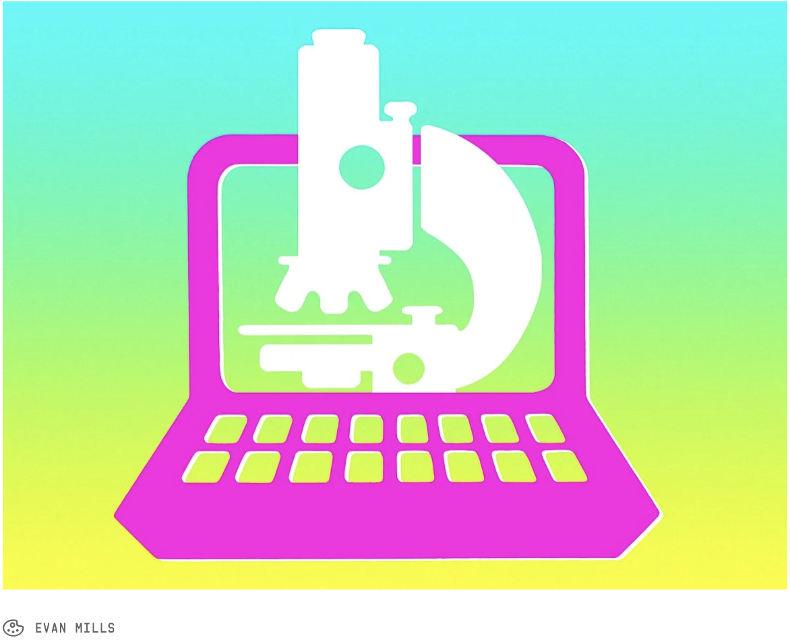

---
title: "BIS 015L Syllabus"
date: "`r Sys.Date()`"
output:
  html_document:
    theme: spacelab
    toc: yes
    toc_float: yes
  word_document:
    toc: yes
---    
```{r echo=FALSE, fig.align="center", out.width="40%"}

```

> **Want to Make it as a Biologist? Better Learn to Code**  
> "In biology, big data is the thing. Every day, biologists go into the lab to coax data out of living matter—more and more data, with the advent of biological tools like Crispr/Cas9..."We cannot manually look through 15,000 data points anymore," Udeshi says. To analyze it all, biologists need to write programs specifically tailored for their experiments."  
> [Wired Magazine (2017)](https://www.wired.com/2017/03/biologists-teaching-code-survive/)

## Course Summary  
In BIS 015L, you will be introduced to the fundamentals of data science with emphasis on data frequently used by biologists. We will use the R software environment to develop and practice key skills including data management, transformation, analysis, and visualization. Examples will span a range of disciplines including social science, ecology, evolution, and genetics. Labs will use a problem-solving approach where we build on previously learned skills culminating in a small, group-based project. 

This class is designed for students with *no background in computer programming, R, or statistics*. Our assumption is that you know how to turn a computer on and use a mouse- that's it!  

## Equipment  
In order to complete the work in class, you need to be able to run R and RStudio. Mac and PC computers both work, but *not* Chromebooks. If you experience problems, contact [Joel Ledford](mailto:jmledford@ucdavis.edu).  

## Health and Safety  
We take the health and safety of everyone in the class very seriously. You are required to have passed the daily symptom survey (DSS) and correctly wear a mask at all times. We will check your DSS prior to each in-person class. If you do not feel well, please fill out the DSS honestly. Your grade will not be penalized for missing class.  

## UC Davis’ Principles of Community  
We expect all interactions in this class to be guided by the [UCD Principles of Community](https://diversity.ucdavis.edu/principles-community). This stresses commitment to a climate of equity, inclusiveness and justice that is demonstrated by respecting and celebrating one another. The richness of our learning community and our ability to address pressing societal challenges require all of our unique contributions and perspectives. In this class, we will value open expression of our individualism, within the bounds of courtesy and respect to others. We will confront and reject all manifestations of discrimination, including based on age, citizenship status, disability, ethnicity, gender, gender expression, nationality, race, sexual orientation, socio-economic class, status inside or outside the university, veteran status, religious/non-religious, spiritual or political beliefs, or any other differences among people which have been excuses for misunderstanding, dissension or hatred.  

Please communicate with the instructional team:  

* If you have a name and/or set of pronouns that differ from those that appear in your official records.  
* If you feel like your performance in class is being significantly impacted by your experiences outside of class. We can work with you to provide additional support and advice, connect you with campus resources, or modify deadlines if warranted by the circumstances.  
* If something is said in class (by anyone) that makes you feel uncomfortable, please talk to us about it, or provide anonymous feedback.  

## Educational Equity  
UC Davis is committed to educational equity in the academic setting, and in serving a diverse student body. We encourage all students who are interested in learning more about the Student Disability Center (SDC) to contact them directly at [SDC](mailto:sdc.ucdavis.edu) or 530-752-3184. If you are a student who receives academic accommodation(s), please submit your SDC Letter of Accommodation to us as soon as possible, ideally within the first week of this course.  

## UC Davis Land Acknowledgement  
UC Davis has a formal land acknowledgement to recognize the Indigenous people who have lived where UC Davis is today. It was written by the Yocha Dehe Wintun Nation and approved by the three Patwin tribes who inhabit(ed) this land. The land acknowledgement is as follows: “We should take a moment to acknowledge the land on which we are gathered. For thousands of years, this land has been the home of Patwin people. Today, there are three federally recognized Patwin tribes: Cachil DeHe Band of Wintun Indians of the Colusa Indian Community, Kletsel Dehe Wintun Nation, and Yocha Dehe Wintun Nation. The Patwin people have remained committed to the stewardship of this land over many centuries. It has been cherished and protected, as elders have instructed the young through generations. We are honored and grateful to be here today on their traditional lands.”  

## Learning Goals  
*At the end of this course, you will be able to:*  
1. Use R and RStudio to perform basic analyses including arithmetic and basic statistics.  
2. Work with multiple types of data in R and RStudio including vectors, data frames, and nucleotide sequences.  
3. Import and transform complex, messy data for analysis in R using `dplyr`, `tidyr`, and `purrr`.  
4. Produce a variety of plots and charts to visualize results of data analysis using `ggplot2`.  
5. Build an exploratory analysis pipeline that can be applied to a variety of data types and structures.  
6. Use Shiny to build an interactive application.  
7. Use geospacial data to produce distribution maps.  

## Course Structure  
Our class has collaborative work as its foundation. Many people learn R on their own and there are literally thousands of courses designed to teach you the fundamentals. Working as a community is what sets our class apart. We encourage you to work together throughout the class!  

Our class is scheduled for 2-hour blocks on Tuesday and Thursday. Each class works though examples of live coding but includes frequent breaks where we will work together to solve problems. Please don't expect this to be a traditional lecture class- we require your active participation. After each class, there will be a homework assignment. We encourage you to work together on these! Since each assignment has many different solutions, the expectation is that your code is free from errors and runs cleanly. See grading below for details.  

There are two exams in the class, both of which are take-home. You may use any resources you like on the exam except for posting questions to open stacks or R programming forums; your work should be entirely your own.  

## Grading  
The class is graded out of 300 points on a straight scale. Grading is divided into four parts:  

1. **Weekly homework assignments (50%)**. Each assignment must be completed and uploaded to GitHub prior to the next lab. I will randomly pull an example from GitHub to discuss with the class to see alternate solutions and address issues. You must complete all homework assignments to receive a passing grade in the course. There are 15 homework assignments total, each of which is worth 10 points.  

2. **Midterms (20%)**. The midterms help us keep one another accountable. These exams will be take-home and the due dates are strict; no late work is accepted. Each midterm is worth 30 points.  

3. **Class project (30%)**. As part of the class, you will form a group to explore a project in data science. The project may be based on any available data of interest to the group and should highlight skills learned in the labs. The group will present their results during the last lab sessions.  The class project is worth 90 points.  

4. **Attendance**. As a skills-based lab class, in-person attendance provides you with immediate hands-on experience and help. We expect classes to return to in-person instruction starting January 10, and we are eager to see you. Understandably, in-person attendance may not be possible at all times and we will do our best to accommodate your absences. If you miss class, please use the [class website](https://jmledford3115.github.io/datascibiol/) and [YouTube channel](https://www.youtube.com/channel/UCFX-MipGKF9jCEXaP-59BzQ) as your guide. It is unlikely that we will be able to provide recordings of the labs, but these two resources will help you work through missed class material.  

Your grade will not be penalized for missing class. If you do not feel well, please answer the DSS questions honestly and do not attend class.  

## Suggested Reading  
[R for Data Science](https://r4ds.had.co.nz/), Grolemund and Wickham (2017).  

## Office Hours  
Office hours are scheduled each week and are also available by appointment. If there are problems with the assignments, it is important that we communicate together as a class. Please use the class discord as a first step so we all benefit.  

## About Joel Ledford  
I am an assistant teaching professor in the department of [Plant Biology](http://www-plb.ucdavis.edu/). My research is focused on education and spider biology. I completed my B.S. at UC Davis in entomology as a community college transfer student. My experience in R involves statistical analysis in education and evolutionary biology. I also teach part of the introductory biology series `BIS2C` (Fall and Winter) and introductory plant biology `PLB10` (Spring).  

## About Hannah Houts
I am a 3rd year Microbiology PhD student in the [lab for Data Intensive Biology](http://ivory.idyll.org/lab/). I completed my B.S. in microbiology here at UC Davis (go Aggies), as a proud community college transfer. These days I research (computationally) gut bacteria and the viruses that infect them, while improving computational tools & techniques for wrangling metagenomic data. I use R to manage metadata and generate plots.

## Do's and Dont's  
Learning any programming language is hard; it only gets easier with time and practice. Don't give up!  

+ Please *do* ask questions, get help from class partners, and complete assignments on-time.  
+ Please *don't* miss class or get behind on the homework.  

We are very open to suggestions, especially when it comes to relevant and interesting examples. If you find data that are especially interesting to you please let us know and we will do our best to incorporate them into class examples. Most of all, have fun learning R and if you are not then let us know!  

-->[Home](https://jmledford3115.github.io/datascibiol/)