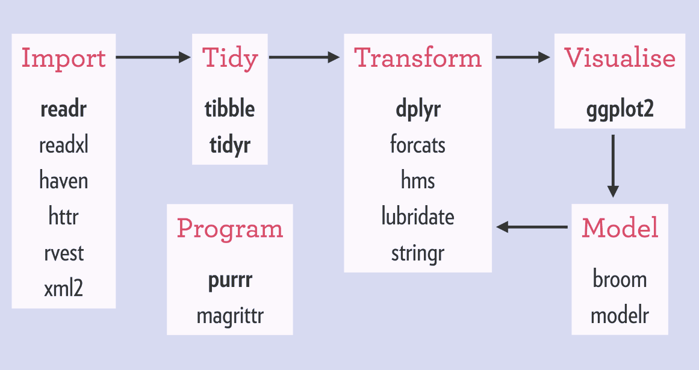

```{r setup, include=FALSE}
knitr::opts_chunk$set(echo = FALSE)
library("jpeg")
```

## Setup
- Please download `class_files` from [GitHub](https://github.com/FRS417-DataScienceBiologists)
- Please open your homework in RStudio
- Open a browser window to your GitHub repository

## Lessons Learned
- We need `GitHub`, we don't need `Git`
- Use the [class website](https://jmledford3115.github.io/datascibiol/)
- Email me (jmledford@ucdavis.edu) if you need help
- My repository has notes and **homework keys**
- Breaks

## What You Should Know
- Basics of RStudio, especially RMarkdown
- `knit` and post your homework to your GitHub
- How to do arithmetic and name objects
- The difference between vectors and data matrices

## Tidyverse
- A collection of packages designed to work together for data analysis
- Consistent, intuitive, and much easier to use
```{r out.width = "100%", fig.align = "center"}

```

## Today
1. Make sure everyone has their homework in GitHub.
2. Review any homework questions.
3. Start working in the tidyverse.